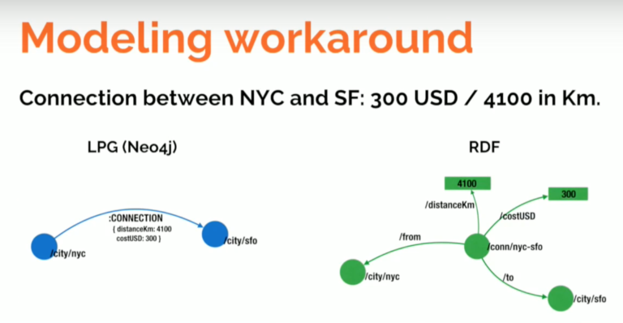

title:: 06.03.2022

- # Daily Reflections
	- # Morning Pages
		- The Huberman cocktail I have been trying for sleep (Magnesium Threonate, Theanine, and Apigenin) seems to be taking its time or has simply not been working for the past two days. Perhaps I am forcing God's hand and trying to fall asleep to early (although this can be remedied by consistently waking early), or maybe I overconsume caffeine during the day. Maybe it is a lack of movement, although yesterday I went running, lifting, and swimming, though none of the three at a strenuous intensity. Sadly, bumping it up to that level would make it difficult to sustain without tiring out the body and crashing. Let's see how the cocktail continues to evolve for the next two weeks. I also realize that waking this early might be the source of the problem, although the prospect of a couple of useful hours before having to leave to town is attractive.
		- In my dreams this morning, I was at some kind of a Dutch sports society event/festival (I think it was ice hockey). We were all huddled up, sitting on the floor in wooden houses like those at Rondon. The frat people were wearing frocks and striped gray pants like the VSV elders do during the Freshman Weekend. There was a senior looking girl who was crouching just a meter from me, and said something in Dutch I could not understand or hear due to the babble around us. Suddenly, the group inside quieted down, and she repeated herself - this time, I understood something to the effect of, "Get up and get out of here, I want to sit in your spot." I looked at her for a second, sizing her up and analysing the presence of drunk, possibly white-knighting frat guys around her, and gave her a dismissive smile as I stood up and walked out. I even winked at a girl I was talking to before, faking it all through my shameful exit. As I walked around the house to go find some other situation to distract me from the thorough social beating I had received, I could feel their eyes following the top of my head, the hegemony of the group having been reinforced. I could already picture what the whispers and giggles were about.
		- This scene in the dream was a re-visit of my teenage anxieties concerning group belonging and female rejection, all in one Dutch package. I woke up shortly after, and played out all the redeeming hypotheticals out in my mind. In the consciously edited version of the story, I told her kindly to sit where she was crouching, as there was room enough for all of us. The white knights are activated telepathically, and the most drunk of all knocks the back of my snapback off my scalp (apparently I was wearing one just for this scene). I silently beckon him outside, and the appropriate ring of onlookers forms, bringing us ever closer to our simian roots. I end up jiu-jitsuing him onto the ground and in a hold where I could rip his arm out of its socket and also whisper in his ear. I threaten to do the former unless the girl apologizes. When she begrudgingly does, I answer, "The next time you try to pull another pathetic power play on someone different from the group just to make yourself look and feel better, it's your ass I'll be kicking instead of someone elses." Granted, threatening a woman directly with violence is not my style, but it felt pretty good to say it nevertheless, if only to remind her that the consequences for our actions cannot always to outsourced to someone else.
		- I am still just documenting what I can remember without trying to judge it too much - hopefully it will make more sense at some point in the future.
		-
	- # 5-minute journal
		- ## Morning
		-
			- ### I am grateful for:
				- 1. The comfortable room I live in and the fan therein
				- 2. Having a gym within walking distance from my house
				- 3. Being able to look outside and see nothing but trees
			- ### What would make today great?
				- 1. Having a great meal with Dad in town
				- 2. Getting some work done (that I can show Monday) and also make progress with personal stuff
				- 3. Staying away from the bullshit and focus on making today solid
			- ### Daily Affirmation - I am...
		- ## Evening
			- ### 3 amazing things that happened today:
				- 1. Went to go eat sushi with Dad
				- 2. Went for a run this morning and did my almost whole routine
				- 3. Actually took notes about my day and tracked time somewhat
			- ### How could I have made today better?
				- I could have spent more time focussing on a single task and actually getting it done (preferably in the morning)
	- # Evening Pages
		-
-
- 07:49 Just finished morning routine, took 2 hours total including some lag time upon waking and a morning run around the neighborhood that lasted exactly the length of Maceo Plex's "Solar Detroit".
- 09:00 Was reading some stuff in bed and fell asleep for an hour, maybe tiredness caused by Vitamin D pills?
- To-do:
	- DONE Read Giba's Investment Thesis doc, annotate, comment, and send back
	- TODO Read Loïc's email's content and apply to research
	  :LOGBOOK:
	  CLOCK: [2022-03-06 Sun 09:14:58]--[2022-03-06 Sun 09:15:01] =>  00:00:03
	  CLOCK: [2022-03-06 Sun 09:35:28]--[2022-03-06 Sun 10:16:20] =>  00:40:52
	  :END:
		- 09:46 Read these initial lecture slides [M01-01-Introduction.pptx](../assets/M01-01-Introduction_1646570782094_0.pptx)
		- 09:58 Reading [RDF vs. LPG](https://neo4j.com/blog/rdf-triple-store-vs-labeled-property-graph-difference/) about why Neo4j is better to use?
			- Difference 1: RDF Does Not Uniquely Identify Instances of Relationships of the Same Type
			- Difference 2: Inability to Qualify Instances of Relationships
				- 
			- Difference 3: RDF Can Have Multivalued Properties and the Labeled Property Graph Can Have Arrays
			- Difference 4: RDF Uses Quads for Named Graph Definition (Quads have no equivalent in LPG)
			-
			-
			-
	- DONE Start preliminary market research for CARE and organize graph-style data organization
	  :LOGBOOK:
	  CLOCK: [2022-03-06 Sun 09:14:36]--[2022-03-06 Sun 09:14:39] =>  00:00:03
	  CLOCK: [2022-03-06 Sun 10:43:05]--[2022-03-06 Sun 11:05:02] =>  00:21:57
	  :END:
		- Learning [[Neo4j]]'s [[Cypher]] language
	- TODO Read up some more for meeting with Simon
		- TODO Understand renewal theory and paper's contents
		-
	-
	- Messages:
		- DONE Message Tom
		  :LOGBOOK:
		  CLOCK: [2022-03-06 Sun 09:13:56]--[2022-03-06 Sun 09:13:57] =>  00:00:01
		  :END:
		- DONE Message Maciej
		- DONE Message Björn
		- DONE Message Yessin
		- DONE Message Artus/Tristan
	-