title:: 23.05.2022

- Peter Zeihan Energy at the End of the World Seminar:
	- Russian energy going offline for decades
		- Oil services corps pulling out
		- Pipelines failing upstream to destroy wells
			- Takes decades to re-drill, get online again
		- 4-5 million barrels of russian crude lost soon
		- 2 million barrels of Khazahk crude lost soon
	- Germany shutting down if loses access to russian energy
	- Unprecedented levels of european cohesion
	- 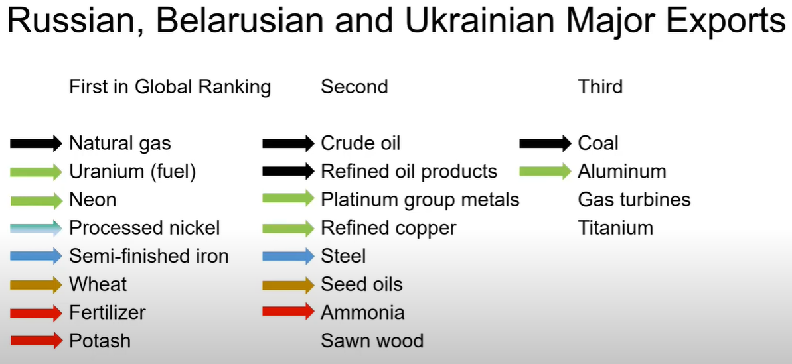
		- Building new potash, fertilizer facilities takes at least 3 years
		-
	- 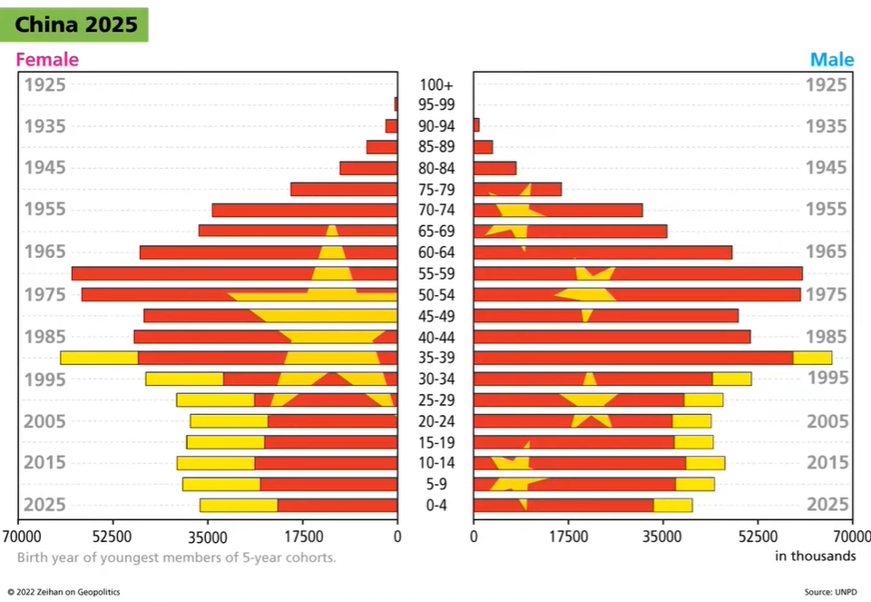
		- Overcounted by 100 million, yellow bars missing
		- By 2050 China's population will halve
		- Peaked in 2003
	- 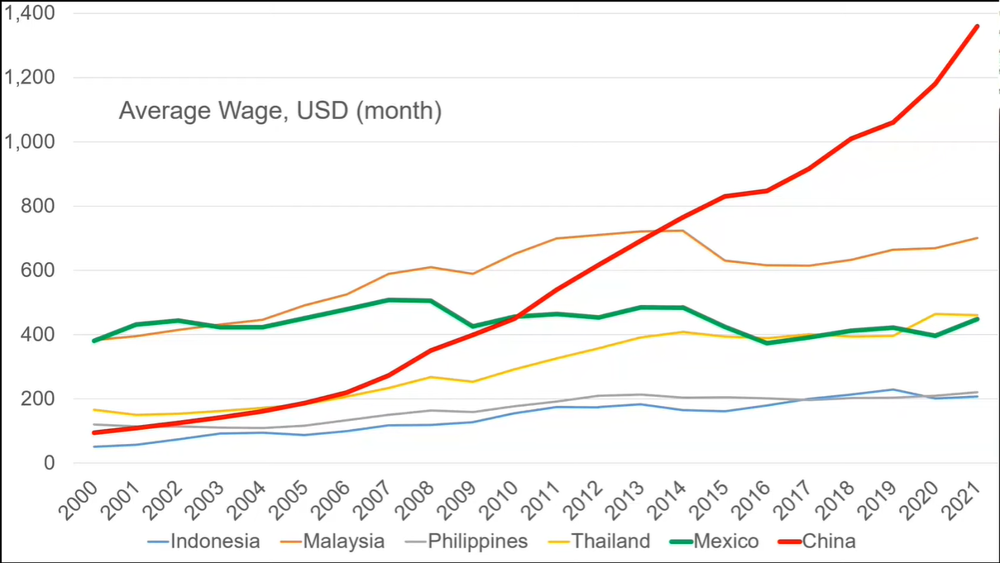
		- Fastest labour appreciation in history
		- 15x since 1999
		- Labour productivity 2-3x
		- Sunk costs because of pre-existing industrial plant (few trillion dollars)
		- West (US) is re-industrializing very fast
		-
	- Ukraine has been lesson from Russia to China re Taiwan
		- Russia-style sanctions would destroy China
		- 85% of energy and food inputs imported in China
		- Russia is major production of energy and food
	- 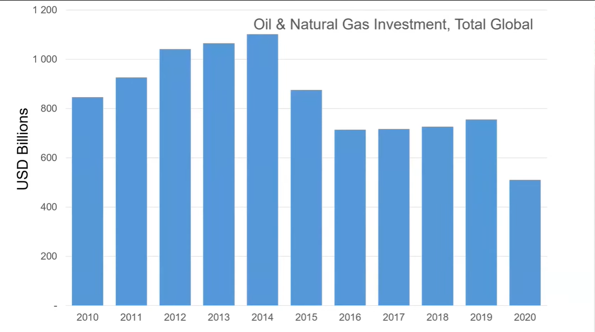
	- 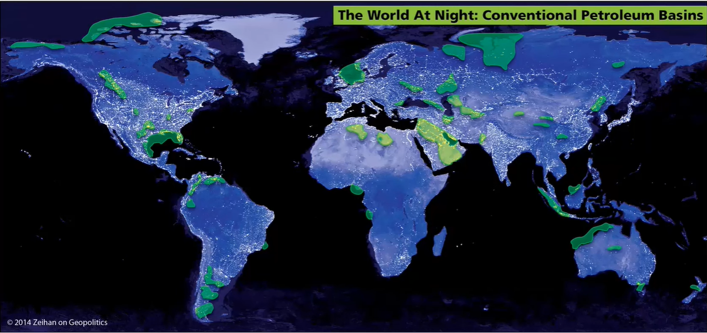
	- 
	- 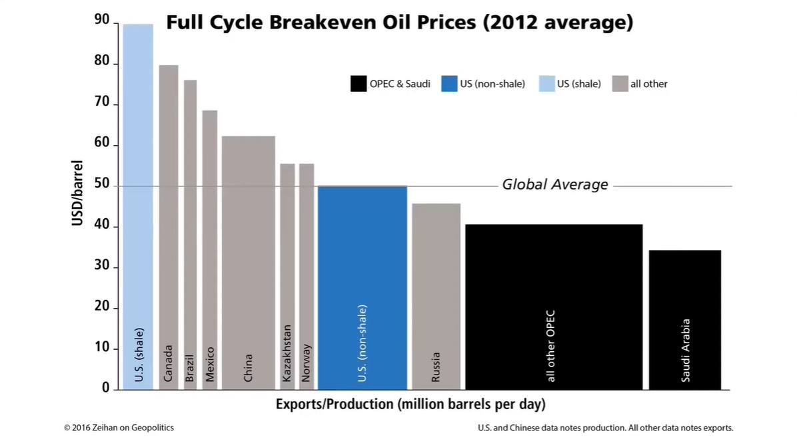
	- 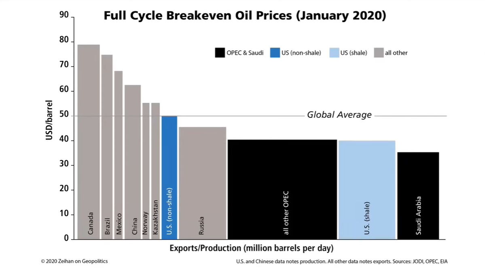
	- 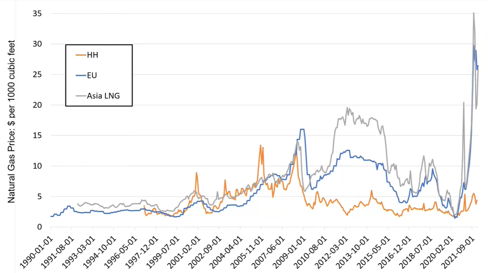
	- 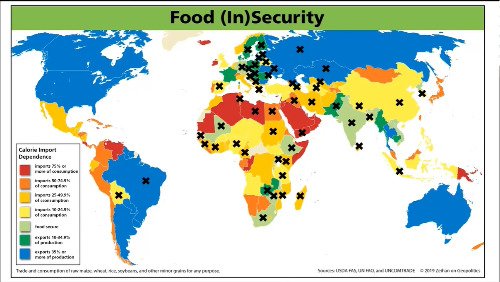
		- X represents at least a 40% reduction in ability to grow food from potash, nitrogen fertilizer disruptions
		- 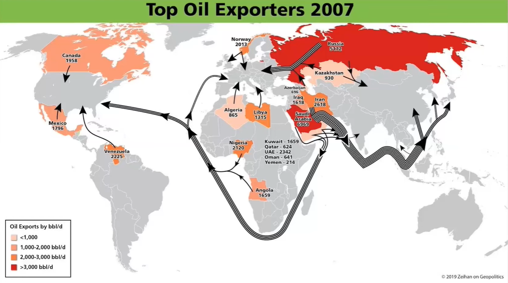
		- 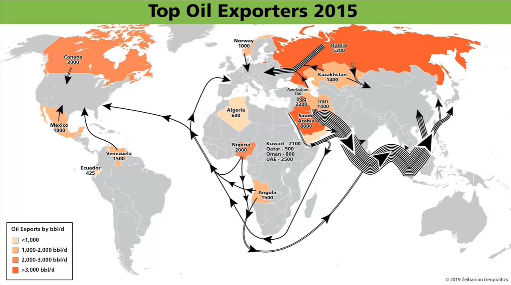
			- North American Shale, european demand drop due to crisis
		- 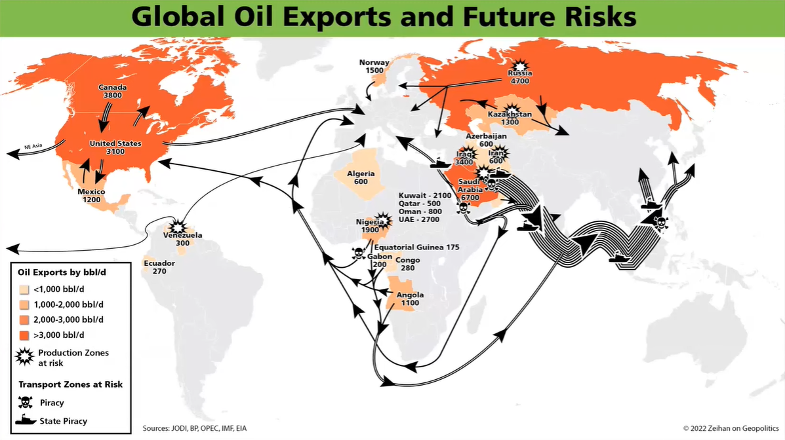
		- 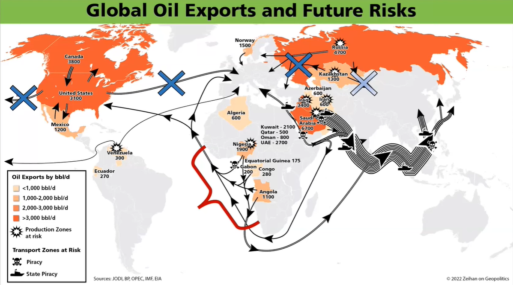
			- Russia:
				- Western and Eastern oil systems in Russia not interconnected
				- Western flows to Europe
				- Eastern flows to Chinese system via Kazakhstan
					- Deeper, more expensive to drill (cold weather)
					- Infra set up by Western service providers, which are now gone due to war
					- Maintenance not done by Russians
					- Infra collapse
			- USA:
				- Oil export ban can be put into effect at any moment to isolate from global energy markets
				- Biden most nationalist leader in 100 years
				- USA not invested in keeping post-WW2 system of global security
			- Africa:
				- Europeans lose access to Russian crude
				- Convince ex-colonies to send up to Europe instead of China
		- 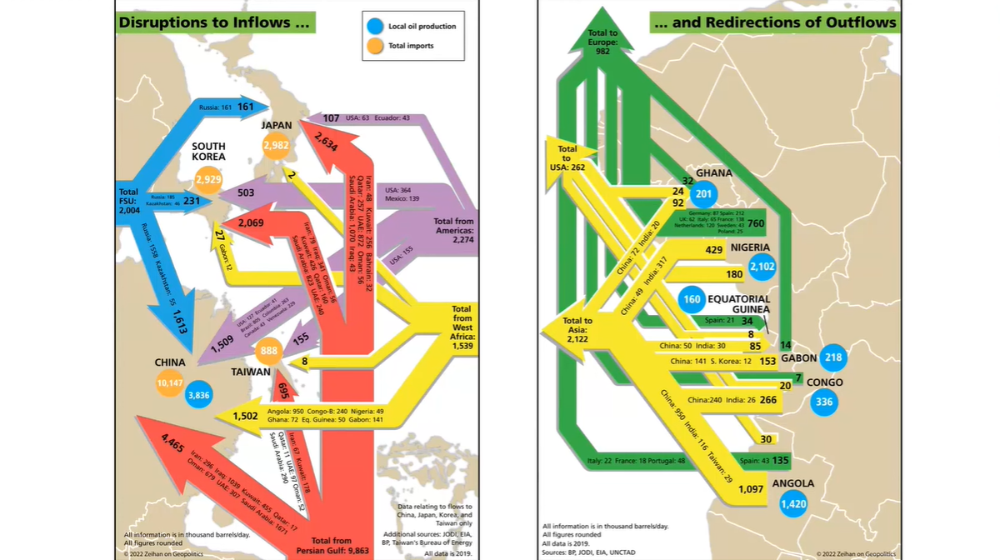
		- Chinese suck up entire energy shortfall
			- Ability to source crude falling by 1/3 before end of the year
		- 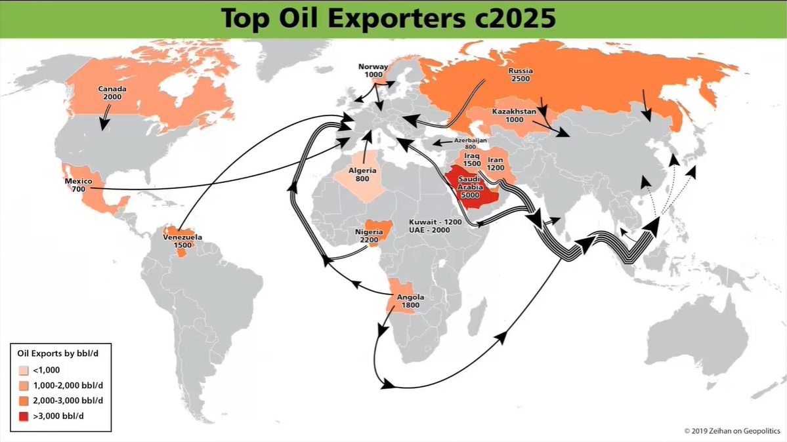
		- 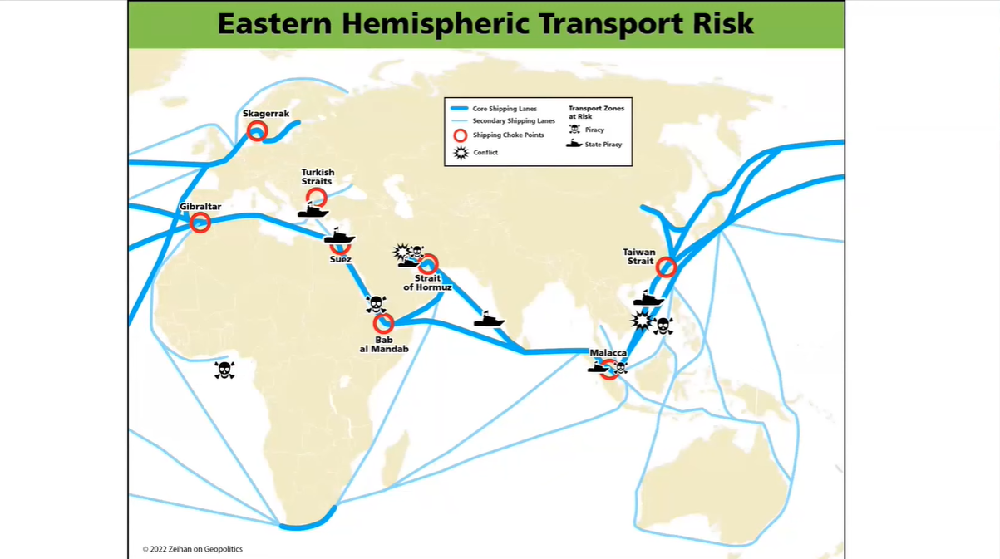
			- USA has access to all strategic chokepoints, no one military power has access to more than 1
			- US becomes agent of chaos instead of guarantor of security, disrupting global energy flows
			- Europe partnering with Eurasia for energy could flip US position
		- 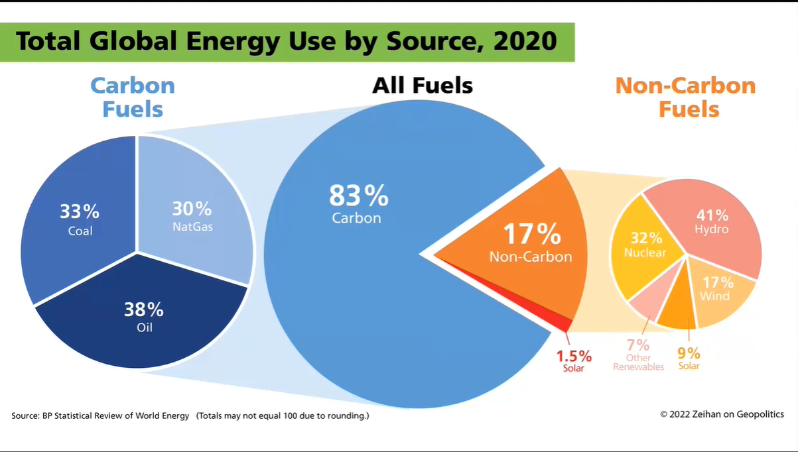
		- 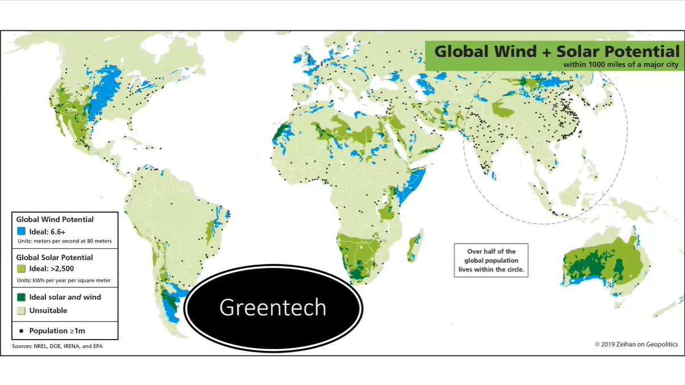
			- Only about 7 countries exist that can do wind+solar at scale, areas removed that are more than 1000 miles away from >1m population centers (transmission+storage problems)
				- India and China are not in this list
		- 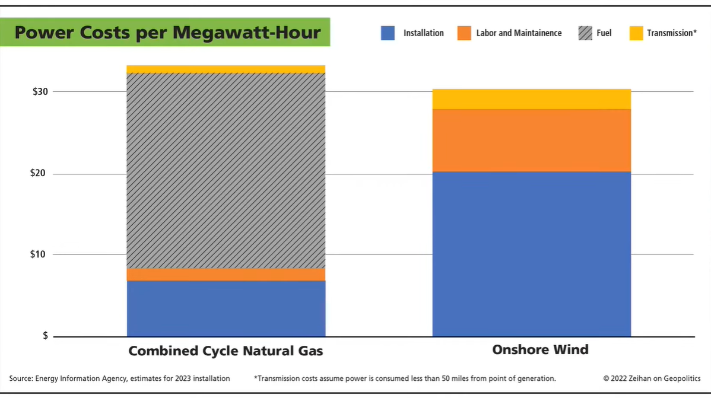
			- High upfront costs of setting up renewables (plus high labor costs) mean that rising labor and capital costs kill any possibility of feasibility
	-
-
- Principais fatores para colapso Chinês/Russo:
	- China:
		- Demografia
		- Redirecionamento de fluxos de energia
			- Três razões: EUA, Europa, Rússia
		- Falta de liderança (Xi isolado e arbitrário)
		- Falta de opções perante COVID que não sejam lockdowns (efeito manufatura, portuário)
	- Rússia:
		- Última chance de conquistar fronteiras necessárias antes de faltar gente
		- Colapso demográfico
		- Infra petrolífera dependente de companhias ocidentais retiradas por sanções
- Effects on Order Portfolio:
	- Logística marítima cara
	- CARE
		- Verificar fontes de manufatura, como são afetadas por energia cara
		- Possíveis ingredientes petroquímicos (menos provável por causa de proposta green)
	- Enova Foods
		- Verificar tipos de alimentos produzidos e dependência em fertizilantes Slávicos
	- WAP
		- Totalmente exposto ao colapso Chinês
		- Exposto ao transporte caro por causa de importações extensas
	- Ztecs
		- Verificar porcentagem de alimento de gado de abate sendo de grandes monoculturas dependentes de fertilizante (soja)
		- Possível efeito cascata