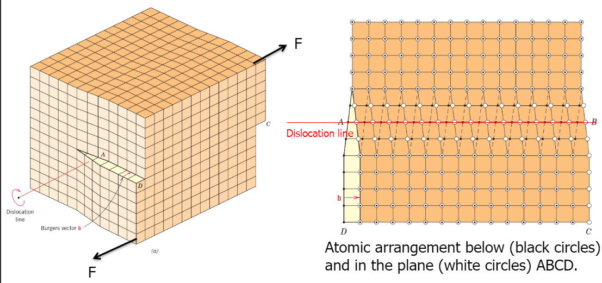

tags:: class

- # Main Topics
	- ## Materials and Structures
		- Materials by design:
		  collapsed:: true
			- Application
			- Properties
				- Product shape
				- Product properties
				- Properties of materials
			- Structure
				- Macrostructure: >mm's
				- Microstructure: 100 nm-cm
				- Nanostructure / Molecular Structure: < 100 nm
			- Processing
				- Shaping
				- Metallurgy, Chemical Processing, Mixing
				- Extracting raw materials
			- Composition:
				- Metals
				- Polymers
				- Ceramics
				- Glass
				- Composites
				- Semiconductors
				- Biomaterials
		- Atomic Bonds
		  collapsed:: true
			- Correlation between atomic bond force and properties:
				- Elastic Modulus
				- Melting temperature
			- Types of atomic bonds:
				- Ionic
				- Metallic
				- Covalent
			- Types of crystal structure
			  collapsed:: true
				- Body-centered cubic 
				  
				- Face-centered cubic
				  
				- Hexagonal close-packed
				  
			- Atomic bonding structure
				- Long-range vs. short-range order
				- Crystalline: atoms pack in periodic, 3D arrays
				  
					- Metals, many ceramics, some polymers
				- Semi-crystalline:
				- Amorphous: have no periodic packing 
				  
					- Complex structures
					- Rapid cooling
				- Isotropic vs. anisotropic parameters
				-
				-
	- Polymers
	- Metals
		- Properties:
		  Ductile
		  Malleable
		  Electrically conductive
		  Thermally conductive
		- Crystalline structure
		- Processing: bending, casting or extrusion
		- Composition:
		  Monoatomic or alloy
		  Metallic bond
		- Structure:
			- Typically all aromic radii are the same
			- Metallic bonding is not directional
			- Electron clouds shields cores from each other
			- Body- or face-centered cubic structures are more common
		- Imperfections in crystal structures govern most of the properties:
		  collapsed:: true
			- Defects
				- 0-D: point defects (vacancies, interstitial atoms, substitutional, ...)
				- 1-D: line defects - dislocations (edge or screw), dislocation loops
				- 2-D: grain-boundaries, phase boundaries, stacking faults
				- 3-D: precipitates, voids \(\rightarrow\) not always considered as imperfections but as a part of materials microstructure.
			- Dislocations
			  
			- Work-hardening: strengthening of a metal or polymer by plastic deformation. Dislocation movements and dislocation generation within the crystal structure of the material.
		- Typical properties to be considered:
			- High specific strength
			- Stiffness
			- Toughness
			- Fatigue resistance
			- Corrosion resistance
			- Low or high temperature resistance
			- Low density
			- Recyclability?
		- Building blocks for designing aerospace alloys
			- Microstructure
				- Phases
				- Grain size
				- Texture
				- Precipitates
				- Atoms in solid solution
				- Dislocation networks
			- Defects
			  collapsed:: true
				- Vacancies
				  
				- Substititions
				  
				- Dislocations
				  
				- Grain boundaries
				  
			- Challenges in alloy design
				- Microstructures are heterogeneous
				- Diffusional processes in metal are exponential in nature
				- Alloying elements interact with each other
				- Dislocations enhance diffusion rates of alloying elements
				- Heterogeneities can act as nucleation sites
				- Interface energies depend on local concentration of alloying element and crystallographic misorientation between grains
				- Microstructures are hierarchical in nature
				- Dislocations form networks in 3D
			- Typical metal stress-strain curve
			  {:height 456, :width 531}
			- Shear yield strength \(\tau_{\mathrm{y}}\) based on strengthening mechanisms
			  
			- Plastic deformation
			  
			- Dislocation motion
			  collapsed:: true
				- Dislocation gliding
				  
					- Edge dislocation gliding
					  
				- Edge dislocation with Burgers vector
				  
				- Dislocations carry plastic deformation
				  
				- Screw dislocations
					- 
					- Screw and edge together create mixed dislocations
					  
				- Defining a dislocation using Burgers vector
				  
			- Precipitates
			  collapsed:: true
				- Incoherent precipitates: typically high interface energy
				  
				- Coherent precipitates: typically low interface energy and strain energy
				  
			- Design of aluminium alloys
				- Main families of aluminium alloys
					- 2XXX
						- Al-Cu
						- Al-Cu-Li
						- Al-Cu-Mg
					- 7XXX:
						- Al-Zn
						- Al-Zn-Mg
						- Al-Zn-Mg-Cu
					- 8XXX: Al-Li-Cu-Mg
				- The Al-Cu system
				  {:height 336, :width 417}
					- Precipitates can increase the strength of pure Al by 15 times
					-
	- Ceramics
	  collapsed:: true
		- Properties (usually):
			- Brittle
			- Strong
			- High hardness
			- High melting points
			- Low thermal expansion
		- Structure (usually)
			- Crystalline by nature
		- Processing (usually)
			- Extrusion, slip casting or compression molding
		- Composition
			- Metal oxides or metallic element
			  with \(\mathrm{C}, \mathrm{N}\) or \(\mathrm{S}\)
			- Ionic, covalent or mixture
		- Bonding:
			- Can be ionic and/or covalent in character.
			  -- \% ionic character increases with difference in electronegativity of atoms.
			- Bonds responsible for unique properties of ceramics, including brittleness.
			- Covalent and ionic bonds cause brittleness
		- Crystal structures:
		-
	- Smart Materials
	- Materials and Temperature
	- Materials and Damage
	- Materials and Lifetime
	-
- Examples of materials:
	-
-