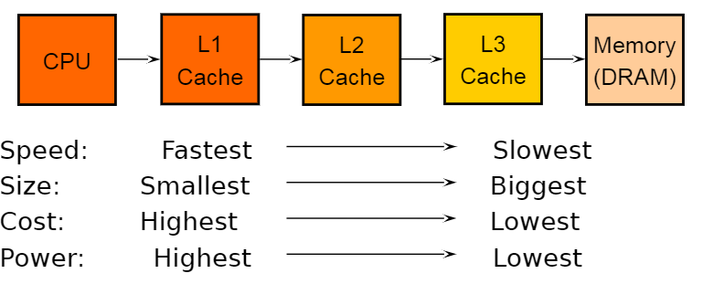

- **Benefits of Embedded Systems**
  id:: 64301906-b5cc-4d0c-a713-eb82f110a77c
  Greater performance and efficiency: being specialized in one task means a minimization of resources (power, size/mass, data memory utilization, code-size, run-time) while maximizing the performances on that specific task
  Lower cost
  More features: many not possible or practical with other approaches
  Better dependability: the knowledge of the expected behavior and the physical environment at design time can be used to achieve higher predictability and reliability
- **Dependability**
  The extent to which the fulfillment of a required function can be justifiably trusted
  Consists of reliability, availability, and maintainability
- **Reliability**
  The ability of an item to perform a required function under given conditions for a given time interval
- **Availability**
  Ability of an item to be in a state to perform a required function under given conditions at a given instant of time or over a given time interval, assuming that the required external resources are provided
- **Maintainability**
  Ease of performing maintenance on a product
	- [[GPT Generated Flashcards]]
	  collapsed:: true
		- What is a benefit of embedded systems? #card
		  id:: 642bb74e-129f-4b05-9a87-956ee6926de1
			- Greater performance and efficiency.
		- How do embedded systems reduce cost? #card
		  id:: 642bb74e-7c83-4055-8f2d-d78e5bca99e1
			- By specializing in one task.
		- What is a feature unique to embedded systems? #card
		  id:: 642bb74e-61ea-431a-b0a5-b5f6ec6a748c
			- Many features not possible or practical with other approaches.
		- What contributes to better dependability in embedded systems? #card
		  id:: 642bb74e-0f68-4a8c-ac14-2e6287169846
			- Knowledge of expected behavior and physical environment at design time.
		- What does dependability consist of? #card
		  id:: 642bb74e-35c8-43d0-8320-bdac96bd6050
			- Reliability, availability, and maintainability.
		- What is reliability in embedded systems? #card
		  id:: 642bb74e-a18c-4b4d-b0b3-548fbb9dd493
			- The ability to perform a required function under given conditions for a given time interval.
		- What is availability in embedded systems? #card
		  id:: 642bb74e-cc62-4483-b84f-fb68e9bc044c
			- The ability to perform a required function under given conditions at a given instant of time or over a given time interval, assuming required external resources are provided.
		- What is maintainability in embedded systems? #card
		  id:: 642bb74e-ef81-43e2-b56e-e8d14e9b4d8a
			- The ease of performing maintenance on a product.
- ## Component Options for Embedded Systems
  | Option | What it is? |  Size, Weight |  Design, Cost |  Unit, Cost | Flexibility | Power |
  | :---: | :---: | :---: | :---: | :---: | :---: | :---: |
  | Discrete components |  Transistors, resistors, etc or small scale integrated circuits. Largely obsolete, not recommended. | -+ | ++ | + |  | ? |
  | Microprocessors |  General purpose computing device. Needs external memory and peripherals | + | -+ | + | ++ | ... |
  | Microcontroller |  Computing device for specific tasks. It includes , internal memory and peripherals | ++ | ++ | ++ | ++ | + |
  | FPGA | Re-programmable logic component | ++ | ++ | +- | ++ | ++ |
  | ASIC | Application Specific Integrated Circuit | ++ | ... | ++ | -+ | +++ |
  | DSP | Digital Signal Processor | ++ | ++ | ++ | ++ | ... |
	- [[GPT Generated Flashcards]]
	  collapsed:: true
		- What are discrete components in embedded systems? #card
		  id:: 642bb74e-b244-4a0b-ba79-2914808ddc60
			- Transistors, resistors, and small scale integrated circuits.
		- What is a microprocessor in the context of embedded systems? #card
		  id:: 642bb74e-fbb3-4728-b636-40449c98a334
			- A general purpose computing device that needs external memory and peripherals.
		- What is a microcontroller in an embedded system? #card
		  id:: 642bb74e-18c7-46b9-8f26-fa388f24ca4f
			- A computing device for specific tasks that includes internal memory and peripherals.
		- What is an FPGA in embedded systems? #card
		  id:: 642bb74e-2eeb-400b-89a1-a238b6bca285
			- A re-programmable logic component.
		- What is an ASIC in embedded systems? #card
		  id:: 642bb74e-7a57-4dfa-99fe-88e6e3323d8d
			- Application Specific Integrated Circuit.
		- What is a DSP in embedded systems? #card
		  id:: 642bb74e-081a-4214-9eb1-f9109b737b16
			- Digital Signal Processor.
	- [[GPT Generated Flashcards]]
	  		The text presents a comparison of component options for embedded systems: 1. Discrete components: Consist of transistors, resistors, and small-scale integrated circuits. They are largely obsolete and not recommended, with unknown power consumption. 2. Microprocessors: General-purpose computing devices that require external memory and peripherals. They have moderate size and weight, mixed design and cost, a positive effect on unit cost, high flexibility, and unspecified power consumption. 3. Microcontrollers: Task-specific computing devices with internal memory and peripherals. They offer excellent size, weight, design, cost, unit cost, and flexibility, with positive power consumption. 4. FPGA: Re-programmable logic components with excellent size, weight, design, flexibility, and power consumption, but moderate unit cost. 5. ASIC: Application Specific Integrated Circuits, providing excellent size, weight, unit cost, and power consumption, but mixed design and flexibility. 6. DSP: Digital Signal Processors have excellent size, weight, design, cost, unit cost, flexibility, and unspecified power consumption.
		- [[GPT Generated Flashcards]]
		- What do microprocessors require? #card
		  id:: 642bb74e-1a28-4544-ab7d-d98eb370ce6e
			- External memory and peripherals.
		- What do microcontrollers have built-in? #card
		  id:: 642bb74e-da94-43c1-ad23-24842a25f7d5
			- Internal memory and peripherals.
		- What are the advantages of using a microcontroller in embedded systems? #card
		  id:: 642bb74e-7ef0-4a2d-8673-489848c64e48
			- Excellent size, weight, design, cost, unit cost, flexibility, and positive power consumption.
		- How does the unit cost of an FPGA compare to a microcontroller? #card
		  id:: 642bb74e-d183-4028-ba3d-0279ccbe809c
			- Moderate unit cost.
- ## Microcontroller vs Microprocessor
  **Microprocessor (uP)**
  Computing power for general purpose applications
  IC with only CPU, it requires external RAM, ROM, I/O and other peripherals to be operated.
  Microprocessors are generally used for unspecific tasks(no input/output relationship defined).
  The clock speed of the Microprocessor is quite high
  
  **Microcontroller Unit (MCU)**
  Simplified definition: MCU= CPU + peripherals
  MCUs are designed to perform specific tasks Since the applications are very specific, they need small resources like RAM, ROM, I/O ports, etc. which can be embedded on a single chip. Specific means applications where the relationship of input and output is defined.
  Depending on the input, some processing needs to be done and output is delivered.
  The use of the microcontroller requires to develop ad-hoc software code.
	- Microprocessor usecases: developing software, games, websites, photo editing, creating documents etc. 
	  MCU Examples: keyboards, mouse, washing machine, digicam, pendrive, remote, microwave, cars, bikes, telephone, mobiles, watches
	- [[GPT Generated Flashcards]]
	  collapsed:: true
		- What is the main difference between a microprocessor and a microcontroller? #card
		  id:: 642bb74e-6a80-4ad7-ba7e-b39f44098eb1
			- A microprocessor is a general-purpose computing IC with only CPU, while a microcontroller is an IC designed for specific tasks and includes a CPU and peripherals.
		- What external components do microprocessors require? #card
		  id:: 642bb74e-f954-4796-8998-93340721d269
			- Microprocessors require external RAM, ROM, I/O, and other peripherals.
		- What is a microcontroller unit (MCU) typically used for? #card
		  id:: 642bb74e-df76-4bab-8852-57b8d5632e0c
			- MCUs are used for predefined, specific tasks in applications where input-output relationships are defined.
		- How is the clock speed of a microprocessor compared to that of a microcontroller? #card
		  id:: 642bb74e-6113-422f-bbf3-7b5f5aeb4fb4
			- The clock speed of a microprocessor is generally higher.
		- What do building software, gaming, and creating websites have in common? #card
		  id:: 642bb74e-0ea4-4e1f-86e3-1791fccfca15
			- They are common use cases for microprocessors.
		- What are some examples of devices that use microcontrollers? #card
		  id:: 642bb74e-d859-446c-af47-52c64568ed40
			- Keyboards, mouse, washing machines, digicam, pendrives, remote, microwave ovens, cars, bikes, telephone, mobiles, and watches.
- **Processor - Memory Gap**
  There is a limit on performance due to the fact that access to external memory is becoming slower.
- **Memory Trade-Offs**
  Large (dense) memories are slow
  Fast memories are small, expensive and consume high power
  Goal: give the processor a feeling that it has a memory which is large (dense), fast, consumes low power, and cheap
  Solution: a Hierarchy of memories
  {:height 306, :width 771}
- **Sum of main microcontroller advantages**
  The size of a circuit can be reduced significantly: one microcontroller can replace several other ICs.
  Allows greater flexibility: it can be reprogrammed to change its function.
  It is generally faster than a general purpose processor for its specific function, thanks to access to local, embedded memory and peripherals.
  It requires less software to be written, which means less software to be tested.
  Low design and unit cost.
- [[GPT Generated Flashcards]]
  collapsed:: true
	- What causes the processor-memory performance gap? #card
	  id:: 642bb74e-757a-4c12-b5cd-dc533b636ea0
		- Access to external memory becoming slower.
	- What are the trade-offs for large dense memories? #card
	  id:: 642bb74e-7078-4066-a567-0476b74684e5
		- They are slow.
	- What are the trade-offs for fast memories? #card
	  id:: 642bb74e-9876-4d55-9889-06bbec0f0694
		- They are small, expensive, and consume high power.
	- What is the goal when dealing with memory trade-offs? #card
	  id:: 642bb74e-f994-4123-a4e4-a7884be438f1
		- To provide a large, fast, low power, and cheap memory.
	- What is the solution to memory trade-offs? #card
	  id:: 642bb74e-a2dd-4ba6-8c89-9235feb1a6a3
		- A hierarchy of memories.
	- How does using a microcontroller benefit circuit size? #card
	  id:: 642bb74e-2715-4bb1-a44f-1811616105be
		- It significantly reduces the size by replacing several ICs.
	- What benefit does a microcontroller offer in terms of flexibility? #card
	  id:: 642bb74e-ac52-42b8-8f46-497062ec2573
		- It can be reprogrammed to change its function.
	- Why are microcontrollers generally faster for a specific function compared to general purpose processors? #card
	  id:: 642bb74e-915d-4f9b-969b-da8e8a41ecdf
		- They have access to local, embedded memory and peripherals.
	- How does using a microcontroller impact software requirements? #card
	  id:: 642bb74e-964d-4412-badf-f71ea29b7db3
		- It requires less software to be written and tested.
	- What are the cost benefits of using a microcontroller? #card
	  id:: 642bb74e-6979-43ef-81f1-98c91574c473
		- Low design and unit cost.