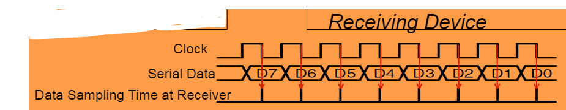

- ## Interrupt 
  An interrupt is a signal to the processor emitted by hardware or software indicating an event that needs immediate attention.
  Whenever an interrupt occurs, the controller completes the execution of the current instruction and starts the execution of an Interrupt Service Routine (ISR) or Interrupt Handler.
  ISR tells the processor or controller what to do when the interrupt occurs.
  
  Interrupts can be Hardware or Software:
  Hardware interrupts are electric signals often created by a input device (e.g. keyboard, mouse)
  Software interrupts are caused by either an exceptional condition or a special instruction in the instruction set (e.g. divide-by-zero exception)
	- [[GPT Generated Flashcards]]
	  collapsed:: true
		- What is an interrupt? #card
		  id:: 642bb74f-2a57-414b-bddb-7706b7b7ff0b
			- A signal to the processor indicating an event requiring immediate attention.
		- What are the two types of interrupts? #card
		  id:: 642bb74f-a3a8-4016-9ca4-293fa1e29e18
			- Hardware and Software.
		- What is a hardware interrupt? #card
		  id:: 642bb74f-46ce-48e5-8de6-d82d2da60781
			- An electric signal created by an input device, such as a keyboard or mouse.
		- What is a software interrupt? #card
		  id:: 642bb74f-f36e-4a4b-84cf-3c80894f5d05
			- Caused by an exceptional condition or a special instruction in the instruction set, such as a divide-by-zero exception.
		- What does an Interrupt Service Routine (ISR) do? #card
		  id:: 642bb74f-d170-4725-aeeb-e8e2d07ce98b
			- Tells the processor or controller what to do when an interrupt occurs.
- ## Polling vs. Interrupts 
  **Polling** is when software continuously monitors the status of other devices to check if an event occurred
  Slow: need to explicitly check to see if switch is pressed
  Wasteful of CPU time: the faster a response we need, the more often we need to check
  Scales badly: difficult to build system with many activities which can respond quickly. Response time depends on all other processing.
  
  **Interrupt** uses special hardware in MCU to detect event, run specific code (ISR) in response
  Efficient: code runs only when necessary (event-based processing)
  Fast: hardware mechanism
  Scales well: allows many multi-threaded embedded systems to be responsive without an operating system (specifically task scheduler)
	- [[GPT Generated Flashcards]]
	  collapsed:: true
		- What is polling in embedded systems? #card
		  id:: 642bb74f-2a6a-4970-bb0f-96af342eec73
			- Continuously monitoring the status of other devices to check if an event occurred.
		- Why is polling considered slow and wasteful of CPU time? #card
		  id:: 642bb74f-4a98-4ac7-801c-d7589eecaebc
			- It requires explicit checks and more frequent checks for faster responses.
		- How is the interrupt method different from polling? #card
		  id:: 642bb74f-4eae-44f0-993e-cdebabfcec1b
			- Interrupt uses special hardware in the MCU to detect events and run specific code in response.
		- What are the advantages of using interrupts? #card
		  id:: 642bb74f-7d32-475a-aaed-8d1aec1e3d91
			- Efficiency, faster response time, and better scalability.
- ## Interrupt/Exception Processing Sequence 
   
  Other code (background) is running
  Interrupt trigger occurs
  Processor does some hard-wired processing
  Processor executes ISR (foreground), including return-from-interrupt instruction at end
  Processor resumes other code
- **Interrupt Response Latency**
  This is an overhead which increases as the interrupt rate rises, delaying our response to external events
  
  How long does it take?
  1. Finish executing the current instruction or abandon it if too long
  2. Push various registers on to the stack, fetch vector
  3. If we have external memory with wait states, this takes longer
	- [[GPT Generated Flashcards]]
	  collapsed:: true
		- In the context of embedded systems, what is Interrupt Response Latency? #card
		  id:: 642bb74f-534c-4667-be40-78f10e6b74f5
			- The overhead that increases as the interrupt rate rises, delaying response to external events.
		- In an interrupt/exception processing sequence, what is the first step after an interrupt trigger occurs? #card
		  id:: 642bb74f-f059-4da8-ae60-4ab630f2d3c9
			- Processor does some hard-wired processing.
		- What happens after hard-wired processing in an interrupt/exception processing sequence? #card
		  id:: 642bb74f-e20e-498d-b9ae-352965f3e75f
			- Processor executes ISR (foreground), including return-from-interrupt instruction at end.
		- What occurs after executing ISR and the return-from-interrupt instruction in the processing sequence? #card
		  id:: 642bb74f-5e8e-429c-bda2-326e55e2f263
			- Processor resumes other code.
		- What are the three factors affecting Interrupt Response Latency? #card
		  id:: 642bb74f-6b6c-4112-b84a-61ff472a9a71
			- 1. Finish executing the current instruction or abandon it if too long, 2. Push various registers on to the stack, fetch vector, 3. If external memory with wait states, this takes longer.
- ## Maximum Interrupt Rate  
  How many interrupts can be handled per second?
  \(F_{\text{Max-int}}\): maximum interrupt frequency
  \(F_{\text {CPU }}:\) CPU clock frequency
  \(C_{I S R}:\) Number of cycles ISR takes to execute
  \(C_{\text{overhead}}\): Number of cycles of overhead for saving state, vectoring, restoring state, etc.
  \(\mathrm{F}_{\text {Max Int }}=\mathrm{F}_{\mathrm{CPU}} /\left(\mathrm{C}_{\mathrm{ISR}+} \mathrm{C}_{\text {overhead }}\right)\)
  Note that model applies only when there is one interrupt type in the system
  
  When an interrupt occurs, the CPU is occupied and cannot execute the other (main) code
  \(U_{\text {Int }}\) : Utilization (fraction of processor time) consumed by interrupt processing
  \(\mathrm{U}_{\text {Int }}=100 \% * \mathrm{~F}_{\text {Int }} *\left(\mathrm{C}_{\mathrm{ISR}}+\mathrm{C}_{\text {overhead }}\right) / \mathrm{F}_{\mathrm{CPU}}\)
  It means that the CPU running the main code at clock speed of \(\left(1-U_{\text {Int }}\right) * F_{\mathrm{CPU}}\)
	- [[GPT Generated Flashcards]]
	  collapsed:: true
		- What is the formula to calculate the maximum interrupt frequency? #card
		  id:: 642bb74f-2a3a-4b91-b2e6-69ed5b4eaba4
			- \(F_{\text {Max Int }}=\mathrm{F}_{\mathrm{CPU}} /\left(\mathrm{C}_{\mathrm{ISR}+} \mathrm{C}_{\text {overhead }}\right)\)
		- What does \(F_{\text{Max-int}}\) represent? #card
		  id:: 642bb74f-bf26-472c-a947-99f78382e7f5
			- Maximum interrupt frequency.
		- What does \(F_{\text {CPU }}\) represent? #card
		  id:: 642bb74f-f6be-411d-a92f-4bad6eef9b8f
			- CPU clock frequency.
		- What does \(C_{I S R}\) represent? #card
		  id:: 642bb74f-6a0b-416f-92a9-b5a5626a9552
			- Number of cycles ISR takes to execute.
		- What does \(C_{\text{overhead}}\) represent? #card
		  id:: 642bb74f-b448-4982-b060-a5a5610bbe70
			- Number of cycles of overhead for saving state, vectoring, restoring state, etc.
		- What limitation does the model mentioned in the text have? #card
		  id:: 642bb74f-12e4-4716-9091-2659b06526f9
			- It applies only when there is one interrupt type in the system.
		- What is the formula to calculate the Utilization (fraction of processor time) consumed by interrupt processing? #card
		  id:: 642bb74f-5618-4fe0-b844-f00f34bb0aa3
			- \(\mathrm{U}_{\text {Int }}=100 \% * \mathrm{~F}_{\text {Int }} *\left(\mathrm{C}_{\mathrm{ISR}}+\mathrm{C}_{\text {overhead }}\right) / \mathrm{F}_{\mathrm{CPU}}\)
		- What does \(U_{\text {Int }}\) represent? #card
		  id:: 642bb74f-c90f-4156-9ad2-e49642eda3d0
			- Utilization (fraction of processor time) consumed by interrupt processing.
		- How is the CPU clock speed affected by Utilization and interrupt processing? #card
		  id:: 642bb74f-c6b1-4a91-9414-478c3e7cd8c1
			- The CPU runs the main code at a clock speed of \(\left(1-U_{\text {Int }}\right) * F_{\mathrm{CPU}}\).
- ## GPIO Basics 
  GPIO = General-purpose input and output (digital)
  Sets outputs as 1 or 0 and recognizes inputs as 1 or 0 when interfacing with external devices or on-board peripherals
  
  Input signal's value is determined by voltage
  Input threshold voltages depend on supply voltage \(\mathrm{V}_{\mathrm{DD}}\)
  Exceeding \(\mathrm{V}_{\mathrm{DD}}\) or GND may damage chip
  
  Nominal output voltages
  1: \(\mathrm{V}_{\mathrm{DD}}-0.5 \mathrm{~V}\) to \(\mathrm{V}_{\mathrm{DD}}\) 
  \(0: 0\) to \(0.5 \mathrm{~V}\)
	- [[GPT Generated Flashcards]]
	  collapsed:: true
		- What does GPIO stand for? #card
		  id:: 642bb74f-f2b5-4681-8827-e60e5106012a
			- General-purpose input and output.
		- What are the two main functions of GPIO? #card
		  id:: 642bb74f-7123-40dc-a1b9-a48e9aca2108
			- Set outputs as 1 or 0 and recognize inputs as 1 or 0.
		- What determines the value of an input signal in a GPIO? #card
		  id:: 642bb74f-b11a-47d0-912a-b6c64f05ba2a
			- Voltage.
		- What happens if the input voltage exceeds VDD or GND in a GPIO system? #card
		  id:: 642bb74f-66f8-4a9a-a299-27a5cb983247
			- The chip may get damaged.
		- What is the nominal output voltage range for 1 in a GPIO system? #card
		  id:: 642bb74f-2dda-4e69-9d25-c76fc1dd9354
			- VDD - 0.5 V to VDD.
		- What is the nominal output voltage range for 0 in a GPIO system? #card
		  id:: 642bb74f-149d-440d-8f60-3697c0bce8d6
			- 0 to 0.5 V.
- ## Analog Interfaces 
  Embedded systems often need to measure values of physical parameters These parameters are usually continuous (analog) and not in a digital form which computers (which operate on discrete data values) can process
	- Examples and usecase:
	  collapsed:: true
		- Temperature
			- Temperature sensor (is our equipment too hot?)
			- Thermostat for thermal control
			- Propulsion nozzle controller
			- Chemical reaction monitor
			- Safety (e.g. microprocessor/processor thermal management)
		- Environment monitor
			- Digital camera sensor
			- Sun sensor (for AOCS)
			- Plasma/radiation sensor
			- Charging monitor
		- Rotary position
			- Attitude sensor
			- Solar panel movement mechanism
		- Pressure
			- Tank pressure monitor
			- Valve pressure
			- Propulsion controller
			- Thrust monitoring
		- Acceleration
			- Thrust monitoring
			- Inertial Platform
		- Mechanical strain
		- Housekeepings
			- Current, Voltages
			- Battery Monitor
	- [[GPT Generated Flashcards]]
	  collapsed:: true
		- Why do embedded systems often need analog interfaces? #card
		  id:: 642bb74f-1ae9-474f-8e0f-e901bddaee07
			- To measure values of physical parameters which are usually continuous (analog).
- ## Analog to Digital Conversion
  A **Comparator** tells us if the input voltage is smaller than a reference voltage
  Compares an analog input voltage with an analog reference voltage and determines which is larger, returning a 1-bit number
  
  An **Analog to Digital Converter** (AD or ADC) tells us how large the input voltage is as a fraction of the reference voltage.
  Reads an analog input signal (usually a voltage) and produces a corresponding multi-bit number at the output.
	- ### Waveform Sampling and Quantization 
	   
	  A waveform is sampled at a constant rate - every \(\Delta t\)
	  Each such sample represents the instantaneous amplitude at the instant of sampling
	  Sampling converts a continuous time signal to a discrete time signal
	  The sample can now be quantized (converted) into a digital value
	  Quantization represents a continuous (analog) value with the closest discrete (digital) value
	- ### Flash Conversion 
	  A multi-level voltage divider is used to set voltage levels over the complete range of conversion.
	  A comparator is used at each level to determine whether the voltage is lower or higher than the level.
	  The series of comparator outputs are encoded to a binary number in digital logic (a priority encoder)
	  {:height 258, :width 334} 
	  Components used
	  \(2^N\) resistors
	  \(2^N-1\) comparators
	- ### Successive Approximation Conversion (SAR)
	  This ADC successively approximates input voltage by using a binary search and a DAC. It performs
	  1. Sample and hold of the analog signal.
	  2. For each bit, the SAR logic outputs a binary code to the DAC that is dependent on the current bit under scrutiny and the previous bits already approximated.
	  3. The comparator is used to determine the state of the current bit.
	  4. Once all bits have been approximated, the digital approximation is output at the end of the conversion (EOC).
		- [[GPT Generated Flashcards]]
		  collapsed:: true
			- What is the process of converting a continuous time signal to a discrete time signal? #card
			  id:: 642bb74f-ebb7-4bbd-b13a-d1442018745d
				- Sampling.
			- What is the purpose of quantization in waveform sampling? #card
			  id:: 642bb74f-ad4f-492f-859f-79a68e123cd1
				- To represent a continuous (analog) value with the closest discrete (digital) value.
			- In flash conversion, what components are used to set voltage levels over the complete range of conversion? #card
			  id:: 642bb74f-26ff-439a-b4e4-a58895768293
				- A multi-level voltage divider and comparators.
			- What is the purpose of a priority encoder in flash conversion? #card
			  id:: 642bb74f-0ec9-46b4-bde0-c86ebe2362d8
				- To encode the series of comparator outputs to a binary number.
			- In successive approximation conversion (SAR), what is the purpose of the sample and hold phase? #card
			  id:: 642bb74f-628b-4769-87bf-bae527606148
				- To capture the analog signal.
			- In successive approximation conversion, how is the input voltage approximated? #card
			  id:: 642bb74f-8d58-4b04-9c8c-a5e636336872
				- By using a binary search and a DAC.
			- During successive approximation conversion, which component is used to determine the state of the current bit? #card
			  id:: 642bb74f-8799-4901-b569-0c1dd57ef2c2
				- Comparator.
	- ### ADC Performance Metrics 
	  Linearity measures how well the transition voltages lie on a straight line.
	  Differential linearity measure the equality of the step size.
	  Conversion time: between start of conversion and generation of result
	  Conversion rate is the inverse of conversion time
	- ### Sampling Problems 
	  Nyquist criterion: the sampling rate must be at least twice the highest analog frequency component
	  Frequency components above 0.5 * the sampling frequency are aliased: distorted measured signals
	  In the real world filters are not perfect (especially Commercial Off The Shelf) therefore so we have to choose a sampling frequency high enough that our filter attenuates aliasing components adequately
	- ### ADC Inputs
	  **Differential**
	  Use two channels, and compute difference between them
	  Very good noise immunity
	  Some sensors offer differential outputs (e.g. Wheatstone Bridge)
	  
	  **Multiplexing**
	  Typically share a single ADC among multiple inputs
	  Need to select an input, allow time to settle before sampling
	  
	  **Signal Conditioning**
	  Amplify and filter input signal
	  Protect against out-of-range inputs with clamping diodes
		- [[GPT Generated Flashcards]]
		  collapsed:: true
			- What do linearity measurements in ADC performance metrics refer to? #card
			  id:: 642bb74f-8149-4f8b-8bf5-0e441d70e134
				- How well the transition voltages lie on a straight line.
			- What does differential linearity measure in ADC performance metrics? #card
			  id:: 642bb74f-94d9-4d74-b4ea-cbafa30a671f
				- The equality of the step size.
			- What is conversion time in ADC performance metrics? #card
			  id:: 642bb74f-0eb3-46a7-98c9-dc25906d22a7
				- The time between the start of conversion and generation of the result.
			- What is the relationship between conversion time and conversion rate in ADC performance metrics? #card
			  id:: 642bb74f-d349-46f6-be97-fde7f98e4397
				- Conversion rate is the inverse of conversion time.
			- What is the Nyquist criterion for the sampling rate? #card
			  id:: 642bb74f-31bc-43a8-b86a-1fdc71a88049
				- The sampling rate must be at least twice the highest analog frequency component.
			- What is aliasing in sampling problems? #card
			  id:: 642bb74f-cf8d-4dd0-8177-c777e01247f3
				- Distorted measured signals caused by frequency components above 0.5 times the sampling frequency.
			- How does noise immunity compare for differential ADC inputs? #card
			  id:: 642bb74f-a735-4c14-abfc-749f6614d700
				- Very good noise immunity.
			- What is multiplexing in the context of ADC inputs? #card
			  id:: 642bb74f-494b-437f-a049-16751d3520db
				- Sharing a single ADC among multiple inputs.
			- Why is settling time important when using multiplexing in ADC inputs? #card
			  id:: 642bb74f-1f8e-4a31-8a6d-3f1905dfec47
				- To ensure accurate sampling after selecting an input.
			- What is the purpose of signal conditioning in ADC inputs? #card
			  id:: 642bb74f-a469-4802-b895-c9fb93bf253f
				- To amplify and filter input signals, and protect against out-of-range inputs with clamping diodes.
	- ### Sample and Hold Devices
	   
	  Some A/D converters require the input analog signal to be held constant during conversion, (e.g. successive approximation devices)
	  In other cases, peak capture or sampling at a specific point in time necessitates a sampling device.
	  This function is accomplished by a sample and hold device as shown to the right:
	  These devices are incorporated into some A/D converters
		- [[GPT Generated Flashcards]]
		  collapsed:: true
			- What do some A/D converters require from the input analog signal during conversion? #card
			  id:: 642bb74f-fc5b-4b30-85b4-3eab5bc15b09
				- To be held constant.
			- What type of device is used for peak capture or sampling at a specific point in time? #card
			  id:: 642bb74f-c554-45b0-b9c4-0a1f9b102682
				- Sample and Hold device.
			- Are sample and hold devices incorporated into some A/D converters? #card
			  id:: 642bb74f-220a-44e3-b12b-09f418f9584d
				- Yes.
- ## Digital to Analog Conversion (DAC)
  In some cases an analog voltage or current as an output signal needs to be generated
  DAC: "Generate the analog voltage which is this fraction of the reference voltage"
  
  **Digital to Analog Converter equation**
  \(n=\) input code
  \(N=\) number of bits of resolution of converter
  \(V_{\text {ref }}=\) reference voltage
  \(V_{\text {out }}=\) output voltage.
  \(V_{\text {out }}=V_{\text {ref }}{ }^* n /\left(2^{\mathrm{N}}\right)\) or
  \(V_{\text {out }}=V_{\text {ref }}{ }^*(n+1) /\left(2^N\right)\)
- ## Timer/Counter Peripherals  
  Embedded microcontrollers usually include several elaborate timers that allow to:
  Capture the current time or time differences, triggered by hardware or software events,
  Generate interrupts when a certain time is reached (e.g. stop watch, timeout), 
  Generate interrupts when counters overflow, generate periodic interrupts, for example in order to periodically execute tasks (e.g. scheduler)
  Generate specific output signals for example PWM (pulse width modulation)
- [[GPT Generated Flashcards]]
  collapsed:: true
	- What is the purpose of a Digital to Analog Converter (DAC)? #card
	  id:: 642bb74f-d78d-44af-9836-8c410c86eaf1
		- To generate an analog voltage or current as an output signal from a digital input.
	- What does DAC stand for? #card
	  id:: 642bb74f-9b05-48dd-b7a4-742499f31fe6
		- Digital to Analog Conversion.
	- In the DAC equation, what does \(n\) represent? #card
	  id:: 642bb74f-807e-429b-b525-894d356ced9c
		- Input code.
	- In the DAC equation, what does \(N\) represent? #card
	  id:: 642bb74f-4951-4e2a-bbe9-9b7471f47a06
		- Number of bits of resolution of the converter.
	- In the DAC equation, \(V_{\text{out}}\) equals either... #card
	  id:: 642bb74f-3d38-4375-b2ef-8b21f6e7b4f4
		- V_{\text {ref }}{ }^*(n+1) /\left(2^N\right)\) or V_{\text {ref }}{ }^*(n) /\left(2^N\right)\)
	- What is one function of timer/counter peripherals in embedded microcontrollers? #card
	  id:: 642bb74f-9870-417b-9e82-b97b09db7f3d
		- Capture current time or time differences.
	- What is another function of timer/counter peripherals in embedded microcontrollers? #card
	  id:: 642bb74f-549d-4de8-86c1-48aba78f0a38
		- Generate interrupts when a certain time is reached.
	- What is the purpose of timer/counter peripherals generating periodic interrupts? #card
	  id:: 642bb74f-f6c3-4f27-9fe6-388e922aaa62
		- To periodically execute tasks, such as in a scheduler.
	- What output signal can timer/counter peripherals generate? #card
	  id:: 642bb74f-8224-4809-bd88-d73860d60cc3
		- PWM (pulse width modulation).
- ## Serial Communications 
  Why communicate serially? Native word size is multi-bit (8,16,32, etc.)
  
  In many applications it is not feasible to send all the word bits at the same time
  **Cost and weight:** more wires needed, larger connectors needed
  **Mechanical reliability:** more wires -> more connector contacts to fail
  **Timing Complexity:** some bits may arrive later than others due to variations in capacitance and resistance across conductors
  **Circuit complexity and power:** may not want to have 16 different radio transmitters + receivers in the system
- ### Parallel Buses 
   
  All devices use buses to share data, read and write signals
  MCU uses individual select lines to address each peripheral
  MCU requires fewer pins for data, but still one per data bit
  MCU can communicate with only one peripheral at a time
- ### Synchronous Serial Data Transmission 
   
  Use shift registers and a clock signal to convert between serial and parallel formats
  Synchronous: an explicit clock signal is along with the data signal
- ### Synchronous Full-Duplex Serial Data Bus 
   
  Now can use two serial data lines - one for reading, one for writing.
  Allows simultaneous send and receive
  
  Half-Duplex involves sharing the serial data line, and doesn't allow simultaneous send and receive
- ### Asynchronous Serial Communication
   
  Eliminate the clock line!
  Transmitter and receiver must generate clock locally
  Transmitter must add start bit (always same value) to indicate start of each data frame
  Receiver detects leading edge of start bit, then uses it as a timing reference for sampling data line to extract each data bit \(N\) at time \(T_{\text {bit }} *(N+1.5)\)
  Stop bit is also used to detect some timing errors
	- [[GPT Generated Flashcards]]
	  collapsed:: true
		- Why would someone choose serial communication over parallel? #card
		  id:: 642bb74f-bc5a-4769-89d5-bc5d505721fe
			- Cost and weight, mechanical reliability, timing complexity, and circuit complexity.
		- What is a synchronous serial data transmission? #card
		  id:: 642bb74f-6921-4358-986e-0a2142616417
			- It uses shift registers and a clock signal to convert between serial and parallel formats.
		- What is synchronous full-duplex serial data bus? #card
		  id:: 642bb74f-31a3-40a9-9721-6998d50dffe6
			- A data bus using two serial data lines for reading and writing, allowing simultaneous send and receive.
		- What is the difference between full-duplex and half-duplex communication? #card
		  id:: 642bb74f-ec08-4275-be7c-b21dd8845df8
			- Full-duplex allows simultaneous send and receive, while half-duplex does not.
		- What is asynchronous serial communication? #card
		  id:: 642bb74f-e9ef-4549-a69b-9cc7b154ae61
			- Communication without a clock line, where the transmitter and receiver generate clock locally and use start and stop bits for timing.
		-