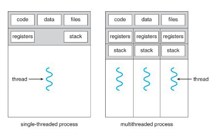

- Concurrency
	- In computer science, concurrency is a property of systems in which several computations are executing simultaneously, and potentially interacting with each other.
	  id:: 6424aa4b-68cb-426a-9be6-664a65e117df
	- A process is a unit of execution in concurrent programming.
	- Thread is an execution unit that is part of a process. A process can have multiple threads.
	- Multithreading is a technique which allows a CPU to execute many tasks of one process at the same time. These threads can execute individually while sharing their resources.
	  
	- Microcontroller Unit HW & SW for Concurrency
		- CPU executes instructions from one or more thread of execution
		- Hardware peripherals add dedicated concurrent processing, some examples being
			- Watchdog timer
			- ADC
			- Timers
			- Communications with other devices
			- Detecting external signal events
			- Power management
		- Peripherals use interrupts to notify CPU of events
	- Simple systems are usually designed as foreground-background or super-loops. Foreground is also called interrupt level; background is called task level.
	- [[GPT Generated Flashcards]]
	  collapsed:: true
		- {{cloze Concurrency}} is the property of systems in which multiple computations are executing simultaneously and potentially interacting with each other.
		  card-last-interval:: 4
		  card-repeats:: 1
		  card-ease-factor:: 2.36
		  card-next-schedule:: 2023-04-07T06:06:01.303Z
		  card-last-reviewed:: 2023-04-03T06:06:01.303Z
		  card-last-score:: 3
		  id:: 64296f3e-1b77-4b43-9f13-19a2576e1c54
		  			#card #cloze
		- A {{cloze process}} is a unit of execution in concurrent programming.
		  id:: 64296f3e-2868-4a7d-bce0-c080e4809491
		  			#card #cloze
		- A {{cloze thread}} is an execution unit that is part of a process, and a process can have {{cloze multiple threads}}.
		  id:: 64296f3e-ed3a-4534-94a1-bb60f7c106da
		  			#card #cloze
		- {{cloze Multithreading}} is a technique that allows a CPU to execute multiple tasks of one process simultaneously while sharing resources.
		  id:: 64296f3e-30d1-4c23-ad8e-21449df94dd5
		  			#card #cloze
		- {{cloze Hardware peripherals}} can add dedicated concurrent processing, with some examples being the watchdog timer, ADC, timers, communications with other devices, detecting external signal events, power management, etc.
		  card-last-interval:: 4
		  card-repeats:: 1
		  card-ease-factor:: 2.6
		  card-next-schedule:: 2023-04-07T06:03:23.122Z
		  card-last-reviewed:: 2023-04-03T06:03:23.122Z
		  card-last-score:: 5
		  id:: 64296f3e-4c08-4473-8d75-b10839197c62
		  			#card #cloze
		- {{cloze Interrupts}} are used by peripherals to notify the CPU of events.
		  id:: 64296f3e-3c74-4944-8dd4-3cc6ffb3a11f
		  			#card #cloze
		- {{cloze Simple systems}} are usually designed as foreground-background or super-loops, with foreground being called the interrupt level, and background being called the task level.
		  id:: 64296f3e-b710-4aa9-884f-4789c2d8e761
		  			#card #cloze
	- [[GPT Generated Flashcards]]
	  collapsed:: true
		- What is concurrency in computer science? #card
		  id:: 64296f3e-256a-467a-bd72-184c03884467
			- Concurrency is a property of systems in which several computations are executing simultaneously and potentially interacting with each other.
		- What is a process in concurrent programming? #card
		  card-last-interval:: -1
		  card-repeats:: 1
		  card-ease-factor:: 2.5
		  card-next-schedule:: 2023-04-03T22:00:00.000Z
		  card-last-reviewed:: 2023-04-03T06:14:48.695Z
		  card-last-score:: 1
		  id:: 64296f3e-98d8-4f10-b0ce-fecead6a03cf
			- A process is a unit of execution in concurrent programming.
		- What is a thread in concurrent programming? #card
		  id:: 64296f3e-6840-4568-a8d4-6a390e8ca59d
			- A thread is an execution unit that is part of a process, and a process can have multiple threads.
		- What is multithreading? #card
		  id:: 64296f3e-dcb9-4744-a2b6-1d693d67dc18
			- Multithreading is a technique that allows a CPU to execute many tasks of one process at the same time.
		- What are hardware peripherals in a microcontroller unit for concurrency? #card
		  id:: 64296f3e-3b26-4727-bb4c-17ca5443d19f
			- Hardware peripherals are components that add dedicated concurrent processing in a microcontroller unit.
		- What are some examples of hardware peripherals in a microcontroller unit for concurrency? #card
		  id:: 64296f3e-17dd-4b19-8fed-e2789cce3d5a
			- Examples of hardware peripherals include the watchdog timer, ADC, timers, communications with other devices, detecting external signal events, power management, among others.
		- How do peripherals in a microcontroller unit notify the CPU of events? #card
		  id:: 64296f3e-7002-443e-9886-0b59ec55c95a
			- Peripherals use interrupts to notify the CPU of events.
		- What are super-loops in concurrency systems? #card
		  id:: 64296f3e-7650-483d-ad71-00d1bf4dec11
			- Super-loops are a way of designing concurrency systems, and they are usually categorized as foreground-background or task level.
- Scheduling
	- Event-triggered scheduling with interrupts relies on the CPU’s hardware interrupt system to run the right code, adequate for simple systems
		- Interrupts provide a basic scheduling approach for CPU in an event-triggered approach
		- Basic architecture, useful for simple low-power devices
			- Very little code or time overhead
		- Uses built-in task dispatching of interrupt system
			- Can trigger ISRs with input changes, timer expiration, UART data reception, analog input level crossing comparator threshold
		- Function types
			- Main function configures system and then goes to sleep
			- If interrupted, it goes right back to sleep
		- Only interrupts are used for normal program operation
		- [[GPT Generated Flashcards]]
			- What is the approach used for event-triggered scheduling with interrupts? #card
			  id:: 64296f3e-c528-42ae-86ff-f5fc8928f49d
				- The approach used for event-triggered scheduling with interrupts relies on the CPU's hardware interrupt system.
			- What does the basic architecture of event-triggered scheduling rely on? #card
			  card-last-interval:: -1
			  card-repeats:: 1
			  card-ease-factor:: 2.5
			  card-next-schedule:: 2023-04-03T22:00:00.000Z
			  card-last-reviewed:: 2023-04-03T06:08:33.354Z
			  card-last-score:: 1
			  id:: 64296f3e-3d83-4a3d-a281-f0af7a258069
				- The basic architecture of event-triggered scheduling with interrupts relies on **interrupts** as a basic scheduling approach for the CPU.
			- What type of devices is event-triggered scheduling with interrupts useful for? #card
			  card-last-interval:: 4
			  card-repeats:: 1
			  card-ease-factor:: 2.6
			  card-next-schedule:: 2023-04-07T06:04:08.042Z
			  card-last-reviewed:: 2023-04-03T06:04:08.042Z
			  card-last-score:: 5
			  id:: 64296f3e-d807-4c63-9bf0-a0ec0a12ba0f
				- Event-triggered scheduling with interrupts is useful for simple low-power devices.
			- What is the advantage of using event-triggered scheduling with interrupts? #card
			  id:: 64296f3e-7df4-49bf-9b6d-4ef1f58cc528
				- Using event-triggered scheduling with interrupts results in very little code or time overhead.
			- What built-in task dispatching does event-triggered scheduling with interrupts use? #card
			  id:: 64296f3e-3b5f-4a7d-9471-4886cd506151
				- Event-triggered scheduling with interrupts uses the built-in task dispatching of the interrupt system.
			- What are some inputs that can trigger ISRs (Interrupt Service Routines) in event-triggered scheduling with interrupts? #card
			  id:: 64296f3e-c096-4e7d-8ce1-6d0db5e2e524
				- Inputs such as input changes, timer expiration, UART (Universal Asynchronous Receiver/Transmitter) data reception, analog input level crossing comparator threshold can trigger ISRs in event-triggered scheduling with interrupts.
			- What is the function of the main function in event-triggered scheduling with interrupts? #card
			  id:: 64296f3e-f070-49b5-9e47-197cdccf01ce
				- The main function configures the system and then goes to sleep. If interrupted, it goes right back to sleep. Only interrupts are used for normal program operation.
	- Software scheduling of CPU time
		- Dynamic priority
			- It allows schedule to be computed on-the-fly
				- Based on importance
				- Prioritization means that less important tasks don't delay more important ones
			- How often do we decide what to run?
				- Coarse grain: After a task finishes. Also called Run-to-Completion (RTC) or non-preemptive dynamic scheduling.
					- Scheduler chooses among Ready tasks for execution based on priority
					- Scheduling Rules
						- If no task is running, scheduler starts the highest priority ready task
						- Once started, a task runs until it completes
						- Tasks then enter waiting state until triggered or released again
				- Fine grain: Any time. Called Preemptive, since one task can preempt another.
					- Advantages
						- Preemption offers best response time
						- It allows to do more processing (support more potholes, or higher vehicle speed)
					- Disadvantages
						- Requires more complicated programming, more memory
						- Introduces vulnerability to data race conditions
						- [[GPT Generated Flashcards]]
							- What is dynamic priority scheduling? #card
							  id:: 64296f3e-51d8-4f22-a9fc-b5452ef0459a
								- It is a type of scheduling that computes schedule on-the-fly based on task importance.
							- What is the difference between coarse grain scheduling and fine grain scheduling? #card
							  id:: 64296f3e-8276-4f29-a89f-d186e243fb68
								- Coarse grain scheduling happens after a task finishes, while fine grain scheduling can happen anytime.
							- What are the advantages of preemptive scheduling? #card
							  id:: 64296f3e-6ddb-486d-b9fb-a6c6a052862a
								- Preemptive scheduling offers the best response time and can allow for more processing.
							- What are the disadvantages of preemptive scheduling? #card
							  id:: 64296f3e-2c76-44d4-b316-e86bf249a0c2
								- Preemptive scheduling requires more complicated programming and more memory. It also introduces vulnerability to data race conditions.
							- What are the scheduling rules in dynamic priority scheduling? #card
							  id:: 64296f3e-a707-440f-8ab4-d54ea4c1b4f1
								- If no task is running, the scheduler starts the highest priority ready task. Once a task starts, it runs until completion. It then enters waiting state until triggered or released again.
		- Static priority scheduling (Cyclic executive)
			- Advantage:
				- Very simple
			- Disadvantages:
				- Always run the same schedule, regardless of changing conditions and relative importance of tasks.
				- All tasks run at same rate. Changing rates requires adding extra calls to the function.
				- [[GPT Generated Flashcards]]
					- What is the advantage of Static priority scheduling (Cyclic executive)? #card
					  card-last-interval:: 4
					  card-repeats:: 1
					  card-ease-factor:: 2.6
					  card-next-schedule:: 2023-04-07T06:06:26.136Z
					  card-last-reviewed:: 2023-04-03T06:06:26.136Z
					  card-last-score:: 5
					  id:: 64296f3e-1981-47da-a4b3-93f7767e00bf
						- It is very simple.
					- What are the disadvantages of Static priority scheduling (Cyclic executive)? #card
					  id:: 64296f3e-5db4-4d7d-bd6e-df224640e0f1
						- 1. It always runs the same schedule, regardless of changing conditions and relative importance of tasks. 2. All tasks run at the same rate, and changing the rates requires adding extra calls to the function.
						- Maximum delay is sum of all task run times. Polling/execution rate is 1 /maximum delay.
	- Time definitions
		- Release time = Time at which task (or interrupt) requests service/is released/is ready to run
		- Latency time = Delay between release and start of service for task
		- Response time = Delay between request for service and completion of service for task
		- Task time = Time needed to perform computations for task
		- ISR time = Time needed to perform interrupt service routine
		- [[GPT Generated Flashcards]]
			- What is release time? #card
			  id:: 64296f3e-3bfa-4c2a-a012-c4ded80c429c
				- Release time is the time at which a task or interrupt requests service, is released, or is ready to run.
			- What is latency time? #card
			  id:: 64296f3e-4a02-4154-b339-ad1e4aa7872c
				- Latency time is the delay between release and start of service for a task.
			- What is response time? #card
			  id:: 64296f3e-b06f-4276-b5f6-e44ddd3e9437
				- Response time is the delay between request for service and completion of service for a task.
			- What is ISR time? #card
			  id:: 64296f3e-8504-4d80-8632-15c1d028499a
				- ISR time is the time needed to perform interrupt service routine.
	- Common schedulers
		- Run-to-Completion Scheduler
			- Follows a "run-to-completion" model
				- A task's execution is not interrupted by any other task
				- Only ISRs can interrupt a task
				- After ISR completes, the previously-running task resumes
			- Priority is typically static, so can use a table with highest priority tasks first for a fast, simple scheduler implementation.
			- [[GPT Generated Flashcards]]
				- What model does the "Run-to-Completion Scheduler" follow? #card
				  id:: 64296f3e-4dc8-4828-8609-feb2c24fe841
					- It follows a "run-to-completion" model.
				- Is a task's execution interrupted by any other task in the "Run-to-Completion Scheduler"? #card
				  id:: 64296f3e-d92f-478f-968e-4852e6570b5b
					- No, a task's execution is not interrupted by any other task.
				- What can interrupt a task in the "Run-to-Completion Scheduler"? #card
				  id:: 64296f3e-578f-436c-b756-d579cb4ea528
					- Only ISRs can interrupt a task.
				- What happens after an ISR completes in the "Run-to-Completion Scheduler"? #card
				  id:: 64296f3e-2097-42cf-b1b9-6cb410772d08
					- After an ISR completes, the previously-running task resumes.
				- What is the priority like in the "Run-to-Completion Scheduler"? #card
				  id:: 64296f3e-404e-4e32-8cc0-84bd51d92537
					- The priority is typically static, so a table with highest priority tasks first can be used for a fast, simple scheduler implementation.
		- Round Robin Scheduler
			- An example of cyclic and preemptive scheduler is the Round-Robin scheduler
			- It employs time-sharing and assigns to each process the same time slot or quantum.
			- It is a pre-emptive algorithm as the scheduler forces the process out of the CPU once the time quota expires.
			- [[GPT Generated Flashcards]]
				- What is an example of a cyclic and preemptive scheduler? #card
				  id:: 64296f3e-3a96-471f-a121-12d883410e67
					- The Round-Robin scheduler.
				- What does the Round-Robin scheduler employ? #card
				  id:: 64296f3e-2883-43a4-aff5-b2eeb7d2325a
					- Time-sharing.
				- How does the Round-Robin scheduler assign time slots to processes? #card
				  id:: 64296f3e-0536-4c5b-8c3a-2006536fa87b
					- It assigns each process the same time slot or quantum.
				- Is the Round-Robin scheduler a pre-emptive or non-preemptive algorithm? #card
				  id:: 64296f3e-fc0f-4c9f-9407-feda4cbaa874
					- It is a pre-emptive algorithm.
				- How does the Round-Robin scheduler handle processes that exceed their time quota? #card
				  card-last-interval:: -1
				  card-repeats:: 1
				  card-ease-factor:: 2.5
				  card-next-schedule:: 2023-04-03T22:00:00.000Z
				  card-last-reviewed:: 2023-04-03T06:12:48.910Z
				  card-last-score:: 1
				  id:: 64296f3e-7062-42e9-a9c8-ede120db1fc2
					- The scheduler forces the process out of the CPU once the time quota expires.
- Real-time Operating Systems (RTOS)
	- A real-time system can calculate and guarantee the maximum response time for each task and interrupt service routine
	- The difference between "Soft" and "Hard" real-time systems is that the the latter have deadlines which must be met.
	- What does an RTOS provide?
		- Task Scheduler
			- Preemptive, prioritized to minimize response times
			- Interrupt support
		- Core Integrated RTOS services
			- Inter-process communication and synchronization (safe data sharing)
			- Time management
		- Optional Integrated RTOS services, for example:
			- I/O abstractions?
			- memory management?
			- File system?
			- networking support?
			- [[GPT Generated Flashcards]]
				- What is a real-time system? #card
				  id:: 64296f3e-93f6-4d3d-a2e5-99aebfddb638
					- A system that can calculate and guarantee the maximum response time for each task and interrupt service routine.
				- What is the difference between "Soft" and "Hard" real-time systems? #card
				  id:: 64296f3e-49b1-4ddc-883f-99c8d204c578
					- "Hard" real-time systems have deadlines which must be met, unlike "Soft" real-time systems.
				- What does an RTOS provide? #card
				  id:: 64296f3e-3b44-4a4b-9d75-132181f04dc6
					- An RTOS provides a Task Scheduler, Preemptive, prioritized scheduling to minimize response times, Interrupt support, Core Integrated RTOS services, Inter-process communication and synchronization (safe data sharing), and Time management.
				- What are some Optional Integrated RTOS services? #card
				  id:: 64296f3e-4370-4cd7-a896-06570666d4dc
					- Some Optional Integrated RTOS services are I/O abstractions, memory management, File system, and networking support.
- Embedded co-design guidelines
	- Approaches to Testing
		- Incremental Testing
			- Code a function and then test it (module/unit/element testing)
			- Test then a few working functions together (integration testing)
				- Continue enlarging the scope of tests as you write new functions
			- Incremental testing requires extra code for the test harness
				- A driver function calls the function to be tested
				- A stub function might be needed to simulate a function called by the function under test, and which returns or modifies data.
				- [[GPT Generated Flashcards]]
					- What is incremental testing? #card
					  id:: 64296f3e-11f6-412f-af01-ca9d7dd68b90
						- Incremental testing is a testing process where a function is coded and tested, then integrated with other functions and tested as a group, with the scope of testing gradually increasing as new functions are added.
					- What types of testing are involved in incremental testing? #card
					  id:: 64296f3e-ea01-4672-ad7b-72de7f8f7209
						- Module/unit/element testing and integration testing.
					- What is the purpose of a driver function in incremental testing? #card
					  id:: 64296f3e-983d-4379-8756-645d81744ab9
						- The purpose of a driver function is to call the function being tested.
					- When might a stub function be needed in incremental testing? #card
					  id:: 64296f3e-cfaa-4152-928e-bca5c58fde5a
						- A stub function might be needed to simulate a function that is called by the function under test, and which returns or modifies data.
					- Does incremental testing require extra code for the test harness? #card
					  id:: 64296f3e-c9a7-4bf9-b47f-71f5ac78444d
						- Yes, incremental testing requires extra code for the test harness.
						- The test harness can automate the testing of individual functions to detect later bugs
		- Big Bang Testing
			- Code up all of the functions to create the system
			- Test the complete system
				- Plug and pray
		- Why Test Incrementally?
			- Finding out what failed is much easier
				- With Big Bang, since no function has been thoroughly tested, most probably have bugs
				- the question is "Which bug in which module causes the failure I see?"
				- Errors in one module can make it difficult to test another module
					- Errors in fundamental modules (e.g. kernel) can appear as bugs in other many other dependent modules
			- Clear root cause tracing: It's clear who made the mistake, and it's clear who needs to fix it
			- [[GPT Generated Flashcards]]
				- What is the advantage of testing incrementally? #card
				  id:: 64296f3e-07b3-4992-b9da-8d54aa069a33
					- Finding out what failed is much easier.
				- What is the disadvantage of using Big Bang testing? #card
				  card-last-interval:: -1
				  card-repeats:: 1
				  card-ease-factor:: 2.5
				  card-next-schedule:: 2023-04-03T22:00:00.000Z
				  card-last-reviewed:: 2023-04-03T06:14:57.214Z
				  card-last-score:: 1
				  id:: 64296f3e-f3ab-4be4-a644-86c510a5a3c5
					- Most probably have bugs because no function has been thoroughly tested.
				- What is the question that arises when bugs occur in the software? #card
				  id:: 64296f3e-f2ba-482a-b0fe-a696fd934444
					- Which bug in which module causes the failure I see?
				- How can errors in one module affect another module? #card
				  id:: 64296f3e-35c3-4532-ace9-0d73e83ededf
					- They can make it difficult to test another module.
				- How can errors in fundamental modules appear as bugs in many other dependent modules? #card
				  id:: 64296f3e-ef05-4ab6-a727-cc3b63b68ea1
					- Errors in fundamental modules (e.g. kernel) can appear as bugs in many other dependent modules.
				- What is the advantage of clear root cause tracing? #card
				  id:: 64296f3e-0607-470b-9268-731e8359edb3
					- It's clear who made the mistake and who needs to fix it.
				- What is the advantage of better automation? #card
				  id:: 64296f3e-8ceb-4434-9b62-66ec50000a33
					- Drivers and stubs initially require time to develop but save time for future testing.
			- Better automation: Drivers and stubs initially require time to develop, but save time for future testing