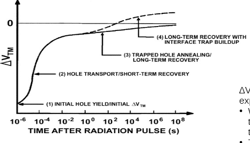

- # Space Radiation Environment and Effects on Embedded Systems
	- ## Interaction of radiation with matter
		- Ionizing radiation is composed of various forms of energetic particles and waves that are capable of dislodging electrons from atoms and molecules, thereby  altering the structure and properties of matter.
			- EM radiation becomes ionizing between 10e15 and 10e16 Hz (between visible and ultraviolet radiation)
			- EM radiation becomes ionizing at around 10 eV
		- ### Three major types of ionizing radiation
			- Alpha particles are effectively helium nuclei, consisting of two protons and two neutrons, and carrying a positive charge of +2. They are relatively large and slow-moving compared to other ionizing particles, and can be stopped by simple barriers such as paper or skin. However, when they collide with atoms or molecules, they can cause significant damage, especially if they are emitted from heavy isotopes with sufficient energy.
			- Beta particles are electrons or positrons that are emitted from the nucleus during radioactive decay. They carry a negative or positive charge of -1 or +1, respectively, and are generally more energetic and faster-moving than alpha particles. Beta particles can penetrate deeper into matter than alpha particles, but can still be stopped by denser materials like plastic or aluminum.
			- Gamma rays, also known as photons, are high-energy electromagnetic waves that have no mass or charge. They are emitted during nuclear decay or other radioactive processes, and can travel long distances through matter and air. Gamma radiation is highly ionizing, but since it is not composed of particles, it interacts differently with matter than alpha or beta radiation. Instead of directly interacting with atoms, gamma rays are absorbed through a process called Compton scattering, in which they collide with electrons and transfer some of their energy, causing the electrons to become ionized.
		- The interactions between ionizing radiation and matter depend on several factors, including the type and energy of the radiation, the density and composition of the material, and the duration and intensity of exposure. In general, dense materials with high atomic numbers are more effective at stopping ionizing radiation than lighter or less dense materials. However, some types of radiation can still penetrate deeply into matter or cause significant secondary ionization, which can lead to harmful biological effects.
		- [[GPT Generated Flashcards]]
		  collapsed:: true
			- What is ionizing radiation? #card
			  id:: 64296f3d-cd3f-4190-a8d2-fef0e137a4af
				- Energetic particles and waves that dislodge electrons from atoms and molecules, altering the structure and properties of matter.
			- Name the three major types of ionizing radiation. #card
			  id:: 64296f3d-84ab-41ee-a829-a629e6912a16
				- Alpha particles, beta particles, and gamma rays.
			- What are alpha particles composed of and what is their charge? #card
			  id:: 64296f3d-b114-44b5-a672-a5df8444483c
				- Two protons and two neutrons, with a positive charge of +2.
			- Can alpha particles penetrate deeply into matter? #card
			  id:: 64296f3d-ca8a-412c-9210-5a770b16bc72
				- No, they can be stopped by simple barriers such as paper or skin.
			- Are beta particles electrons or positrons? #card
			  id:: 64296f3d-e6a2-4e7c-b65f-b0178732e1eb
				- Both, emitted from the nucleus during radioactive decay.
			- What is the charge of beta particles? #card
			  id:: 64296f3d-1dfb-47a3-aa2e-dc69c77f6bb5
				- Negative (-1) for electrons and positive (+1) for positrons.
			- What materials can stop beta particles? #card
			  id:: 64296f3d-646d-43f3-80a0-29cc143f54ee
				- Denser materials like plastic or aluminum.
			- What are gamma rays? #card
			  id:: 64296f3d-8f82-4276-b2a4-b16944fd8a9b
				- High-energy electromagnetic waves with no mass or charge, emitted during nuclear decay or other radioactive processes.
			- How do gamma rays interact with matter? #card
			  id:: 64296f3d-7c7f-4f70-a146-71d41ce10958
				- Through Compton scattering, by colliding with electrons and transferring some of their energy.
			- Which materials are more effective at stopping ionizing radiation? #card
			  id:: 64296f3d-57dd-4c7b-a77b-54894fee033b
				- Dense materials with high atomic numbers.
		- ### Displacement Damage
			- A small portion of energy can be lost in non-ionizing processes which cause atoms to be removed from their lattice sites and form permanent electrically active defects (e.g. interstitial defects) in semiconductor materials.
			- NIEL (non-ionizing energy loss) is that part of the energy introduced via both Coulomb (elastic), nuclear elastic, and nuclear inelastic interactions which creates these defects.
		- ### Particle range
			- The range is the mean distance traveled in a material by a charged particle before coming to rest.
			- The path of heavy charged particles is almost straight, while electrons due to scattering processes are not at all straight.
		- [[GPT Generated Flashcards]]
		  collapsed:: true
			- What type of defects are formed by the removal of atoms from their lattice sites in semiconductor materials? #card
			  id:: 64296f3d-44dd-46d4-8fe9-7addc0bea702
				- Electrically active defects.
			- What does NIEL stand for? #card
			  id:: 64296f3d-b8aa-4a58-a278-9e81ed7120c6
				- Non-ionizing energy loss.
			- DONE What are the three types of interactions that can create defects via NIEL? #card
			  card-last-interval:: -1
			  card-repeats:: 1
			  card-ease-factor:: 2.5
			  card-next-schedule:: 2023-04-03T22:00:00.000Z
			  card-last-reviewed:: 2023-04-03T06:17:32.433Z
			  card-last-score:: 1
			  id:: 64296f3d-4ad6-4576-8175-3ca666370bb5
				- Coulomb elastic, nuclear elastic, and nuclear inelastic interactions.
			- What is the range referring to in regards to charged particles? #card
			  id:: 64296f3d-9dac-4591-8d18-371aba1c33ca
				- The mean distance traveled in a material before coming to rest.
			- How does the path of heavy charged particles compare to that of electrons? #card
			  id:: 64296f3d-cc8b-415b-a6cc-5adbe69c377d
				- Heavy charged particles travel almost straight, while electrons have scattered paths.
	- ## Radiation environment in space
		- ### Three main sources of radiation in space:
			- #### Trapped particles
				- **Charged particles motion in the Earth magnetic field**
				  The Earth's magnetic field lines trap both protons and electrons (in opposing directions) in a helical movement along the lines. These charged particles originate from sources such as the solar wind, cosmic rays, and the Earth's ionosphere. 
				  Their motion is primarily governed by the Lorentz force, which is the force exerted on charged particles by electric and magnetic fields. When these charged particles encounter the Earth's magnetic field, they interact in a way that causes them to follow a spiraling path along the field lines. This trapping of charged particles is an important aspect of the Earth's magnetosphere, as it helps protect the planet from harmful solar and cosmic radiation.
				- **Van Allen radiation belts**
				  The radiation belts are layers around a planet, trapped by its magnetic field.
				  Earth has 2 belts discovered by Van Allen in 1958.
				  The outer belt consists mainly of high energy (0.1\(10 \mathrm{MeV}\) ) electrons.
				  Altitude: \(13000-60000 \mathrm{~km}\left(3-10\right.\) Earth radii \(\left(R_E\right)\) )
				  Highest intensity: \(\sim 4-5 R_E\).
				  The inner belt consist mainly of high energy protons.
				  Altitude: 1000-6000 km (0.2 to 2 Earth radii \(\left(R_E\right)\) )
				- **South Atlantic Anomaly**
				  The South Atlantic Anomaly (SAA) is an area where the Earth's inner Van Allen belt comes closest to the Earth's surface, as low as 200 km.
				  It is due to the fact that the Earth's magnetic field is not perfectly aligned with its geographic center and poles (offset tilted and distorted dipole). Over SSA the Earth's magnetic field is weakest.
				- [[GPT Generated Flashcards]]
				  collapsed:: true
					- What type of charged particles are trapped in Earth's magnetic field lines? #card
					  card-last-interval:: 4
					  card-repeats:: 1
					  card-ease-factor:: 2.6
					  card-next-schedule:: 2023-04-07T06:04:15.760Z
					  card-last-reviewed:: 2023-04-03T06:04:15.760Z
					  card-last-score:: 5
					  id:: 64296f3d-1634-45e8-83a3-576d8d15abab
						- Protons and electrons.
					- What are the sources of charged particles in the Earth's magnetic field? #card
					  card-last-interval:: -1
					  card-repeats:: 1
					  card-ease-factor:: 2.5
					  card-next-schedule:: 2023-04-03T22:00:00.000Z
					  card-last-reviewed:: 2023-04-03T06:19:32.694Z
					  card-last-score:: 1
					  id:: 64296f3d-c029-4841-8d21-530a73680fcc
						- Solar wind, cosmic rays, and Earth's ionosphere.
					- Which force governs the motion of charged particles in the Earth's magnetic field? #card
					  card-last-interval:: 4
					  card-repeats:: 1
					  card-ease-factor:: 2.6
					  card-next-schedule:: 2023-04-07T06:06:18.255Z
					  card-last-reviewed:: 2023-04-03T06:06:18.256Z
					  card-last-score:: 5
					  id:: 64296f3d-953a-46be-924e-80ad9039d019
						- Lorentz force.
					- How does the trapping of charged particles in Earth's magnetosphere benefit the planet? #card
					  card-last-interval:: -1
					  card-repeats:: 1
					  card-ease-factor:: 2.5
					  card-next-schedule:: 2023-04-03T22:00:00.000Z
					  card-last-reviewed:: 2023-04-03T06:07:11.151Z
					  card-last-score:: 1
					  id:: 64296f3d-9412-49cc-bebf-54def9e7d2d8
						- It protects the planet from harmful solar and cosmic radiation.
					- What are the Van Allen radiation belts? #card
					  id:: 64296f3d-3c37-4815-9566-c0652dbde2c6
						- Layers around a planet, trapped by its magnetic field.
					- How many radiation belts does Earth have? #card
					  id:: 64296f3d-040a-4416-9540-c21fa48bbb52
						- 2.
					- Who discovered the Van Allen radiation belts? #card
					  id:: 64296f3d-fd03-4562-99a1-279bb58a24fd
						- Van Allen.
					- What type of charged particles are in the outer belt? #card
					  id:: 64296f3d-ed54-4dd5-a21c-aed5c7d8d678
						- High energy electrons.
					- What is the altitude of the outer belt? #card
					  card-last-interval:: -1
					  card-repeats:: 1
					  card-ease-factor:: 2.5
					  card-next-schedule:: 2023-04-03T22:00:00.000Z
					  card-last-reviewed:: 2023-04-03T06:03:34.184Z
					  card-last-score:: 1
					  id:: 64296f3d-9996-41c0-8b57-ed88b0dc0469
						- 13,000-60,000 km.
					- What type of charged particles are in the inner belt? #card
					  id:: 64296f3d-2b05-49b1-887e-99f19357ed14
						- High energy protons.
					- What is the altitude of the inner belt? #card
					  id:: 64296f3d-def4-458c-a251-ffdc8fd0b649
						- 1,000-6,000 km.
					- What is the South Atlantic Anomaly (SAA)? #card
					  id:: 64296f3d-17b5-4b45-81e1-ff495909448b
						- An area where the Earth's inner Van Allen belt comes closest to Earth's surface.
					- Why does the South Atlantic Anomaly exist? #card
					  id:: 64296f3d-6003-4bbc-a282-579a3c8068c8
						- Earth's magnetic field is not perfectly aligned with its geographic center and poles.
			- #### Solar energetic particles
				- The Sun
					- Sunspots are temporary phenomena on the Sun's photosphere that appear as spots darker than the surrounding areas. They are regions of reduced surface temperature caused by concentrations of magnetic field flux that inhibit convection.
					- Both solar flares and CMEs are energetic events which occur on the Sun associated with high energy particles.
					- A solar flare is a sudden flash of brightness observed near the Sun surface. Solar flares are classified based on their X-ray intensity measured in units of power per area, or Watts per meters squared.
					- In coronal mass ejection, coronal material in the form of huge amount of plasma and electromagnetic radiation is ejected into space at high speeds.
					- [[GPT Generated Flashcards]]
					  collapsed:: true
						- What do sunspots appear as on the Sun's photosphere? #card
						  id:: 64296f3d-4f37-454a-ae41-8cd83f39c47b
							- Darker spots.
						- What causes regions of reduced surface temperature in sunspots? #card
						  id:: 64296f3d-ba9b-4ca1-ac20-6f5915533ed9
							- Concentrations of magnetic field flux.
						- What do solar flares and CMEs have in common? #card
						  id:: 64296f3d-2d4e-4a91-a65c-157f5c32111d
							- They are energetic events which occur on the Sun.
						- How are solar flares classified? #card
						  id:: 64296f3d-2811-44a3-8af0-9e111e02a781
							- Based on their X-ray intensity.
						- What are the units used to measure X-ray intensity of solar flares? #card
						  card-last-interval:: -1
						  card-repeats:: 1
						  card-ease-factor:: 2.5
						  card-next-schedule:: 2023-04-03T22:00:00.000Z
						  card-last-reviewed:: 2023-04-03T06:06:41.440Z
						  card-last-score:: 1
						  id:: 64296f3d-37c7-4f03-bf12-a80e12cc8e0a
							- Watts per meters squared.
						- What is ejected into space during a coronal mass ejection? #card
						  id:: 64296f3d-0452-456d-bd4c-03d399c0e548
							- Plasma and electromagnetic radiation.
						- What characterizes a solar flare? #card
						  id:: 64296f3d-11ae-43cc-8257-80f7b0c8b48f
							- A sudden flash of brightness near the Sun surface.
			- #### Cosmic Rays
				- Cosmic rays are very high-energy heavy particles, mainly originating outside the Solar System.
				- They produce showers of secondary particles that penetrate and impact the Earth`s atmosphere.
				- Cosmic rays have a low incoming flux because of their diffuse origin.
				- The Earth`s magnetic field shields us significantly and also the solar activity reduces the flux (GCR min at solar max).
				- Primary cosmic rays are composed primarily of protons and alpha particles (99%), with a small amount of heavier nuclei (1%)
				- [[GPT Generated Flashcards]]
				  collapsed:: true
					- What are cosmic rays mainly composed of? #card
					  id:: 64296f3d-d79e-46f8-9bd7-352f7280c691
						- Protons and alpha particles.
					- What percentage of cosmic rays are protons and alpha particles? #card
					  id:: 64296f3d-baa1-45d5-9952-016d0ff0b4ce
						- 99%.
					- What percentage of cosmic rays are heavier nuclei? #card
					  card-last-interval:: 4
					  card-repeats:: 1
					  card-ease-factor:: 2.6
					  card-next-schedule:: 2023-04-07T06:06:31.510Z
					  card-last-reviewed:: 2023-04-03T06:06:31.510Z
					  card-last-score:: 5
					  id:: 64296f3d-bd0f-4b46-aa11-1670134d3cbc
						- 1%.
					- What is the relationship between cosmic rays and the Earth's atmosphere? #card
					  id:: 64296f3d-84a9-4f04-b4d8-2544bd8445f7
						- Cosmic rays produce showers of secondary particles that impact and penetrate the Earth's atmosphere.
					- How does the Earth's magnetic field affect cosmic rays? #card
					  id:: 64296f3d-00f8-44e3-84d8-55db3262c82b
						- It shields us significantly from cosmic rays.
					- What is the connection between solar activity and cosmic ray flux? #card
					  card-last-interval:: 4
					  card-repeats:: 1
					  card-ease-factor:: 2.6
					  card-next-schedule:: 2023-04-07T06:16:14.062Z
					  card-last-reviewed:: 2023-04-03T06:16:14.063Z
					  card-last-score:: 5
					  id:: 64296f3d-730a-4fca-b946-0c75e748e15a
						- Solar activity reduces the cosmic ray flux, with the lowest flux occurring at solar maximum.
		- Space radiation type and energy range
			- id:: 6428521e-85a4-454c-b81a-f2afd7c87326
			  | Type | Particle Type | Energy|
			  | Radiation Belts | Electrons | eV∼10MeV |
			  | Radiation Belts | Protons | keV ~500 MeV |
			  |Solare events | Protons | keV ~500 MeV|
			  | Solar events | Ions | 1 to few 10 MeV/n |
			  | GCR | Protons & Ions | Up to several GeV, Max flux at 300 MeV/n |
				- [[GPT Generated Flashcards]]
				  collapsed:: true
					- What energy are in radiation belts for electrons? #card
					  id:: 64296f3d-7a5b-4e29-b88e-b5577eafb4f7
						- eV∼10MeV.
					- What particle energy are in radiation belts for protons? #card
					  id:: 64296f3d-25fa-4825-a991-f819cacaaa21
						- keV ~500 MeV.
					- What particle energy are in solar events for protons? #card
					  id:: 64296f3d-7a7d-4d49-b44c-90600799319a
						- keV ~500 MeV.
					- What particle energy are in solar events for ions? #card
					  id:: 64296f3d-6d98-426d-92ac-6808b6a49b03
						- 1 to few 10 MeV/n.
					- What particle types and energy are in GCR? #card
					  id:: 64296f3d-a90b-4344-a772-738202909f6b
						- Protons & Ions, Up to several GeV, Max flux at 300 MeV/n.
		- #### Space radiation and orbit
			- |Orbit| Radiation type|
			  | LEO (ISS) | Inner radiation belt (protons) and solar particles. |
			  | :--- | :--- |
			  | LEO (polar) |Inner radiation belt (protons), solar particles and GCR over the poles |
			  | MEO and GEO | Outer radiation belt (electrons), solar particles and GCR. |
			  | Interplanetary | Solar Particles and GCR. Trapped particles only during the passage through the belts |
			  | Jupiter | Jupiter radiation belts, solar particles and GCR. |
	- ### Radiation effects
		- #### Cumulative effects
			- Total Ionizing Dose (TID)
			  The energy deposited by the ionizing particles
			  It is measured in Gray (IS) or rad
			  1 Gray = 100 rad
			- TID in MOS devices
			  Basic mechanics:
			  1. electron-hole pairs creation (e.g. in MOS gate/field oxides)
			  2. A fraction of the holes will be transported to the silicon/silicon-dioxide interface
			  3. Deep hole trapping near the interface
			  4. Interface traps within Si bandgap
			  
			  These defects will change the characteristics of the device (Modification of threshold voltage and mobility of the gate and field-oxide)
			- [[GPT Generated Flashcards]]
			  collapsed:: true
				- What is the unit of measurement for Total Ionizing Dose (TID)? #card
				  id:: 64296f3d-414b-45a5-925c-c4124be856bb
					- Gray (Gy) or rad.
				- How many rad equal 1 Gray? #card
				  id:: 64296f3d-012c-449a-baac-91ca5f30a85d
					- 100 rad.
				- In MOS devices, what is created by TID? #card
				  id:: 64296f3d-d86d-40e5-8621-f1425090b02c
					- electron-hole pairs.
				- What happens to a fraction of the holes in MOS devices during TID? #card
				  id:: 64296f3d-f563-44b4-a1cb-113463ecf78f
					- They are transported to the silicon/silicon-dioxide interface.
				- What occurs near the silicon/silicon-dioxide interface during TID in MOS devices? #card
				  card-last-interval:: -1
				  card-repeats:: 1
				  card-ease-factor:: 2.5
				  card-next-schedule:: 2023-04-03T22:00:00.000Z
				  card-last-reviewed:: 2023-04-03T06:11:39.522Z
				  card-last-score:: 1
				  id:: 64296f3d-86c7-46bf-8695-9b8cce98fb1a
					- Deep hole trapping.
					  {:height 232, :width 668}
				- Within the Si bandgap, what is created as a result of TID in MOS devices? #card
				  id:: 64296f3d-eee7-4595-828a-0b079e71da71
					- Interface traps.
				- What characteristics of a MOS device are changed due to TID-induced defects? #card
				  id:: 64296f3d-a8a6-478c-bc14-1fc3c9105548
					- Threshold voltage and mobility of the gate and field-oxide.
			- **Radiation induced charging of gate oxide in N-Channel MOSFET**
			  Radiation induced charging of the gate oxide in N-Channel MOSFETs occurs when ionizing radiation creates electron-hole pairs within the oxide layer. The holes are trapped at the oxide-silicon interface, while the electrons move towards the gate electrode. As the electrons accumulate at the gate, the threshold voltage of the MOSFET decreases, causing an unwanted change in the device's electrical characteristics. This effect is known as radiation-induced threshold voltage shift.
			- **Radiation effects on bipolar devices**
			  Process similar to MOS devices:
			  Charge trapping + Interface States
			  \( \beta=I_C / I_B \)
			  Main effects:
			  1. Increase of base current \(\mathrm{I}_{\mathrm{B}}\)
			  2. Gain degradation ( \(\beta\) or hFE)
			  3. Leakage
			- [[GPT Generated Flashcards]]
			  collapsed:: true
				- What happens when ionizing radiation creates electron-hole pairs within the oxide layer of an N-Channel MOSFET? #card
				  card-last-interval:: -1
				  card-repeats:: 1
				  card-ease-factor:: 2.5
				  card-next-schedule:: 2023-04-03T22:00:00.000Z
				  card-last-reviewed:: 2023-04-03T06:13:13.911Z
				  card-last-score:: 1
				  id:: 64296f3d-fd84-4e59-ba16-1459dfd00e1c
					- Radiation-induced threshold voltage shift.
				- Which particles are trapped at the oxide-silicon interface in an N-Channel MOSFET? #card
				  id:: 64296f3d-fd47-4e3b-9cd4-8012bf17875e
					- Holes.
				- Which particles move towards the gate electrode in an N-Channel MOSFET? #card
				  id:: 64296f3d-60ea-41ec-b83e-1a54bcb39aab
					- Electrons.
				- What is the effect of accumulated electrons at the gate of an N-Channel MOSFET? #card
				  id:: 64296f3d-8169-4691-adf7-f782d6bae5fa
					- Decrease in threshold voltage.
				- What are the two processes that cause radiation effects on bipolar devices? #card
				  id:: 64296f3d-b847-4d25-a5a3-03392fb6e15f
					- Charge trapping and Interface States.
				- What is the formula for defining beta in bipolar devices? #card
				  id:: 64296f3d-6e97-4972-9f68-905cd4943ad9
					- \( \beta=I_C / I_B \)
				- What is the main effect 1 of radiation on bipolar devices? #card
				  id:: 64296f3d-c963-4075-a49e-ce3fddc82e17
					- Increase of base current.
				- What is the main effect 2 of radiation on bipolar devices? #card
				  id:: 64296f3d-6516-4b5d-a13c-93f01f1e5956
					- Gain degradation.
				- What is another term for gain degradation in bipolar devices? #card
				  id:: 64296f3d-5891-460b-9912-67b300279fa3
					- \( \beta\) or hFE.
				- What is the main effect 3 of radiation on bipolar devices? #card
				  id:: 64296f3d-74ee-4c4f-8476-fac828678837
					- Leakage.
			- Radiation can have significant effects on bipolar devices, similar to MOS devices. These effects are mainly due to charge trapping and interface states. The parameter used to describe the amplification of bipolar devices, β or hFE, can degrade due to radiation, ultimately leading to a reduction in gain. The increase in ionizing radiation can lead to an increase in the base current, I_B. Additionally, radiation can also cause leakage in the device. Therefore, it is important to consider radiation effects when designing circuits that are intended to operate in radiation-prone environments, such as satellites or nuclear power plants.
				- **Post Irradiation Recovery**
				  
				  Schematic time dependent post irradiation threshold voltage recovery of a floating gate transistor
				  \(\Delta \mathrm{V}_{\text {TH }}\) is not fixed after radiatio exposure.
				  When \(\mathrm{V}_{\mathrm{GS}}>0 \mathrm{~V}\), holes are trapped into the oxide due to the radiation effect.
				  These trapped holes shifts the operation of the FGT "OFF" to "ON" state even when \(\mathrm{V}_{\mathrm{GS}}=0 \mathrm{~V}\).
				- [[GPT Generated Flashcards]]
				  collapsed:: true
					- What does ΔV_TH represent in a floating gate transistor? #card
					  id:: 64296f3d-d962-4097-86b5-fe0bbf6e9538
						- Post-irradiation threshold voltage recovery.
					- DONE What happens when V_GS > 0 V in a floating gate transistor after radiation exposure? #card
					  card-last-interval:: -1
					  card-repeats:: 1
					  card-ease-factor:: 2.5
					  card-next-schedule:: 2023-04-03T22:00:00.000Z
					  card-last-reviewed:: 2023-04-03T06:16:04.736Z
					  card-last-score:: 1
					  id:: 64296f3d-a1e8-4045-9d36-7ce8a62f1151
						- Holes are trapped into the oxide.
					- What is the impact of trapped holes on the operation of a floating gate transistor? #card
					  id:: 64296f3d-c559-47db-9c60-26297cf5609b
						- Shifts operation from "OFF" to "ON" state when \(V_GS\) = 0 V.
			- DONE Fractional yield by particle type
			- DONE Dose rate
				- **Enhanced Low Dose Rate Sensitivity (ELDRS)** Amount of total dose degradation at a given total dose is greater at low dose rates than at high dose rates
				- Typical TID per different orbits
				  
				- The total TID depends on the amount of shielding
			- Displacement Damage
			- #### Single Event effects
				- ##### Hard errors (non-recoverable)
					- **SEB: Single Event Burnout**
					  SEBs occur when a single energetic-particle strike induces a localized high-current state in a device.
					  Destructive, and if not rapidly quenched, the resultant high current causes the device to go into thermal runaway resulting in destructive failure.
					- **SEGR: Single event Gate Rupture**
					  SEGRs are events in which a single energetic-particle strike results in a breakdown and subsequent conducting path through the gate oxide of a MOSFET.
					  Destructive, and a SEGR is manifested by an increase in gate leakage current and can result in either the degradation or the complete failure of the device.
					- **SEL: Single Event Latch-up**
					  SEL is an abnormal high-current state in a device caused by the
					  passage of a single energetic particle through sensitive regions resulting in the loss of device functionality.
					  Destructive, and if power is not removed quickly, catastrophic failure may occur due to excessive heating or bond wire failure.
					- [[GPT Generated Flashcards]]
					  collapsed:: true
						- What causes a Single Event Burnout (SEB)? #card
						  id:: 64296f3d-4cb4-465b-84b5-f844293a36f7
							- A single energetic-particle strike inducing a localized high-current state in a device.
						- What is the consequence of an unquenched SEB? #card
						  id:: 64296f3d-c99a-4974-9932-a66c8ab76920
							- Destructive failure due to thermal runaway.
						- What causes a Single Event Gate Rupture (SEGR)? #card
						  card-last-interval:: -1
						  card-repeats:: 1
						  card-ease-factor:: 2.5
						  card-next-schedule:: 2023-04-03T22:00:00.000Z
						  card-last-reviewed:: 2023-04-03T06:14:09.424Z
						  card-last-score:: 1
						  id:: 64296f3d-3d23-457f-94b4-264dff0e11ca
							- A single energetic-particle strike leading to the breakdown and conducting path through the gate oxide of a MOSFET.
						- How is an SEGR manifested? #card
						  card-last-interval:: -1
						  card-repeats:: 1
						  card-ease-factor:: 2.5
						  card-next-schedule:: 2023-04-03T22:00:00.000Z
						  card-last-reviewed:: 2023-04-03T06:15:08.911Z
						  card-last-score:: 1
						  id:: 64296f3d-c5aa-4366-96fd-6e633872e42b
							- An increase in gate leakage current.
						- What errors may result from an SEGR? #card
						  card-last-interval:: -1
						  card-repeats:: 1
						  card-ease-factor:: 2.5
						  card-next-schedule:: 2023-04-03T22:00:00.000Z
						  card-last-reviewed:: 2023-04-03T06:19:09.682Z
						  card-last-score:: 1
						  id:: 64296f3d-9a4b-493e-ba1a-de198408e51f
							- Degradation or complete failure of the device.
						- What is a Single Event Latch-up (SEL)? #card
						  card-last-interval:: -1
						  card-repeats:: 1
						  card-ease-factor:: 2.5
						  card-next-schedule:: 2023-04-03T22:00:00.000Z
						  card-last-reviewed:: 2023-04-03T06:07:31.199Z
						  card-last-score:: 1
						  id:: 64296f3d-9f7c-423a-932c-9c65a6e307dd
							- An abnormal high-current state in a device caused by the passage of a single energetic particle through sensitive regions.
						- What happens if power is not removed quickly during an SEL? #card
						  card-last-interval:: -1
						  card-repeats:: 1
						  card-ease-factor:: 2.5
						  card-next-schedule:: 2023-04-03T22:00:00.000Z
						  card-last-reviewed:: 2023-04-03T06:05:28.544Z
						  card-last-score:: 1
						  id:: 64296f3d-ce44-412e-b686-cb4423518541
							- Catastrophic failure due to excessive heating or bond wire failure.
				- ##### Soft errors (recoverable)
					- **SEU: Single Event Upset**
					  SEUs may occur in a digital circuit when a particle strike causes data to change states in a storage element such a flip-flop, latch or memory bit.
					  Not destructive, can be recovered by a soft reboot
					- **SEFI: Single Event Functional Interrupt**
					  SEFIs are interrupts caused by a single particle strike which lead to a temporary non-functionality (or interruption of normal operation) of the affected device. SEFIs occur in a register that controls configuration in, for example, processors, FPGAs or SDRAMs
					  Not destructive, can be recovered by a hard or soft reboot
					- **SET: Single Event Transient**
					  SETs are voltage glitches in circuits caused by single ions. This single event occurs on non-latched elements such as combinatorial logic and clock line or global control lines. The voltage transient generated by this phenomena can propagate any significant distance through the combinatorial logic depending of the width of the transient pulse and the capacitance of the transistor
					  Not destructive, but the technology scaling causes the combinatorial circuit to be more sensitive to transient pulses. The width of the SET is one of the main factors that determine whether an SET will result in an upset (fault) or not.
					- [[GPT Generated Flashcards]]
					  collapsed:: true
						- What is a Single Event Upset (SEU)? #card
						  id:: 64296f3d-8152-493a-83d3-3e9568ca8f7c
							- A particle strike causing data to change states in a storage element like a flip-flop, latch, or memory bit.
						- How can SEUs be recovered? #card
						  id:: 64296f3d-e00e-4212-80af-0990cf01dbf6
							- By a soft reboot.
						- What is a Single Event Functional Interrupt (SEFI)? #card
						  card-last-interval:: -1
						  card-repeats:: 1
						  card-ease-factor:: 2.5
						  card-next-schedule:: 2023-04-03T22:00:00.000Z
						  card-last-reviewed:: 2023-04-03T06:05:19.169Z
						  card-last-score:: 1
						  id:: 64296f3d-8a7c-45f7-8dc3-4e8691fcd630
							- An interrupt caused by a single particle strike, leading to temporary non-functionality of the affected device.
						- How can SEFIs be recovered? #card
						  id:: 64296f3d-1456-46d2-934a-de5f3aa1d202
							- By a hard or soft reboot.
						- What is a Single Event Transient (SET)? #card
						  id:: 64296f3d-5f10-4fce-9147-e84f1baa386e
							- A voltage glitch in circuits caused by a single ion, happening on non-latched elements.
						- Is an SET destructive? #card
						  id:: 64296f3d-4d3b-423c-babd-852367328547
							- No, but it can make combinatorial circuits more sensitive to transient pulses.
						- What factor determines whether an SET will result in an upset? #card
						  id:: 64296f3d-f790-4af2-8915-0320ea635483
							- The width of the SET.
				- Mechanism for heavy ions and protons induced Single Events Effects in embedded systems
				  One of the main mechanisms is ionization, where the ion deposits its energy into the device, causing charge buildup and potentially altering its behavior.
				  
				  Heavy ions can also cause nuclear reactions, which generate secondary ionizing particles that can further cause SEE.
				  
				  Additionally, protons can cause transient disruptions in the device through high-energy collisions with atoms within the material, leading to charge buildup and consequent SEE.
					- [[GPT Generated Flashcards]]
					  collapsed:: true
						- What is one main mechanism for heavy ions and protons induced Single Event Effects in embedded systems? #card
						  id:: 64296f3d-38cb-49d7-9ad1-5d5884eb36e7
							- Ionization.
						- What does ionization cause in the device? #card
						  id:: 64296f3d-efa6-44bf-9745-fdfd3e747744
							- Charge buildup.
						- How can heavy ions cause secondary ionizing particles? #card
						  id:: 64296f3d-845d-428b-af52-3639e0c52e38
							- Nuclear reactions.
						- What can secondary ionizing particles cause? #card
						  id:: 64296f3d-a867-4100-a496-b082da864c5f
							- SEE.
						- How do protons cause transient disruptions in the device? #card
						  card-last-interval:: -1
						  card-repeats:: 1
						  card-ease-factor:: 2.5
						  card-next-schedule:: 2023-04-03T22:00:00.000Z
						  card-last-reviewed:: 2023-04-03T06:12:15.978Z
						  card-last-score:: 1
						  id:: 64296f3d-a757-4880-9ac8-32b549e87337
							- High-energy collisions with atoms.
			- #### DONE Calculation of the upset rate
				- Measure \(\sigma\) vs. LET
					- Testing at high-energy accelerator
					- Cross-section determined from circuit response
				- Integrate with LET spectrum
					- Determine the sensitive volume
					- Requires knowledge of the chip manufacture otherwise
					  assumptions have to be made
				- Radiation is the source of up to almost 50% of the spacecraft anomalies
				- Of spacecraft anomalies caused by radiation, almost 80% are upsets