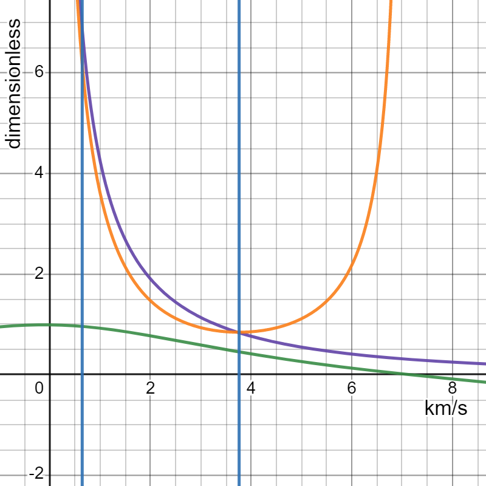
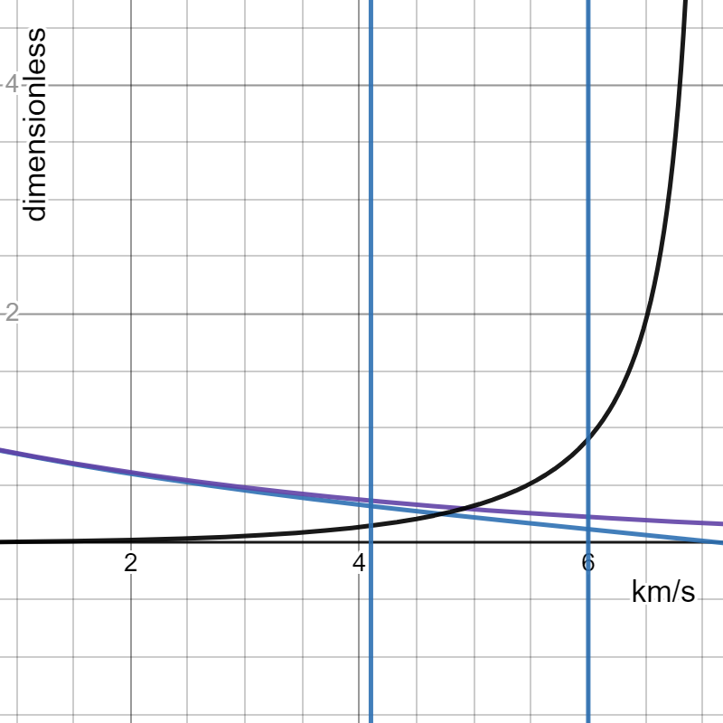
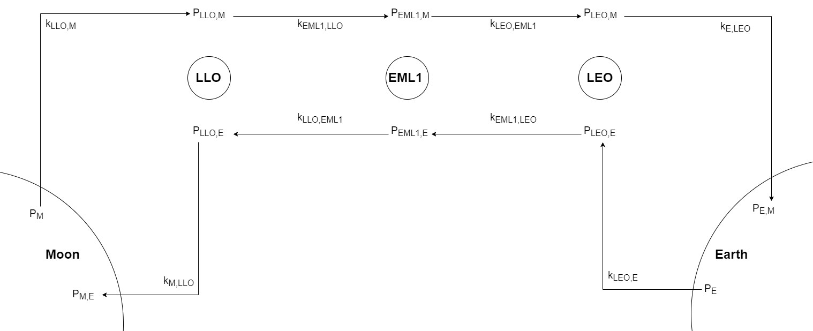
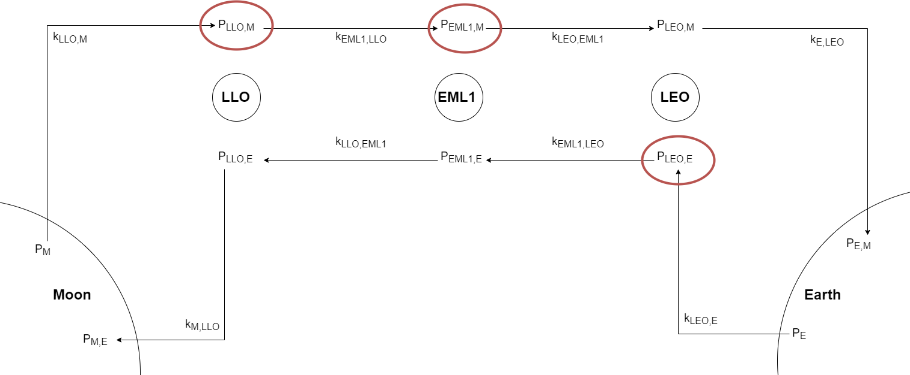
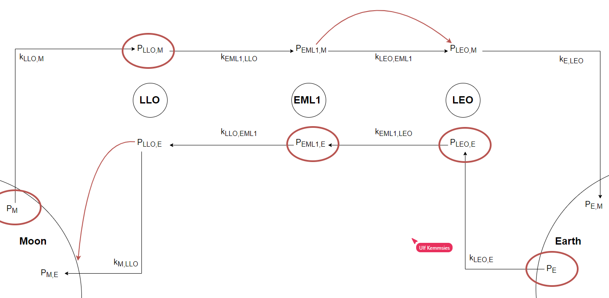
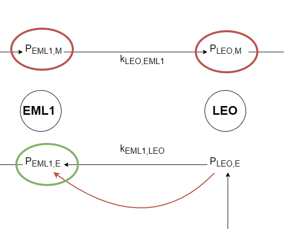
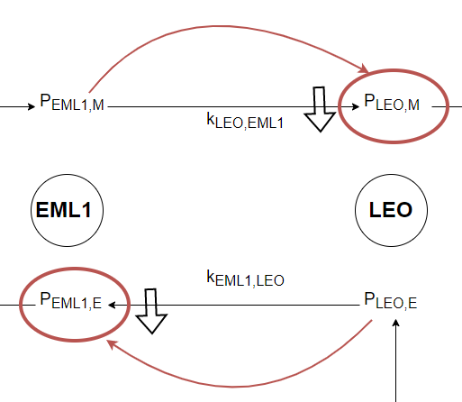

tags:: software, model, space, OOP, blogpost

- Text:
	- When will lunar propellant actually be competitive with Earth's? How do we know exactly how much resources mined in space would cost at any given orbital destination? Let's embark on a modeling journey to find out.
	- The price of resources in space essentially depends on
	  where they are coming from, 
	  where you are buying them, 
	  how they are being transported,
	  and how expensive they were to produce.
	- Each of these factors has a world of complexity within, specially local production costs (which we still have a hard time estimating off of Earth). The other three are more straightforward to investigate: the Moon and Earth (and possibly Near Earth Objects) will likely be the main sources of massive goods in the foreseeable future - these goods will be transported through a network of space tugs, fuel depots, and habitats at several different cislunar points of interest, which is also where they will be bought.
	- However, this transport network does not yet exist - the only comparable piece of existing infrastructure is the ISS, and it was not meant for our more commercially minded purposes. This is a problem because staging a trajectory, or breaking it up into smaller stretches and refueling often, greatly reduces the cost of orbital transport. Tsiolkovsky's rocket equation causes an exponential increase in launch mass as delta V grows, and nipping that growth in the bud is what we're after.
	- # Some Assumptions
		- All vehicles (except for Earth launch) are infinitely reusable and have a negligible profit margin, meaning in-space transport only costs the fuel used in transit.
		- All paths are traversed by the best vehicle available for that stretch.
		- All nodes are also fuel depots and resource storage facilities with infinite capacity.
		- For now, all vehicles (except for Earth launch) are chemical and use LH2/LOx as their propellant - this means the Moon's 600 billion tons of ice will be in great demand as rocket fuel. Later we will also consider non-rocket launch architectures.
		- Propellant sale prices are only adjusted to cover for expenditures, and the assumed profit margin is zero.
		- The delta V's between locations are collected from a variety of sources and are contained in the [[Cislunar Delta V Map]] that remains to be completed fully and one day turned into a self-contained function. When possible, aerobraking is used as an aeroassist for injecting into LEO and ballistic aerocapture when reentering directly to Earth. The difference is around 0.32 km/s for circularization in LEO.
		-
	- # The shoulders I stand on
		- If you haven't yet visited Selenian Boondocks, I highly recommend the blog - a [recent article](https://selenianboondocks.com/2022/04/pf-derivation-split-dv-2/) by Kirk Sorensen saved me some work deriving the equations we're going to need. He considered the case of a vehicle that launches with a payload, drops it off somewhere, and continues on to another location (possibly the original starting point). I will spare you the derivation, which you can find in his article.
		- As a quick reminder, the mass fraction $\eta = m_{init}/m_{init} - m_{propellant}$ for a maneuver is just the fraction between the initial and final mass of the spacecraft after it is done burning propellant. $\eta$ also equals $\Delta V / v_e$, where $v_e$ is the fuel exhaust velocity (depends on the propellant used) and $\Delta V$ the total difference in velocity the engine must impart on the vehicle. This means we can know $\eta$ solely from knowing our propellant and the orbits being traversed.
		- In Sorensen's model, he defines the dry mass of the craft (no propellant or payload) as depending on three terms: [initial-mass-sensitive](https://selenianboondocks.com/2010/02/calculating-gross-mass-sensitive-term/) ($\phi$), [propellant-mass-sensitive](https://selenianboondocks.com/2010/02/calculating-propellant-mass-sensitive-term/) ($\lambda$), and payload-mass-sensitive ($\epsilon$) mass terms. Typical values for in-space (vacuum) liquid hydrogen engines and propellant tanks are $\phi = 0.01$ and $\lambda = 0.03$.
		  $$m_{\text {vehicle }}=\phi m_{\text {initial }}+\lambda m_{\text {prop }}+\epsilon m_{\text {payload }}$$
		-
		- Using some nifty algebra, he arrives upon an expression relating the payload mass to the initial launch mass using only these constants:
		  $$\frac{m_{\text {payload }}}{m_{\text {initial }}}=\frac{1-(\phi+\lambda) \eta_{1} \eta_{2}+\lambda}{\eta_{1}\left(1+\epsilon \eta_{2}-\lambda\left(\eta_{2}-1\right)\right)}$$
		  Here the $\eta$'s are the mass fractions $m_{init}/m_{final}$ for the two maneuvers of the mission (the return trip sans the payload mass).
		- However, we only need a relation between the total propellant mass and the payload for the purposes of this model. So I rearranged his results:
		  $$\frac{m_{prop}}{m_{payload}} = \frac{1-(\phi+\lambda) \eta_{1} \eta_{2}+\lambda}{\eta_{1}\left(1+\epsilon \eta_{2}-\lambda\left(\eta_{2}-1\right)\right)} \cdot (1- \frac{1}{\eta_1 \eta_2}) - (1-\frac{1}{\eta_2})$$
		- What does this [[Propellant-Payload Ratio]] equation tell us? If we know how much propellant was spent delivering our payload, and we know the price we paid for the propellant (and payload) at the starting point, then the price of the payload at the destination if we were to re-sell it, is
		  $$p_{total} =\frac{m_{prop}\cdot p_{prop} + m_{payload} \cdot p_{payload}}{m_{payload}} [\frac{\$}{kg}]$$
		  which is just a weighted average. Notice how we only need our propellant-to-payload ratio, local prices, and one mass to know our final cost at the destination.
		- Let's assume the only cargo we want to ship is propellant itself - this is actually a prerequisite for a more developed model because we need to know the stable prices of fuel at each location before being able to price other goods. With that in mind, if the payload is just more fuel, then the payload-sensitive term ($\epsilon$) introduced by Sorensen is useless (this factor sizes the dry mass needed specifically for non-propellant payload), so now $\epsilon = 0$.
		- Additionally, there are two scenarios which further simplify our equations: if there is no return trip, then $\eta_2 =1$ since the craft's mass does not change. Also, if the return trajectory has the same $\Delta V$ as the initial one, then $\eta_1 = \eta_2 = \eta$. This can only happen when there is no atmosphere to aerobrake in - in orbit or returning to the Moon.
		- It must also be considered that the equations below are not considering staging, since they are mainly describing space-only tugs that don't need it. That means our equations do not apply to multi-stage vehicles and anything launching from Earth.
		- ## Equations to be used:
		- For two-way missions with different $\Delta V$s:
		  $$\frac{m_{prop}}{m_{payload}} = \frac{1-(\phi+\lambda) \eta_{1} \eta_{2}+\lambda}{\eta_{1}\left(1-\lambda\left(\eta_{2}-1\right)\right)} \cdot (1- \frac{1}{\eta_1 \eta_2}) - (1-\frac{1}{\eta_2})$$
		- For two-way missions with identical $\Delta V$s:
		  $$\frac{m_{prop}}{m_{payload}} = \frac{1-(\phi+\lambda) \eta^2+\lambda}{\eta\left(1-\lambda\left(\eta-1\right)\right)} \cdot (1- \frac{1}{\eta^2}) - (1-\frac{1}{\eta})$$
		- For one-way missions:
			- $$\frac{m_{prop}}{m_{payload}} = \frac{1- (\phi +\lambda) \eta +\lambda}{\eta} \cdot (1- \frac{1}{\eta})$$
		- For Sorensen's [[Gross-Sensitive Mass Term]] $\phi$ and [[Propellant-Sensitive Mass Term]] $\lambda$:
		  $$\phi=\frac{(T / W)_{\text {vehicle-initial }}\left(1+\left(f_{T S W}\right)(T / W)_{\text {vac }}\right)}{(T / W)_{\text {engine-initial }}}$$
		  $$\lambda=\frac{(M X R)\left(\frac{f_{O T}}{\rho_{o x}}\right)+\left(\frac{f_{F T}}{\rho_{f u e l}}\right)}{(1+M X R)\left(1-f_{\text {ullage }}\right)}$$
		- Remember that our mass fraction relates to the maneuver $\Delta V$ and propellant exhaust velocity:
		  $$\eta = \exp(\Delta V/v_e)$$
	- # Why one-way rides rule
		- For the same vehicle and trajectory, how much more payload can you deliver (for the same propellant mass burned) by choosing a one-way mission and refueling upon arrival? Conversely, how much more propellant would a two-way trip need to deliver the same payload? Finding this advantage factor is easy:
		  $$(\frac{m_{prop}}{m_{payload}})_2 / (\frac{m_{prop}}{m_{payload}})_1 -1 \rightarrow \frac{m_{payload_1}}{m_{payload_2}} -1 \quad\text{or}\quad \frac{m_{prop_2}}{m_{prop_1}} -1$$
		- To visualize this, let's use typical values for in-space liquid oxygen engines and tanks: $\phi=0.01$, $\lambda=0.03$ and $v_e \approx 4400 m/s$. The x-axis is our $\Delta V$ in km/s. The purple and green line are the $m_{pay}/m_{prop}$ (the inverse of our definition!) ratios for one-way and two-way missions respectively, while the orange line is the advantage factor we defined earlier.
		- {:height 409, :width 446}
		- Even at the local minimum of the advantage factor, one-way trips still deliver nearly 100% more payload than their counterparts. This minimum is close to the $\Delta V$ between LEO and EML1, one of the longest energy-distances one would have to travel if there were refueling nodes at every important cislunar location. This advantage becomes incredible at longer and shorter distances, and specially the short trips are where refueling drastically changes the pricing of space transport. Six times your propellant in payload at 0.64 km/s, the gap between EML1 and LLO? Count me in!
		- In contrast, if one were to plot the $m_{payload}/m_{initial}$ advantage factor, it would quickly become apparent that it matters much less how much initial mass you start with: at around 4 km/s, a one-way trip would only get you around 15% more payload mass than a round trip. This difference only becomes significant after around 5 km/s, and even though the relative advantage factor takes off after 6 km/s, the absolute payload fraction is still tiny. This insensitivity of the payload fraction at low $\Delta V$'s means that filling up the tank completely doesn't make much of a difference for your delivery ratio, and so we will assume that all spacecraft are operating at full (tank) capacity upon departure.
		- {:height 434, :width 489}
	- # How prices propagate
		- ## Simple mass propagation
		  collapsed:: true
			- If I wanted to sell Earth-based LH2/LOx at the Moon's surface, the price would be massively affected by the presence of staging nodes that allow for refueling frequently and between short hops - hopefully the above section clarified how significant the difference in delivered payload prices can be between long hauls and quick trips.
			- To keep our model simple, let's assume that these nodes already exist at 3 key places: Low Lunar Orbit, Earth-Moon Lagrange Point 1, and Low Earth Orbit. That means that our hypothetical propellant must be carried to each node and stockpiled to allow for later refueling - for our purposes, this stockpile already exists at each location. The transfer between one location and the next involves refueling at a new, higher price than the last node because of all that extra propellant mass needed to deliver a payload to a certain location.
			- The $m_{prop}/m_{payload}$ ratios we defined before are only valid for one mission between A and B. When we arrive at B, we will have delivered our payload mass and burned the necessary propellant, so if someone were to buy that payload at B, they would effectively be consuming the total mass (just like we consume lots of oil for overnight shipping):
			  $$m_{total} = m_{prop} + m_{pay} = (\frac{m_{prop}}{m_{pay}} + 1)\cdot m_{pay} \rightarrow \frac{m_{total}}{m_{pay}} = (\frac{m_{prop}}{m_{pay}} + 1)$$
			  So, the increase in total mass required for that propellant to be available at B is just a consequence of describing logistical paths through the payload-propellant relation.
			- What happens if we want to buy this propellant at node C? Let's call our $\frac{m_{prop}}{m_{pay}} = k_{B,A}$ for notation simplicity. Remember, $m_{total}$ is all of the propellant used up to the point of sale plus what was sold.
			  $$ m_{total}= m_{pay_C} \cdot (\frac{m_{total}}{m_{pay}})_{C,B} \cdot (\frac{m_{total}}{m_{pay}})_{B,A} = m_{pay_C} \cdot (k_{C,B} +1) \cdot (k_{B,A} +1)$$
			  So the total payload-propellant relation from A to C is:
			  $$k_{C,A} = [(k_{C,B} +1) \cdot (k_{B,A} +1)] -1 $$
			- To put it more formally, to find the total compounded propellant-payload relation $K_{j,i}$ from the ith to the jth node:
			  $$K_{j,i} = \prod_{i = 2}^{j} (1+k_{i, i-1}) -1$$
			  Now we know the total bought mass (burned + used) from any node to any other node as long as the $\Delta V$s are known between all nodes.
			- ## Simple price propagation
			- Now that we know how propellant mass propagates through the network, maybe a link to the local price of propellant can be made. Back to buying propellant $m_{pay}$ at node B that we paid price $p_A$ for and bought $m_{total}$ at A.
			  $$p_B [\frac{\$}{kg}] = \frac{p_A \cdot m_{total}}{m_{pay}} = \frac{p_A \cdot m_{pay} (k_{B,A} +1)}{m_{pay}} = p_A \cdot (k_{B,A} +1) \rightarrow p_B/p_A = (k_{B,A} +1)$$
			  $$\therefore P_{j,i} = (K_{j,i} +1) \cdot p_i$$
			  A very similar expression to our mass propagation!
			- Now we can know the price of propellant at any node as long as two conditions hold:
				- The flow of propellant must only occur in one direction e.g. from the Moon to Earth.
				- The directional price of propellant at a node only considers propellant coming from the same source.
			- Neither of these are good approximations, since fuel will flow wherever it is needed the most and the earnings are best. However, this "naive" price map will allow us to create initial conditions for the system: All sources travel down the network as far as they can and only take their own fuel into account when calculating prices.
			- 
			-
			- ## More complex price propagation
				- Now each node has two flows of propellant passing through it: one from each source. What if the space transport company decided to stop being naïve (or perhaps just proud) and started using the cheapest available propellant at each node? Mind you, they still want to deliver their homegrown product - that is their payload mass - but the propellant that will be burned anyway can be from anywhere. In the example graph, we compare the two prices available at any node and name the lowest one $P_{i, best}$, which have red circles around them below.
				- 
				- Let's write down the assumed behavior of our space truckers: be sure to ship your own supply, and use the cheapest locally available propellant $P_{best}$ to do it. When you arrive at your destination, you'll have to sell your payload at a new price to not lose money. Let's see what that is:
				  $$p_{i+1,source}^{'} = \frac{m_{prop} \cdot P_{i,best}+ m_{pay} \cdot P_{i,source}}{m_{pay}}$$
				  $$p_{i+1,source}^{'} = k_{i+1,i} \cdot P_{i, best} + P_{i, source}$$
				  $$\Delta p_{i+1,source} = k_{i+1,i} \cdot P_{i, best} + P_{i, source} - p_{i+1,source}$$
				  This useful relation tells us that the price change further down the supply chain depends only on the current and preceding node's local (and best) prices.
				- What if the preceding node's best price is also the one coming from the "correct" source? That is, $P_{i, best} = P_{i, source}$. Then the expression cancels out to
				  $$\frac{p_{i+1,source}^{'}}{P_{i,source}} = k_{i+1,i} +1$$
				  and thus
				  $$\Delta p_{i+1, source} = 0$$
				  This is exactly the same as the price growth described earlier when fuel is only flowing in one direction. This is also the maximum price growth that can happen, because since $P_{i, best} \leq P_{i, source}$,
				  $$\frac{p_{i+1,source}^{'}}{P_{i,source}} = k_{i+1,i} \cdot \frac{P_{i, best}}{P_{i, source}} +1$$
				  must be smaller than the default growth rate.
				- This indicates that we will see two chains of sequential best prices, one coming from each direction, until at some point one fuel beats the other. The only price changes will be one node downstream of the "beaten" price, and the system will stabilize like that.
				- 
				- There is one exceptional case to this equilibrium: if the $\Delta V$s for the two directions of a path are very different, then it is possible that the more expensive flight (which uses much more propellant and thus is more sensitive to price changes) might lower its downstream price so much that it becomes the best price at its node. The example below shows LEO and EML1 interacting because the effect of aerobraking upon arriving at LEO might cause such a $\Delta V$ discrepancy.
				- 
				- This is an unstable state: each locally more expensive price will change its downstream price, and both locally cheapest prices will be driven lower and lower by each other. Such a recursively falling price would require the fuel to be shipped back and forth and sold for less and less while actually costing more (transport isn't free). Even if there were cheaper to do this due to some slight arbitrage, the advantage would be slimmer every cycle, and at one point no longer be worth it. In order to prevent such loops, we will simply make the $\Delta p$ for that trajectory zero until the end of the simulation.
				- 
				- Eventually, the system will arrive at a stable state where prices are no longer changing, and exactly that state is what we need in order to model the pricing of other resources in cislunar space! Without the local, optimal prices for propellant, no other prices can realistically be estimated.
			- ## Converging on stable prices
				- In order to efficiently calculate the propagation of prices for all nodes simultaneously, we can re-write
				  $$\Delta p_{i+1,source} = k_{i+1,i} \cdot P_{i, best} + P_{i, source} - p_{i+1,source}$$
				  as a matrix equation:
				  $$\vec{\Delta p_{i+1}} = \mathbf{K} \cdot \vec{P_{ best}} + \mathbf{L} \cdot \vec{P}$$
				- Each fuel source (and thus price) is described by a separate such equation, but since $\vec{P_{best}}$ depends on the price of all fuels at each node, we cannot solve the equations independently of each other before knowing $\vec{P_{best}}$.
				- There are also some boundary conditions that change our matrices $\mathbf{K}$ and $\mathbf{L}$: since the production price of fuel at each source cannot be affected by the system's price dynamics, $\Delta \vec{p} = 0$ at those nodes for the respective fuel. We are assuming that these prices only change over the long term, much more slowly than the mechanisms at play here.
				- Let's exemplify what our full equation might look like for lunar fuel. The convention used in this example is that the moon is node 5 and its fuel flows to Earth at node 1. There are 3 intermediary nodes (as shown in the graph above): LLO, EML1, and LEO. 
				  $$\begin{bmatrix}
				  \Delta p_1 \\ \Delta p_2 \\ \Delta p_3 \\ \Delta p_4 \\ \Delta p_5
				  \end{bmatrix}_{M} =
				  \begin{bmatrix}
				  0 & k_{1,2} & 0 & 0 & 0\\
				  0 & 0 & k_{2,3} & 0 & 0\\
				  0 & 0 & 0 & k_{3,4} & 0\\
				  0 & 0 & 0 & 0 & k_{4,5}\\
				  0 & 0 & 0 & 0 & 0
				  \end{bmatrix} \cdot
				  \begin{bmatrix}
				  p_1 \\ p_2 \\ p_3 \\ p_4 \\ p_5
				  \end{bmatrix}_{best} +
				  \begin{bmatrix}
				  -1 & 1 & 0 & 0 & 0\\
				  0 & -1 & 1 & 0 & 0\\
				  0 & 0 & -1 & 1 & 0\\
				  0 & 0 & 0 & -1 & 1\\
				  0 & 0 & 0 & 0 & 0
				  \end{bmatrix} \cdot
				  \begin{bmatrix}
				  p_1 \\ p_2 \\ p_3 \\ p_4 \\ p_5
				  \end{bmatrix}_{M}
				  $$
				  Remember that here, the downstream node of the flow is at $i-1$ instead of $i+1$. Our boundary condition and the price propagation equations are collected in two matrices so that, if we know all the current prices of the network, then we can find their change over the next timestep.
				- Similarly, for Earth fuel (which flows toward $i+1$), the equation looks like this:
				  $$\begin{bmatrix}
				  \Delta p_1 \\ \Delta p_2 \\ \Delta p_3 \\ \Delta p_4 \\ \Delta p_5
				  \end{bmatrix}_{E} =
				  \begin{bmatrix}
				  0 & 0 & 0 & 0 & 0\\
				  k_{2,1} & 0 & 0 & 0 & 0\\
				  0 & k_{3,2} & 0 & 0 & 0\\
				  0 & 0 & k_{4,3} & 0 & 0\\
				  0 & 0 & 0 & k_{5,4} & 0
				  \end{bmatrix} \cdot
				  \begin{bmatrix}
				  p_1 \\ p_2 \\ p_3 \\ p_4 \\ p_5
				  \end{bmatrix}_{best} +
				  \begin{bmatrix}
				  0 & 0 & 0 & 0 & 0\\
				  1 & -1 & 0 & 0 & 0\\
				  0 & 1 & -1 & 0 & 0\\
				  0 & 0 & 1 & -1 & 0\\
				  0 & 0 & 0 & 1 & -1
				  \end{bmatrix} \cdot
				  \begin{bmatrix}
				  p_1 \\ p_2 \\ p_3 \\ p_4 \\ p_5
				  \end{bmatrix}_{E}
				  $$
				- Arriving at a stable price state simply requires: establishing the best prices, calculating the $\Delta p$'s, and moving forward in time by adding them to the current prices - iteratively, until $\Delta P= \vec{0}$.
		- # Setting up the model
		  collapsed:: true
			- The stable price state defined above is only stable within a macro time period e.g. a year. The objective is to model how this state changes from one macro period to the next, for instance over the next decade. The parameters that alter how the network will converge at the beginning of each period are the ones we previously assumed as static:
				- The location (and existence) of nodes i.e. the structure of the graph itself
				  The $\Delta V$'s between the nodes
				  The best vehicle used for every edge or trajectory ($\phi$ and $\lambda$)
				  The production price of each fuel at its source $P_M$ and $P_E$
				- From these, we can calculate the propellant-payload relations $k_{B,A}$ for each trajectory, the $\mathbf{K}$ matrices, as well as the initial "naïve" (unidirectional) price state for each fuel type. In short, everything needed to converge on a final stable price state.
			- These macro-parameters can both change smoothly over time (local fuel costs falling 2% per year) and/or cause sudden effects as events (a node being built in LLO or new lunar lander introduced). The inherent uncertainty and variability of these parameters can be somewhat rectified through their modeling as samples from a probability distribution through Monte Carlo simulation. Some variables need to be sampled only at the beginning of the entire simulation (initial existing nodes), and others at the beginning of every time period (YoY fuel production cost change). The definition of these probability distributions is the crux of the model's quality and fidelity.
			- ## Steps for setup
				- Define the initial conditions for the system
					- Nodes
					- Vehicles
					- Fuel sources (and prices)
				- Define events to happen in simulation timeframe
				- Define all macro parameters' probability distributions (for those with sufficient uncertainty)
					- Smooth rates of change
					- Timing for each event
		- # Further Work
		  collapsed:: true
			- Adding a profit margin per trajectory
			- Realistically model the initial response to system changes (e.g. lunar lander making two-way trips to LLO until it becomes until one-way becomes possible through accumulated fuel)
			- Modeling real capacity of fuel and materials at nodes (they can be full)
			- Using different market shares of companies/vehicles to model percentage of all interactions happening like that (Markov Chains?)
			- Include price of vehicles and finite reusability, make them recoup initial cost over first X trips and price that in
			- Include Earth financial market behavior and how interest rates affect investment in cislunar infrastructure (by changing the discount rate and thus NPV)
			- Model how Earth launch prices affect the price of building nodes and ISRU over time
			- Assume structural percentage of total mass for orbital structures and find price of construction taking differently sourced materials into account
			- Add the possibility of non-chemical launch systems, other fuels, other propulsion mechanisms (electric)
			- Add real time passing for price convergence calc? Or perhaps consider how financial instruments like futures can affect these price changes?
			- [[Cost sources for in-space shipping]]:
			- Define vehicles for each trajectory:
				- Anything not touching the moon, Earth, Asteroids, or LEO: in-space tug with LH2/LOx propellant
				- Going and coming from lunar surface: lunar lander with LH2/LOx propellant
					- Consider that long haul trips to the moon e.g. from LEO might be staged
					- Assuming a T/W ratio of 2:1 for launch from Moon
				- Any vehicle performing aerobraking to LEO: same as in-space tug but with 15% more initial mass
				- Earth to LEO launch: starship or other rocket with good info and prices
					- launch cost is already known this will be fixed instead of calculating from vehicle properties
				- Earth re-entry from LEO: shuttle-style winged vehicle for minimum fuel usage
				-
					-