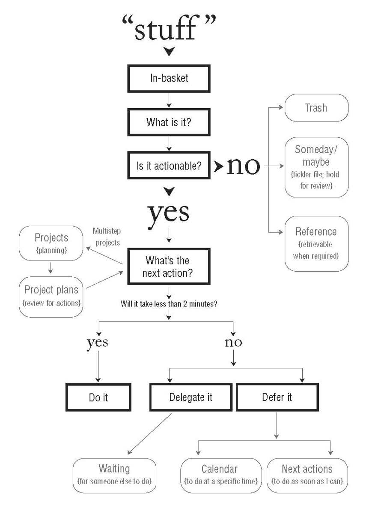
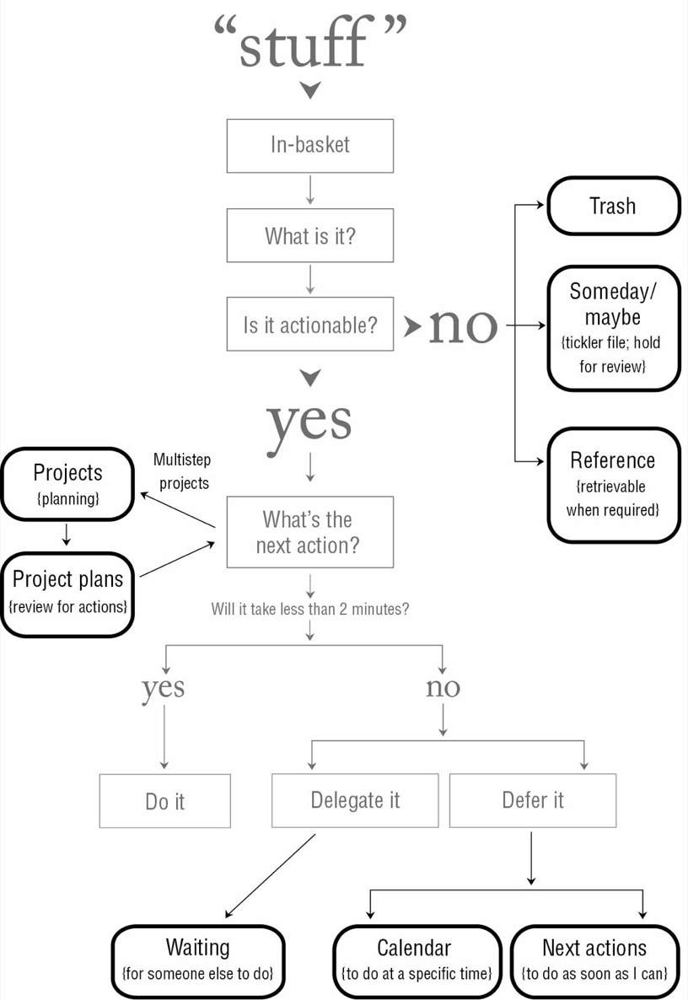

- Book notes:
	- # General quotes:
		- Your ability to generate power is directly proportional to your ability to relax.
		- Anything that does not belong where it is, the way it is, is an “open loop,” which will be pulling on your attention if it’s not appropriately managed.
		- Think like a man of action, act like a man of thought.
		- Most often, the reason something is on your mind is that you want it to be different than it currently is, and yet:
			- you haven’t clarified exactly what the intended outcome is
			- you haven’t decided what the very next physical action step is; and/or
			- you haven’t put reminders of the outcome and the action required in a system you trust
		- We need to transform all the “stuff” we’ve attracted and accumulated into a clear inventory of meaningful actions, projects, and usable information.
		- Thought is useful when it motivates action and a hindrance when it substitutes for action.
		- Things rarely get stuck because of lack of time. They get stuck because what “doing” would look like, and where it happens, hasn’t been decided.
		- Clarifying things on the front end, when they first appear on the radar, rather than on the back end, after trouble has developed, allows people to reap the benefits of managing action.
		- **Getting things done requires two basic components: defining (1) what “done” means (outcome) and (2) what “doing” looks like (action).**
		- You need to control commitments, projects, and actions in two ways—horizontally and vertically
			- Horizontal control maintains coherence across all the activities in which you are involved.
			- Vertical control, in contrast, manages thinking, development, and coordination of individual topics and projects.
		- There is usually an inverse relationship between how much something is on your mind and how much it’s getting done.
		- There is no reason to ever have the same thought twice, unless you like having that thought.
		- Ask yourself, “When do I need to see what, in what form, to get it off my mind?” You build a system for function, not just to have a system.
		- It is better to be wrong than to be vague.
		- THE KEY INGREDIENTS of relaxed control are (1) clearly defined outcomes (projects) and the next actions required to move them toward closure, and (2) reminders placed in a trusted system that is reviewed regularly.
		- Simple, clear purpose and principles give rise to complex and intelligent behavior. Complex rules and regulations give rise to simple and stupid behavior.
		- Plans get you into things but you’ve got to work your way out.
	- # The Five Steps of Mastering Workflow
		- We (1) capture what has our attention; (2) clarify what each item means and what to do about it; (3) organize the results, which presents the options we (4) reflect on, which we then choose to (5) engage with.
		- ## Capture
			- As soon as you attach a “should,” “need to,” or “ought to” to an item, it becomes an incomplete.
			- In order to manage this inventory of open loops appropriately, you need to capture it into “containers” that hold items in abeyance until you have a few moments to decide what they are and what, if anything, you’re going to do about them. Then you must empty these containers regularly to ensure that they remain viable capture tools.
			- ### The Success Factors for Capturing
				- **Get It All Out of Your Head**
					- Keep everything in your head or out of your head. If it’s in between, you won’t trust either one.
					- These collection tools should become part of your lifestyle. Keep them close by so no matter where you are you can collect a potentially valuable thought
				- **Minimize the Number of Capture Locations**
					- You should have as many in-trays as you need and as few as you can get by with.
				- **Empty the Capture Tools Regularly**
		- ## Clarify
			- Many people try to get organized but make the mistake of doing it with incomplete batches of stuff. You can’t organize what’s incoming—you can only capture it and process it.
			- 
			- What Is It?
				- do we actually need to do something about them?
			- Is it actionable?
		- ## Organize
			- To manage actionable things, you will need
				- a list of projects, storage or files for project plans and materials
					- I define a project as any **desired result that can be accomplished within a year that requires more than one action step**.
					- Another way to think of this is as a list of open loops, no matter what the size.
				- a calendar
					- time-specific actions
					- Day-specific actions
					- Day-specific information
					- No More “Daily To-Do” Lists on the Calendar
				- a list of reminders of next actions
				- a list of reminders of things you’re waiting for
			- To manage inactionable things:
				- Trash
				- Incubation
					- Someday/Maybe lists
						- These items are of the nature of “projects I might want to do, but not now . . . but I’d like to be reminded of them regularly.”
						- Category-specific "tickler" lists e.g. books to read
					- Tickler System
						- A second type of things to incubate are those you don’t want or need to be reminded of until some designated time in the future.
				- Reference Material
					- Many things that come your way require no action but have intrinsic value as information.
					- Topic-and area-specific storage
					- General-reference files
			- 
				-
		- ## Reflect
			- You need to be able to step back and review the whole picture of your life and work from a broader perspective as well as drop down “into the weeds” of concrete actions to take, as needed, and at appropriate intervals.
			- What to Review When
				- The item you’ll probably review most frequently is your calendar, which will remind you about the “hard landscape” for the day—that is, what things truly have to be handled that day.
				- After checking your calendar, you’ll most often turn to your Next Action lists. These hold the inventory of predefined actions that you can take if you have any discretionary time during the day.
				- Projects, Waiting For, and Someday/Maybe lists need to be reviewed only as often as you think they have to be in order to stop you from wondering about them.
			- Critical Success Factor: The Weekly Review
				- Everything that might require action must be reviewed on a frequent enough basis to keep your mind from taking back the job of remembering and reminding.
				- The Weekly Review is the time to:
					- Gather and process all your stuff.
					  Review your system.
					  Update your lists.
					  Get clean, clear, current, and complete.
		- ## Engage
			- Every decision to act is an intuitive one. The challenge is to migrate from hoping it’s the right choice to trusting it’s the right choice.
			- ### Three Models for Making Action Choices
				- **The Four-Criteria Model for Choosing Actions in the Moment**
					- Context
						- A few actions can be done anywhere (such as drafting ideas about a project with pen and paper), but most require a specific location (at home, at your office) or having some productivity tool at hand, such as a phone or a computer.
					- Time Available
					- Energy Available
						- Timing during the day
						- Rate from 0 to 10 and make bins for energy levels?
					- Priority
				- **The Threefold Model for Identifying Daily Work**
					- Doing Predefined Work
						- working from your Next Actions lists and calendar
					- Doing Work as It Shows Up
						- Every day brings surprises—unplanned-for things that just show up—and you’ll need to expend at least some time and energy on many of them.
					- Defining Your Work
						- As you process your inputs, you’ll no doubt be taking care of some less-than-two-minute actions and tossing and filing numerous things (another version of doing work as it shows up). A good portion of this activity will consist of identifying things that need to get done sometime, but not right away.
				- **The Six-Level Model for Reviewing Your Own Work**
					- Ground: Current Actions
						- This is the accumulated list of all the actions you need to take
					- Horizon 1: Current Projects
						- These are the relatively short-term outcomes you want to achieve
					- Horizon 2: Areas of Focus and Accountabilities
						- You create or accept your projects and actions because of the roles, interests, and accountabilities you have. These are the key areas of your life and work within which you want to achieve results and maintain standards.
						- And your personal life has an equal number of such focus arenas: health, family, finances, home environment, spirituality, recreation, etc.
					- Horizon 3: Goals
						- What you want to be experiencing in various areas of your life and work one to two years from now will add another dimension to defining your work.
					- Horizon 4: Vision
						- Projecting three to five years into the future generates thinking about bigger categories: organization strategies, environmental trends, career and lifestyle transition circumstances.
						- Internal factors include longer-term career, family, financial, and quality-of-life aspirations and considerations. Outer-world issues could involve changes affecting your job and organization, such as technology, globalization, market trends, and competition.
					- Horizon 5: Purpose and Principles
						- This is the big-picture view. Why does your company exist? Why do you exist? What really matters to you, no matter what? The primary purpose for anything provides the core definition of what the work really is. It is the ultimate job description. All goals, visions, objectives, projects, and actions derive from this, and lead toward it.
					-
		-
	- # The Five Phases of Project Planning
		- ## Enhancing Vertical Focus
			- Sometimes, however, you may need greater rigor and focus to get a project or situation under control, to identify a solution, or to ensure that all the right steps have been determined. This is where vertical focus comes in.
			- Most of the thinking you’ll need to do is informal, what I call back-of-the-envelope planning
		- ## The Natural Planning Model
			- You have an urge to make something happen; you image the outcome; you generate ideas that might be relevant; you sort those into a structure; and you define a physical activity that would begin to make it a reality.
			- How much planning is required: If the project is still on your mind, there’s more thinking required.
			- If you’re waiting to have a good idea before you have any ideas, you won’t have many.
			- Your mind goes through five steps to accomplish virtually any task:
				- 1 | Defining purpose and principles
					- It never hurts to ask the why question. Here are just some of the benefits of asking why:
						- It defines success.
						  It creates decision-making criteria.
						  It aligns resources.
						  It motivates.
						  It clarifies focus.
						  It expands options.
					- A great way to think about what your principles are is to complete this sentence: “I would give others totally free rein to do this as long as they . . .” As long as they what?
					- Whereas purpose provides the juice and the direction, principles define the parameters of action and the criteria for excellence of conduct.
				- 2 | Outcome visioning
					- This is the what instead of the why.
					- There is a simple but profound principle that emerges from understanding the way your perceptive filters work: you won’t see how to do it until you see yourself doing it.
				- 3 | Brainstorming
					- Once you know what you want to happen and why, the how mechanism is brought into play.
					- Capturing ideas: mind mapping, clustering, patterning, webbing, and fish boning.
					- The great thing about external brainstorming is that in addition to capturing your original ideas, it can help generate many new ones that might not have occurred to you if you didn’t have a mechanism to hold your thoughts and continually reflect them back to you.
					- Brainstorming Keys
						- Don’t judge, challenge, evaluate, or criticize.
						- Go for quantity, not quality.
						- Put analysis and organization in the background.
				- 4 | Organizing
					- Give structure to the result of brainstorming
					- The Basics of Organizing
						- Identify the significant pieces
						- Sort by (one or more):
							- components
							- sequences
							- priorities
						- Detail to the required degree
				- 5 | Identifying next actions
					- Answering the question about **what, specifically, you would do about something physically if you had nothing else to do** will test the maturity of your thinking about the project. If you’re not yet ready to answer that question, you have more to flesh out at some prior level in the natural planning sequence.
					- The Basics
						- Activating the Moving Parts
							- A project is sufficiently planned for implementation when every next-action step has been decided on every front that can actually be moved on without some other component’s having to be completed first.
							- “Is there something that anyone could be doing on this right now?”
						- Next Action in the Planning Process
							- Sometimes the next action will be a return to the planning process, which is okay
							- If the next action is not yours, you must nevertheless clarify whose it is
					-
			- Are you aware of a need for greater clarity, or great action, on any of your projects?
				- More clarity? Move up the planning chain.
				- More action? Move down the planning chain.
	- # Setting Up the Time, Space, and Tools
		- ## Tricks
			- The 2 minute rule: if it takes less than two minutes to do, do it now
			- Put it in front of the door (of your mind)
		- ## Setting Aside the Time
			- create a block of time to initialize this process and prepare a workstation with the appropriate space, furniture, and tools.
			- Capturing everything and assigning actions: An ideal time frame for most people is **two whole days, back to back**.
			-
		- ## Setting Aside the Space
			- You must have a dedicated, individual, self-contained workspace—at home, at work, and even in transit.
			- You need to use your system—not continually have to re-create it.
			- You can work virtually anywhere if you have a clean, compact system and know how to process your stuff rapidly and portably.
		- ## Getting the Tools You Need
			- ### The Critical Factor of a Filing System
				- You will resist the whole process of capturing information if your reference systems are not fast, functional, and fun.
				- It should take you **less than one minute** to pick something up out of your in-tray or print it from e-mail, decide it needs no next action but has some potential future value, and finish storing it in a trusted system.
				- Things you name, you own. Collected but unnamed stuff owns you.
				- In the fire zone of real work, if it takes longer than sixty seconds to file something where it belongs, you won’t file, you’ll “stack.”
				- Purge Your Files at Least Once a Year
			- ### Tools to be used for each purpose
				- Information processing
				-
				-
				-