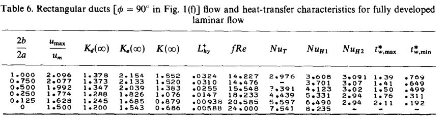

public:: true

- Previous model recap
	- Propulsion background (common equations)
		- The equations for analyzing the performance of micropropulsion systems are given by:
		  Thrust (F): $F = \dot{m}V_e + (p_e - p_a)A_e$
		  
		  Exhaust velocity (V_e): $V_e = M_e\sqrt{kRT_1}$
		  
		  Mass flow rate ($\dot{m}$): \(\dot{m}=A_t p_1 k \frac{\sqrt{\left(\frac{2}{k+1}\right)^{\frac{k+1}{k-1}}}}{\sqrt{k R T_1}}\)
		  
		  Mach number at the exit (M_e):
		  $A_e/A_t = ((k+1)/2)^{(k+1)/(2(k-1))}M_e^{-1}(1+(k-1)/2M_e^2)^{(k+1)/(2(k-1))}$
		  
		  Temperature at the exit (T_e): $T_e = T_1(1+(k-1)/2M_e^2)^{-1}$
		  
		  Pressure at the exit (p_e): $p_e = p_1(1+(k-1)/2M_e^2)^{-k/(k-1)}$
		  
		  Specific impulse (I_sp): $I_sp = F/\dot{m}g$
		- The Reynolds number of the flow in a nozzle is a good measure for how large exactly this boundary layer is, and is traditionally given by
		  \(R e=\frac{\rho \cdot v \cdot D}{\mu}\).
		  Smaller nozzles will naturally cause the flow Reynolds number to become very small.
	- Conventional Nozzles project
		- Performance Losses
			- Divergence Losses 
			  When the exit half angle of a nozzle is greater than 0°, the gases ejected from the nozzle are not parallel to the direction of thrust. This results in momentum components in directions perpendicular to the thrust vector. However, since the nozzle is symmetric, these perpendicular momentum components cancel each other out and do not cause thrust misalignment. Nevertheless, they contribute to a loss in thrust as not all momentum is effectively used to propel the spacecraft forward.
			  
			  The divergence thrust correction factor, denoted as ε_div, quantifies this loss. It is calculated using the equation:
			  
			  \(\epsilon_{div} = 1 - \frac{1 - \cos(\alpha)}{2}\)
			  
			  where α represents the exit half angle of the nozzle. This loss factor depends solely on the exit half angle and affects both large and small nozzles.
			- Boundary Layer Losses
			  The boundary layer is formed along the nozzle wall due to viscous flow effects, causing the flow to slow down near the walls and deflect the full flow. This phenomenon is more significant in micro-nozzles due to their low Reynolds number, which increases the skin friction coefficient and causes larger boundary layers.
			  
			  Characterizing the boundary layer is crucial for predicting performance losses in micro-nozzles. A simplified model using flat plate boundary layer solutions can be used for linear convergent-divergent micro-nozzles. The skin friction coefficient for incompressible, laminar flow is given by the equation \(c_{f x}=\frac{0.664}{\sqrt{R e_x}}\), where \(R e_x\) is the Reynolds number.
			  
			  The momentum thickness (\(\theta_x\)) and displacement thickness (\(\delta^*\)) are given by
			  \(\begin{gathered}\theta_x=c_{f x} \cdot x \\ \delta^*=2.59036 \cdot \theta_x\end{gathered}\)
			  respectively. The displacement thickness represents how much the flow is displaced by the boundary layer. The angle of the nozzle divergent should be optimized to balance displacement thickness and divergence losses. The true area ratio of the nozzle can be calculated using \(\left(\frac{A_e}{A_t}\right)_{t r u e}=\frac{2 \cdot\left(R_e-\delta^*\right)}{W_t}\), where \(W_t\) is the throat width.
			  
			  It is important to note that the assumptions made in this boundary layer solution include laminar and attached flow, as well as the assumption that the boundary layer starts developing at the throat and increases in size until the nozzle exit.
			- Momentum Losses
			  The presence of a boundary layer in addition to the modification of effective nozzle geometry leads to momentum losses in the flow. These losses occur as the flow loses momentum within the boundary layer. To account for this, the thrust loss due to momentum can be calculated using the equation:
			  
			  \(\Delta F_{\text {momentum }}=\left(\rho_c \cdot u_c \cdot\left(2 \pi R_c\right) \cdot \theta_c\right) \cdot u_e\)
			  
			  It is important to note that for nozzles with non-circular cross sections, the circumference term should be replaced with the equivalent perimeter.
		- Reference Temperature Approach
		  The previous section discussed a method for predicting boundary layer properties assuming incompressible flow. However, when the flow becomes supersonic, this assumption is no longer valid. To account for this, the "Reference Temperature Approach" corrects the skin friction coefficient using an average temperature across the boundary layer. The correction can be calculated using the equation:
		  
		  \[c_f=c_{f, i}\left(\frac{T_w / T_0+1}{2}+0.22 \frac{\gamma-1}{2} M^2\right)^{-0.6}\]
		  
		  where \(T_w\) is the wall temperature and \(T_0\) is the stagnation temperature at the point where the skin friction coefficient is determined. In this context, we only consider the exit stagnation temperature, as the characteristics of the flat plate boundary layer will be determined at the exit of the nozzle to quantify the loss in exit area. The exit total temperature (\(T_{0_e}\)) can be calculated using isentropic relations:
		  
		  \[T_{0_e}=T_e \cdot\left(1+\frac{\gamma-1}{2} \cdot M_e^2\right)\]
		  
		  This equation can be used for any point along the nozzle, as long as the corresponding flow Mach number (\(M_e\)) is used.
		- Aggregate Performance Loss
		  To calculate the aggregate performance loss, a step-by-step procedure is followed. First, independent loss factors not affected by boundary layer effects are determined. The divergence thrust correction factor is calculated based on the divergent half angle. Then, the properties of the boundary layer, such as the compressible skin friction coefficient, exit momentum thickness, and exit displacement thickness, are calculated using known flow parameters.
		  
		  The following steps are taken to account for boundary layer effects:
		  
		  1. Thrust reduction due to momentum loss is determined based on the momentum thickness.
		  2. The true area ratio is determined based on the displacement thickness.
		  3. The true area ratio leads to a lower exit pressure than predicted by IRT (Isentropic Relation Theory). The effective pressure ratio and exit pressures are iteratively determined using the equation:
		  
		  \(\frac{\mathrm{A}_{\mathrm{e}}}{\mathrm{A}_{\mathrm{t}}}=\frac{\Gamma}{\sqrt{\frac{2 \gamma}{\gamma-1} \cdot\left(\frac{\mathrm{p}_{\mathrm{e}}}{\mathrm{p}_{\mathrm{c}}}\right)^{\left(\frac{2}{\gamma}\right)}\left(1-\left(\frac{\mathrm{p}_{\mathrm{e}}}{\mathrm{p}_{\mathrm{c}}}\right)^{\left(\frac{\gamma-1}{\gamma}\right)}\right)}}\)
		  
		  4. The resulting aggregate thrust loss is calculated by combining the divergence loss, momentum loss, and reduced exit pressure. The true thrust, estimated using this methodology, is given by:
		  
		  \(F_{\text {true }}=m \cdot \epsilon_{\text {div }} \cdot \sqrt{2 \cdot \frac{\gamma}{\gamma-1} \cdot \frac{\mathrm{R}_{\mathrm{A}}}{\mathrm{M}} \cdot \mathrm{T}_{\mathrm{c}} \cdot\left(1-\left(\frac{\mathrm{p}_{\mathrm{e}}}{\mathrm{p}_{\mathrm{c}}}\right)_{\text {true }}^{\frac{\gamma-1}{\gamma}}\right)}-\Delta F_{\text {momentum }}\)
		  
		  Finally, the thrust coefficient can be determined using the equation:
		  
		  \(C_{F_{\text {true }}}=\frac{F_{\text {true }}}{p_c \cdot A_t}\)
	- Wavy chambers project
		- Given the extremely low Reynolds numbers, the flow was assumed to be completely laminar. The following assumptions were used:
		  • Incompressible flow
		  • Steady state (this was verified with transient simulations)
		  • Negligible radiative and natural convective heat transfer
		  • Negligible viscous dissipation
		  • Laminar flow
		  • Constant fluid properties
		- Constant heat flux and constant wall temperature were assumed, with a wall temperature of 370 K and a constant heat flux chosen so that the water in the chambers would not exceed 370 K, thus remaining liquid.
		- Performance factors (only considered for liquid phase)
			- Larger contact area helps reduce wall temperature. Lower channel temperature means a simpler heat management. Minimizing the leakage of heat from the thruster to the surrounding environment leads to higher heating efficiency, lowering the power requirements.
			- The Nusselt number is a dimensionless parameter used in heat transfer analysis to quantify the relationship between convective and conductive heat transfer across a boundary or surface.
			  It considers factors such as thermal conductivity, fluid properties, and flow characteristics. For low Reynolds numbers (between 10 and 100), the Nusselt number increases significantly with increasing Reynolds numbers.
			  
			  A higher Nusselt number also means that, given a wall temperature, a shorter channel is needed to reach certain fluid temperature (or vaporization).
			  
			  Studies have shown that wavy microchannels result in higher Nusselt numbers and improved convective heat transfer compared to straight channels of the same size. However, this improvement comes at the cost of increased pressure losses. 
			  
			  The Nusselt number can be calculated using the equation: \(N u=\frac{h \cdot D_h}{k_W}\), where \(h\) is the convective heat transfer coefficient, \(D_h\) is the hydraulic diameter, and \(k_W\) is the thermal conductivity.
			- The heat transfer coefficient is calculated using:
			  $$
			  h=\frac{q}{A_{\text {wall heat }} \cdot\left(T_w-T_m\right)}
			  $$
			  where \(T_w\) is the average temperature of the three heated walls and \(A_{\text {wall heat }}\) is their area.
			- The mean fluid temperature was calculated making an average over the whole fluid volume due to the constant wall temperature assumption. The mean fluid temperature, \(T_m\), is calculated with the following two methods:
			  $$
			  \begin{array}{r}
			  T_m=0.5 \cdot\left(T_{\text {in }}+T_{\text {out }}\right) \\
			  T_{m, \text { volAve }}=\frac{\int_{V_{\text {fluid }}} T d V}{V_{\text {fluid }}}
			  \end{array}
			  $$
			  Note that the inlet and outlet bulk temperature are calculated using the mass flow average over the respective areas.
			- ## Pressure Losses
				- Can be seen either as a performance loss or as an increased requirement in the pressure of the propellant tank
				- To evaluate the pressure losses in the channel the friction factor of the channels is evaluated. This is defined as:
				  $$
				  f=\frac{\left(p_{\text {inlet }}-p_{\text {outlet }}\right) \cdot D_h}{\frac{1}{2} \rho U_{\text {inlet }}^2 \cdot L}
				  $$
				  Here \(p_{\text {inlet }}\) and \(p_{\text {outlet }}\) are the average pressures over the respective areas. \(U_{\text {inlet }}\) is the mean flow velocity, obtained from the mass flow. \(L\) is the centerline length.
				- Shah and London affirm that, for macrochannels, for a fully developed flow, the product of the friction factor and the Reynolds number, \(f R e\), is constant. However, given the presence of a pressure drop associated with the developing region, we should expect a measured \(f R e\) to behave as depicted by the following equation:
				  $$
				  f R e_{e f f}=f R e+K_{\infty} \cdot R e \cdot \frac{D_h}{L}
				  $$
				  
				  
			- The Reynolds number is calculated as:
			  $$
			  R e=\frac{m \cdot D_h}{A_{\text {inlet }} \cdot \mu}
			  $$
			  which is an equivalent and more useful (for dimensioning, given the density of water is known) version of
			  \(R e=\frac{\rho \cdot v \cdot D}{\mu}\)
			- ## Isp Losses
				- Isp can be calculated using:
				  $$
				  I s p=\frac{F}{m g}=\frac{\sqrt{2 C_p T_c\left(1-\left(\frac{p_e}{p_c}\right)^{\frac{\gamma-1}{\gamma}}\right)}}{g}+\frac{A_e}{m g} p_c\left(\frac{p_e}{p_c}\right)
				  $$
				  Using the specific heat ratio of water vapour (approximated as 1.31).
				  
				  Given that \(\frac{p_e}{p_c}\) and \(T_c\) are constant, only the second term of the equation is influenced by pressure losses. Assuming that the water vapour in the chamber and in the nozzle behaves as an ideal gas, and considering only the pressure losses in the microchannel, where the water is still liquid, we can approximate the Isp loss as:
				  $$
				  I s p_{\text {loss }}=\frac{A_e}{m} \cdot\left(\frac{p_e}{p_c}\right) \cdot \Delta p 
				   ~ [\mathrm{s}]
				  $$
	- Aerospike project
		- Thrust efficiency \(\eta_F\)
			- $$\eta_F=\frac{F_{\text {meas }}}{F_{1 D}}$$
			  $$\left.F_{1 D}=C_F p_c A_t=p_c A_t \sqrt{\frac{2 \gamma^2}{\gamma-1}\left(\frac{2}{\gamma+1}\right)^{\frac{\gamma+1}{\gamma-1}}\left(1-\frac{p_e}{p_c}\right.}\right)+A_e\left(p_e-p_{\infty}\right)$$
			- Momentum loss (method 1)
			  
			  Skin friction on the walls of the nozzle leads to a reduction in thrust of the propulsion system. This reduction is known as the "momentum loss thickness" and can be represented as a force with an axial component in the direction of thrust. By subtracting this force from the total thrust, the "measured" thrust can be calculated, allowing for the determination of thrust efficiency. The equation for calculating the momentum loss is given as \(\Delta F=\left(\rho_e \cdot u_e \cdot 2 \pi R_e \cdot \theta_e\right) \cdot u_e\).
			- Effect of viscous forces on thrust calculation (method 2)
			  
			  Only valid for Reynolds number between 2000 and 10000
			  
			  It introduces an equation derived by Spisz (1965) to estimate the impact of viscous forces caused by the boundary layer on the nozzle quality. The equation is given as:
			  \[C_F = C_{F, i} - C_{F, visc}\]
			  Where \(C_F\) is the thrust coefficient corrected for viscous effects, \(C_{F, i}\) is the ideal thrust coefficient, and \(C_{F, visc}\) represents the effect of the boundary layer on the thrust coefficient. The equation for \(C_{F, visc}\) is:
			  \[C_{F, visc} = \frac{17.6 e^{\frac{0.0032 A_e}{A_t}}}{\sqrt{0.773 Re_t}} \quad 2000 \leq Re_t \leq 10000\]
			  
			  Additionally, the text mentions the calculation of thrust efficiency using the following expressions:
			  \[F_{meas} = C_F \cdot p_c \cdot A_t\]
			  \(\eta_F = \frac{F_{meas}}{F_{1D}} = \frac{C_F \cdot p_c \cdot A_t}{C_{F, i} \cdot p_c \cdot A_t} = \frac{C_F}{C_{F, i}}\)
			  These equations are used to estimate the experimental value of thrust and determine the thrust efficiency.
		- Discharge coefficient \(C_D\)
			- The text discusses the derivation of an expression to calculate the discharge coefficient for choked axisymmetric nozzles with a circular cross-section. The expression takes into account the effect of the boundary layer in reducing the effective nozzle throat area. These effects are more significant for throat Reynolds numbers under 100,000. The equation for the discharge coefficient, derived by Tang and Fenn (1978), is given as:
			  
			  \[C_D=1-\left(\frac{\gamma+1}{2}\right)^{3/4}\left(\frac{-2.128}{\gamma+1}+3.266\right) R^{-0.5}+9.428 \frac{(\gamma-1)(\gamma+2)}{(\gamma+1)^{0.5}} R^{-1}\]
			  
			  where \(C_D\) is the discharge coefficient and \(R\) is the modified throat Reynolds number. The modified throat Reynolds number can be calculated using the expression:
			  
			  \[R=R_e t\left(\frac{R^*}{R_t}\right)\]
			  
			  where \(R_e t\) is the throat Reynolds number, \(R^*\) is the radius of the throat, and \(R_t\) is the throat radius curvature. The values for \(R^*\) and \(R_t\) can be obtained from Table 3.1. The specific heat ratio \(\gamma\) is 1.4 for nitrogen. It is important to note that the expression by Tang and Fenn was derived for adiabatic flow of cold gases through smooth circular nozzles.
		- Specific impulse efficiency \(\eta_{I_{s p}}\)
			- $$\eta_{I_{s p}}=\frac{I_{s p_{\text {meas }}}}{I_{s p_{1 D}}}$$
			  
			  $$I_{s p_{1 D}}=\frac{F_{1 D}}{\dot{m}_{1 D} \cdot g_0}$$
			- The text discusses a study conducted by Bayt (1999) on different micronozzles and their performance. One of the designs studied is a micronozzle with a rectangular throat section and an area ratio of 16.9. The study examines the performance of this nozzle at various Reynolds numbers. Additionally, Bayt (1999) investigates the relationship between the effective and geometric area ratio of the micronozzle for different Reynolds numbers.
			- The value of discharge coefficient was assumed to be the ratio between effective area ratio and geometric area ratio.
			  \(C_D=\frac{\dot{m}_{\text {meas }}}{\dot{m}_{1 D}}=\frac{\rho u A_{e f f}}{\rho u A_{g e o}}=\frac{A_{e f f}}{A_{g e o}}\)
			- This function finds the best fit for the given values (which in this case are the values of the ratio between effective and geometric area ratio) and displays the equation for that fit, which in this case was a non-linear regression.
			  This equation is only valid over the Reynolds number interval between 382 and 3721.
			  
			  \(\frac{A_{\text {eff }}}{A_{\text {geo }}}=0.322135-\frac{38.6498}{R e}+0.063732 \cdot \log (R e)\)
	- Topology optimization paper
		- Energy efficiency: relates to the efficiency in the heat transfer process occurring inside the vaporization chamber
		- Propulsion efficiency: relates to the friction losses in the fluid flow inside the vaporization chamber that affects the thrust and specific impulse. Friction losses are known to impact the nozzle performance as well but here we focus only on the chamber aspects.
	- Control model paper
		- The text discusses important parameters for design trade-offs, including size, wall temperature, and pressure losses. It mentions that a wavy microchannel geometry can enhance convective heat transfer by thinning the boundary layer and creating Dean vortices. The Nusselt number is introduced as a measure of the ratio between heat transferred through convection and conduction. A higher Nusselt number indicates lower wall temperatures, which is crucial for Cubesats with limited power. The text suggests that future research should focus on simulating boiling and vapor in the flow.
		- Nozzle Model
		  
		  Provides the mass flow at the nozzle based on the pressure in the chamber
		  
		  \(\dot{m}_3=\left(\alpha_1 p_1+\beta_1\right) A_t \sqrt{\frac{k}{R_s}\left(\frac{2}{k+1}\right)^{\frac{k+1}{k-1}}}\)
			- Derivation:
			  
			  The mass flow rate at the nozzle, \(\dot{m}_3\), is calculated using the ideal rocket conditions. The mass flow rate equation is given by:
			  \[
			  \dot{m}_3 = \sqrt{\frac{2 \gamma}{R}} \frac{A_t}{A_e} p_1 \sqrt{\frac{\gamma}{R T_1}} \left(1 - \left(\frac{p_0}{p_1}\right)^{\frac{\gamma - 1}{\gamma}}\right)
			  \]
			  where \(\gamma\) is the specific heat ratio, \(R\) is the specific gas constant, \(A_t\) is the throat area, \(A_e\) is the exit area, \(p_1\) is the chamber pressure, \(T_1\) is the chamber temperature, and \(p_0\) is the ambient pressure.
			  
			  The ideal rocket conditions assumed in the model do not apply to the microthruster due to factors such as heat transfer from the nozzle to the gas, non-negligible friction and boundary layer effects, and non-uniform distribution of gas properties. But these effects are neglected, to be corrected by a discharge coefficient.
			  
			  
			  The temperature of the gas is assumed to be the saturation (boiling) temperature.
			  
			  The temperature of the vapor can be calculated based on the pressure using the Antoine equation: \(T=\frac{B}{A-\log _{10} p}+C\) where \(A=10.27, B=1810.94\), and \(C=28.67\) for pressure in \(\mathrm{Pa}\) and temperature in the range \(372.15-647.15 \mathrm{~K}\).
			  
			  If we consider the pressure in the range \(1-5\) bar, then we can replace the term \(\frac{p_1}{\sqrt{T_1}}\) in (3) with a function of the pressure:
			  $$
			  \frac{p_1}{\sqrt{T_1}}=\frac{p_1}{\sqrt{\frac{B}{A-\log _{10} p_1}+C}} \approx \alpha_1 p_1+\beta_1
			  $$
			  where \(\alpha_1\) and \(\beta_1\) are the coefficients of the first order Taylor series expansion and are functions of the parameters used in (11) and the linearization point \(p_s\) :
			  
			  $$
			  \begin{gathered}
			  \alpha_1=\frac{C \log _{10}\left(p_s\right)^2-(2 A C+B) \log _{10}\left(p_s\right)+A(A C+B)-\frac{B}{\ln (10)}}{\left(C+\frac{B}{\left(A-\log _{10}\left(p_s\right)\right)}\right)^{\frac{3}{2}}\left(A-\log _{10}\left(p_s\right)\right)^2} \\
			  \beta_1=\frac{p_s}{\sqrt{C+\frac{B}{\left(A-\log _{10}\left(p_s\right)\right)}}}-\alpha_1 p_s
			  \end{gathered}
			  $$
		- Vaporization Model
		  
		  Provides the mass flow in the chamber (vaporization rate) based on the thruster temperature and pressure
		  
		  The vaporization rate, \(\dot{m}_2\), is calculated as the difference between the liquid flow rate, \(\dot{m}_1\), and the time derivative of volume multiplied by the liquid density, \(\rho_l\):
		  \[
		  \dot{m}_2 = \dot{m}_1 - \dot{V} \rho_l
		  \]
			- Derivation:
			  
			  The average volume of vapor, \(V_{av}\), is calculated as a function of the thruster temperature and pressure:
			  \[
			  V_{av} = a_T T_n + a_p p_1 + b
			  \]
			  where \(a_T\), \(a_p\), and \(b\) are parameters of the linear regression, and \(T_n\) is the temperature of the chip measured around the nozzle.
			  
			  Time derivative of volume:
			  The time derivative of the volume, \(\dot{V}\), is assumed to be a first-order linear system:
			  \[
			  \dot{V} = A(V_{av} - V)
			  \]
		- Pressure model
		  collapsed:: true
		  
		  The pressure inside the chamber, \(p\), is calculated using the ideal gas law:
		  \[
		  p = \frac{1}{\alpha_2} \left(\frac{m R_s}{V} - \beta_2\right)
		  \]
		  where \(\alpha_2\) and \(\beta_2\) are coefficients obtained from a linear approximation.
			- Derivation:
			  
			  Considering the ideal gas law given by:
			  $$
			  \frac{p}{T} V=m R_s
			  $$
			  where \(m\) is the mass of gas. Following a similar approach as the linear approximation used in the nozzle model, we can approximate the term \(\frac{p}{T}\) by a linear relation reducing the equation to:
			  $$
			  p=\frac{1}{\alpha_2}\left(\frac{m R_s}{V}-\beta_2\right)
			  $$
			  where:
			  $$
			  \begin{gathered}
			  \alpha_2=\frac{C \log _{10}\left(p_s\right)^2-(2 A C+B) \log _{10}\left(p_s\right)+A(A C+B)-\frac{B}{\ln (10)}}{\left(B-C \log _{10}\left(p_s\right)+A C\right)^2} \\
			  \beta_2=\frac{p_s}{\sqrt{C+\frac{B}{\left(A-\log _{10}\left(p_s\right)\right)}}}-\alpha_2 p_s
			  \end{gathered}
			  $$
		- Chip Temperature Model
		  collapsed:: true
		  
		  Provides thruster temperature based on input power
		  
		  $$T = 3405.75 \cdot P ~ [W]$$
			- Derivation:
			  
			  The temperature of the thruster is modeled as a linear first-order system whose input is the applied power. The Laplace transfer function of the powertemperature system is given by (23):
			  $$
			  \frac{T(s)}{P(s)}=\frac{K}{s+\frac{1}{\tau}}
			  $$
			  where \(\tau=119.5 \mathrm{~s}\) and \(K=28.5 \mathrm{~K} \mathrm{~W}^{-1} \mathrm{~s}^{-1}\) have been experimentally estimated using data of power and temperature.
			  
			  Assuming a fixed value for the power, modelled as a step function, and finding the steady state value of the time-domain response using the final value theorem \(g(\infty)=\lim _{s \rightarrow 0} s G(s)\), we find the relation
			  
			  $$
			  T(s)=\frac{K}{s+\frac{1}{\tau}} \cdot \frac{P}{s} \rightarrow \\
			  \lim _{s \rightarrow 0} s G(s) \rightarrow T = K \cdot \tau \cdot P \\
			  T = 3405.75 \cdot P ~ [W]
			  $$
	- Fluid flow control paper
		- Solving the Navier-Stokes equations for the connecting channel between the pressure valve and heating chamber...
		  
		  If we define the velocity as the state of the system we can re-write it in the state space form \(\dot{x}=A x+B \bar{u}\) considering the pressure drop as the input \(\bar{u}=\Delta p\) :
		  $$
		  \frac{\partial u}{\partial t}=-\frac{8 \eta}{R^2 \rho} u-\frac{\Delta p}{\rho L}
		  $$
		  
		  By assuming the velocity in the heating chamber is the same as the one in the single cylindrical channel connecting the propellant pressure valve to the chamber, and that this velocity is constant over the length of the chamber, we get:
		  
		  $$
		  \frac{8 \eta}{R^2 \rho} u = -\frac{\Delta p}{\rho L}
		  $$
	- Integrated heaters paper
	  collapsed:: true
		- This paper has little to offer from a theoretical/modelling standpoint that has not been covered in other papers.
		- The resistance of the heaters depends on the temperature and might be approximated by the following linear relation:
		  $$
		  \alpha=\frac{R-R_0}{R_0\left(T-T_0\right)}
		  $$
		  
		  The values for alpha are experimentally determined but do not offer equations to optimize concerning e.g. sizing of the channels.
- Heating chamber heat transfer
- Micro-nozzle performance