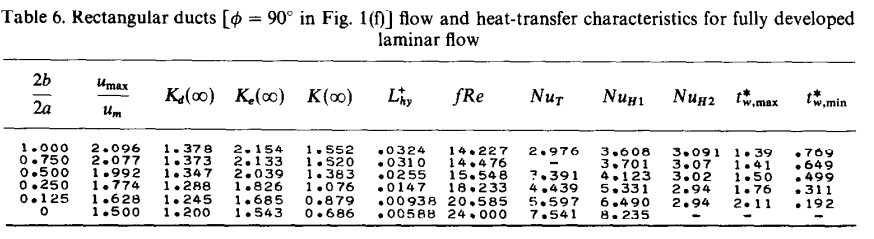

id:: d87cb3e3-b6b9-458b-8f91-7187b1c68b36

- Title
	- Integrating Analytical Models for Vaporizing Liquid Micropropulsion Systems: Towards Next-Generation Design and Flow Behavior Characterization
- Abstract
	- This paper presents a comprehensive approach to designing the next generation of vaporizing liquid micropropulsion systems. The study proposes a framework that integrates existing analytical models for key components of the system and characterizes the flow behavior within the system. By leveraging the strengths of these models and gaining insights into the complex fluid dynamics, heat transfer, and combustion processes, the proposed approach aims to overcome design challenges and achieve more accurate predictions and efficient designs. The framework holds significant potential for advancing the field of micropropulsion systems, enabling enhanced efficiency, reliability, and maneuverability for small satellites in space missions.
- Introduction
	- This paper presents a comprehensive approach to designing the next generation of vaporizing liquid micropropulsion systems by combining existing analytical models and characterizing the flow behavior. Micropropulsion systems play a crucial role in various space missions, enabling precise control and maneuverability of small satellites. However, the design and optimization of these systems remain challenging due to the complex interplay of fluid dynamics, heat transfer, and combustion processes.
	  
	  TU Delft has been one of the centers of research around Vaporizing Liquid Microthrusters, with several papers published in the past few years considering different aspects of VLMs. However, each model depends on assumptions that limit its predictive power experimentally, and often focus on single elements of the VLM, like the flow in the heating chamber microchannels, the nozzle's performance, or control of the propellant injector to ensure constant thrust. There is a gap in the literature for an integrated model which characterizes the entire VLM's behavior based on a few inputs, mainly related to sizing the system.
	  
	  To address these challenges, this study proposes a novel framework that integrates multiple analytical models to enhance the understanding and performance of vaporizing liquid micropropulsion systems. By leveraging existing models, we aim to capitalize on their strengths and overcome their limitations, ultimately leading to more accurate predictions and efficient designs.
	  
	  The first step involves a comprehensive review and selection of relevant analytical models for key components of the micropropulsion system, including the inlet, combustion chamber, and nozzle. Each model is carefully evaluated based on its applicability, accuracy, and computational efficiency. Subsequently, these models are integrated into a unified framework, allowing for a holistic analysis of the system's behavior.
	  
	  By combining existing analytical models and characterizing flow behavior, we can overcome the limitations of individual models and achieve a more comprehensive understanding of system performance. This, in turn, will facilitate the design of next-generation micropropulsion systems that offer enhanced efficiency, reliability, and maneuverability for small satellites in space missions.
- Literature Review and Modeling
	- The given source material was composed of previous student-led investigations on the topic and professional research by TUD researchers.
	- Model overview
		- The general structure of the VLM is taken from [[@A Comprehensive Model for Control of Vaporizing Liquid Microthrusters]] and is shown in Figure X:. Water is pressurized to mimic the conditions of a blow-down propellant feed and fed into the inlet of the heating chamber. A resistive heater is used to heat the walls of the microchannels of the chamber, and the water is assumed to lose pressure due to the mechanics of wavy microchannels before boiling. The resulting vapor is accelerated through the remaining channel length toward the micronozzle. The nozzle is a standard axisymmetric choked convergent-divergent type.
	- Assumptions
		- Water enters pressurized at the inlet at standard temperature (22 C), the corresponding density is 997.8 kg/m3.
		- Water flows inside the heating chamber, losing pressure through convective effects due to wavy
		- Vapor remains at same temperature and pressure from boiling until nozzle largely without extra heat transfer from the walls
		- Nozzle is axisymmetric choked flow and no heat transfer between nozzle walls and gas occurs
		- Heaters heat the entire VLM equally, so that all the walls of the heating chamber and nozzle are at the same temperature $T_w$.
		- Constant wall temperature and heat flux
	- Sizing
		- Inlet
		  The main model inputs for the circular inlet are the chosen mass flow $\dot{m}_{1}$ and the inlet radius $R_{in}$, which will the determine the pressure of the water.
		- Heating Chamber
		  This chamber consists of wavy microchannels with 3 heated sides (the top wall consists of the next layer in the assembly) and a fixed geometry taken from [[@Micropropulsion course Numerical analysis of wavy microchannels employed in a Vaporizing Liquid Micro-resistojet thruster]] as shown in Figure X. In order to simplify the modeling process, the standard unit was used unaltered, and this geometry is repeated $n_{elem}$ times along the length of the chamber to form a single channel. Along the width of the VLM, $n_{chan}$ channels are used to form the complete heating chamber.
		  
		  The centerline $L_C = 1.00714$ mm and length $L = 0.64$ mm of one such element have been previously determined, and need only be multiplied by the number of elements to be calculated for the whole chamber.
		  
		  The other main sizing variable for the heating chamber is the chamber depth $H$, which will determine the total area of the heated walls $A_{heat}$ when multiplied by the integrated wall length according to $$(2.01062 \ mm \cdot H + 0.213126 \ mm^{2} ) \cdot n_{elem} \cdot n_{chan}$$. The total volume of the chamber $V_{tot}$ is similarly calculated using \( (0.213126 \ mm^{2} \cdot H ) \cdot n_{elem} \cdot n_{chan}\). The aspect ratio $\alpha$ of the rectangular cross-section of the channel is found using \( \alpha = 0.212 \ mm \div H \).
		  
		  Finally, the hydraulic diameter of this same cross-section is calculated with \(D_h=\frac{4 A}{p}\), where $A$ is the cross-sectional area and $p$ the rectangular perimeter.
		- Nozzle
		  The micronozzle has three main sizing input variables: the throat radius $R_t$, the exit radius $R_e$, and the nozzle length $L_n$. The diverging section of the nozzle is assumed to expand outward from the throat without any curvature, so that the length along the nozzle wall can be found with \( x = \sqrt{R_{e}^2 + L_{n}^2} \), and the nozzle exit half-angle with \( \alpha = \tan^{-1} \left( \frac{R_{e}}{L_n} \right) \).
	- Heating Chamber Liquid Phase
		- The assumptions of the model used in this phase, in the original paper [[@Micropropulsion course Numerical analysis of wavy microchannels employed in a Vaporizing Liquid Micro-resistojet thruster]], are as follows:
		  • Incompressible flow
		  • Steady state (this was verified with transient simulations)
		  • Negligible radiative and natural convective heat transfer
		  • Negligible viscous dissipation
		  • Laminar flow
		  • Constant fluid properties
		  This is due to the extremely low Reynolds numbers found in that investigation, and in order to keep the validity of the model intact, we must design our liquid flow phase according to those low Reynolds numbers. Additionally, constant heat flux from the walls was assumed, although in that model, the heat flux was chosen to ensure the flow would stay liquid, which is not the case in this more comprehensive model.
		- The essence of this phase of the model is characterizing the loss in pressure (which can be seen either as a performance loss or as an increased requirement in the pressure of the propellant tank) due to friction and the interaction of the fluid with the waviness of the channel walls. Once the pressure at boiling is found, the boiling temperature follows, and the rest of the conditions can be calculated. This is done using the following equations and quantities, and the exact simulation procedure will be discussed in a later chapter.
			- Reynolds number
			  id:: 64b187ff-4ac4-4fb1-b528-64d9ff78d098
			  
			  The Reynolds number is a dimensionless quantity used in fluid mechanics to characterize the flow of a fluid, such as water, through a pipe or any other conduit. It helps determine the type of flow, whether it is laminar or turbulent, based on the fluid's velocity, density, viscosity, and the characteristic length or diameter of the conduit.
			  
			  The Reynolds number is calculated using two different formulas, both of which are equivalent but used in different situations. The first formula is:
			  
			  $$
			  R e=\frac{\dot{m} \cdot D_h}{A \cdot \mu}
			  $$
			  
			  In this formula, \(Re\) represents the Reynolds number, \(\dot{m}\) is the mass flow rate of the fluid, \(D_h\) is the hydraulic diameter of the conduit, \(A\) is the cross-sectional area of the flow region, and \(\mu\) is the dynamic viscosity of the fluid.
			  
			  The Reynolds number is crucial in determining the flow regime of a fluid. When the Reynolds number is below a certain critical value, the flow is considered laminar, characterized by smooth and orderly movement of fluid layers. On the other hand, when the Reynolds number exceeds the critical value, the flow becomes turbulent, with chaotic and irregular fluid motion.
			- Channel friction factor
			  $$
			  f=\frac{\left(p_{\text {inlet }}-p_{\text {outlet }}\right) \cdot D_h}{\frac{1}{2} \rho U_{\text {inlet }}^2 \cdot L}
			  $$
			  
			  To evaluate the pressure losses in the channel the friction factor of the channels is evaluated. Here \(p_{\text {inlet }}\) and \(p_{\text {outlet }}\) are the average pressures over the respective areas. \(U_{\text {inlet }}\) is the mean flow velocity, obtained from the mass flow. \(L\) is the centerline length.
			- Shah and London Relations
			  
			  Shah and London [REFERENCE] affirm that, for macrochannels, for a fully developed flow, the product of the friction factor and the Reynolds number, \(f R e\), is constant. However, given the presence of a pressure drop associated with the developing region, we should expect a measured \(f R e\) to behave as depicted by the following equation:
			  $$
			  f R e_{e f f}=f R e+K_{\infty} \cdot R e \cdot \frac{D_h}{L}
			  $$
			  
			  {:height 152, :width 526}
			  
			  Since \( f \ Re\) and \( K_{\infty} \) can be characterized for a given channel purely through its aspect ratio, they remain fixed for a given channel geometry.
			- Water Boiling Temperature
			  
			  The equation provided in the function is a polynomial fit that approximates the relationship between water boiling temperature \(\left(T_{boil}\right)\) and pressure \(p\). This polynomial fit is based on empirical data collected from EngineeringToolbox. The equation is given by:
			  $$
			  T_{boil}=-1.98450335 \times 10^{-10} \cdot p^2+2.48821438 \times 10^{-4} \cdot p+ 3.50254608 \times 10^2
			  $$
			  ​
			  This equation is an approximation and might not accurately represent extreme conditions, although the range of 0-100 degrees Celsius was used.
		- Heating Chamber Liquid Phase Performance Metrics
			- Nusselt number
			  id:: 64b187ff-20cf-46c6-a290-4d508fe0c853
			  
			  The Nusselt number is a dimensionless parameter used in heat transfer analysis to quantify the relationship between convective and conductive heat transfer across a boundary or surface.
			  It considers factors such as thermal conductivity, fluid properties, and flow characteristics. For low Reynolds numbers (between 10 and 100), the Nusselt number increases significantly with increasing Reynolds numbers.
			  
			  A higher Nusselt number also means that, given a wall temperature, a shorter channel is needed to reach certain fluid temperature (or vaporization).
			  
			  Studies have shown that wavy microchannels result in higher Nusselt numbers and improved convective heat transfer compared to straight channels of the same size. However, this improvement comes at the cost of increased pressure losses. 
			  
			  The Nusselt number can be calculated using the equation:
			  
			  $$N u=\frac{h \cdot D_h}{k_W}$$
			  
			  where \(h\) is the convective heat transfer coefficient, \(D_h\) is the hydraulic diameter, and \(k_W\) is the thermal conductivity.
			- Heat transfer coefficient
id:: 64b187ff-2940-4304-8395-8954d0948db6
			  $$
			  h=\frac{q}{A_{\text {wall heat }} \cdot\left(T_w-T_m\right)}
			  $$
			  
			  where \(T_w\) is the average temperature of the three heated walls and \(A_{\text {wall heat }}\) is their area, and \(T_M\) is the mean fluid temperature calculated using 
			  
			  \(T_m=0.5 \cdot\left(T_{\text {in }}+T_{\text {out }}\right)\)
			  
			  making an average over the whole fluid volume due to the constant wall temperature assumption.
	- Heating Chamber Gaseous Phase
		- The model for the gaseous flow phase in the heating chamber was chiefly taken from [[@A Comprehensive Model for Control of Vaporizing Liquid Microthrusters]]. In this study, two-phase flow was investigated experimentally with cameras to determine at which point of the chamber the vaporization happened, allowing a fitted equation that relates the average volume of vapor in the chamber with the pressure at vaporization and the temperature of the walls (technically the temperature of the chip at the nozzle, but the constant temperature assumption extends this to the chamber walls):
		  
		  $$
		  V_{av} = a_T T_n + a_p p_1 + b
		  $$
		  where \(a_T\), \(a_p\), and \(b\) are parameters of the linear regression, and \(T_n\) is the temperature of the chip measured around the nozzle, and \(p_1\) is the pressure of the water at the point of boiling.
		  For the analysis presented here, the coefficients have been estimated as: \(a_T=1.63 \times 10^{-11} \mathrm{~m}^3 \mathrm{~K}^{-1}, a_p=\) \(-7.45 \times 10^{-15} \mathrm{~m}^3 \mathrm{~Pa}^{-1}\), and \(b=-4.36 \times 10^{-10} \mathrm{~m}^3\).
		  
		  This relation allows for the relative distance covered by the liquid phase flow to be estimated, and along with it, the total friction losses.
		- Once the water has been vaporized, it is assumed that the vapor remains at the saturation temperature until it reaches the nozzle. The saturation temperature of the vapor in the chamber can be calculated using the Antoine equation, which is expressed as the Antoine equation:
		  
		  \(T_{1}=\frac{B}{A-\log _{10} p_{1}}+C\)
		  
		  In this equation, the constants \(A\), \(B\), and \(C\) are assigned the values of \(10.27\), \(1810.94\), and \(28.67\) respectively. It is important to note that this equation is applicable when the pressure (\(p_{1}\)) is measured in pascals (\(\mathrm{Pa}\)) and the temperature (\(T_{1}\)) falls within the range of \(372.15-647.15 \mathrm{~K}\).
		- The pressure inside the chamber, \(p_c\), is calculated using the ideal gas law:
		  \[
		  p_c=\frac{1}{\alpha_2}\left(\frac{R_s}{v_g}-\beta_2\right)
		  \]
		  where \(\alpha_2\) and \(\beta_2\) are coefficients obtained from a linear approximation. Linearizing around a pressure of $3 \ atm$, these are evaluated to be $\alpha_2 = 0.0023 \text{K}^{-1}$ and $\beta_2 = 62.17 \ \text{Pa} \ \text{K}^{-1}$.
		  
		  The specific volume term $v_g$ used in the above equation is calculated using a polynomial fit taken from [[@Simplified Equations for Saturated Steam Properties for Simulation Purpose]] 
		  $$\ln \left(\mathrm{v}_{\mathrm{g}}\right)=\mathrm{a}+\mathrm{b}\left[\ln \left(1 / \mathrm{T}_{\mathrm{r}}\right)\right]^{0.4}+\mathrm{c} / \mathrm{T}_{\mathrm{r}}^2+\mathrm{d} / \mathrm{T}_{\mathrm{r}}^4+\mathrm{e} / \mathrm{T}_{\mathrm{r}}^5$$
		  
		  $$
		  \begin{array}{lllll}
		  \hline \mathrm{a} & \mathrm{b} & \mathrm{c} & \mathrm{d} & \mathrm{e} \\
		  \hline-7.75883 & 3.23753 & 2.05755 & -0.06052 & 0.00529 \\
		  \hline
		  \end{array}
		  $$
		  
		  \(\mathrm{T}_{\mathrm{r}}\) is the reduced temperature which is defined as \(\mathrm{T} / \mathrm{T}_{\mathrm{cr}}\). \(\mathrm{T}_{\mathrm{cr}}\) is critical temperature; for steam it is \(647.096 \mathrm{~K}\).
		- The final applicable relation from this paper related the mass flow at the nozzle \(\dot{m}_3\) to the conditions in the chamber
		  \(\dot{m}_3=\left(\alpha_1 p_1+\beta_1\right) A_t \sqrt{\frac{\gamma}{R_s}\left(\frac{2}{\gamma+1}\right)^{\frac{\gamma+1}{\gamma-1}}}\)
		  
		  where \(\gamma\) is the specific heat ratio, \(R_s\) is the specific gas constant for steam, \(A_t\) is the throat area.
		  
		  If we consider the pressure in the range \(1-5\) bar, then we can replace the term \(\frac{p_1}{\sqrt{T_1}}\), where \(p_1\) is the chamber pressure and \(T_1\) is the chamber temperature, with a function of the pressure:
		  $$
		  \frac{p_1}{\sqrt{T_1}}=\frac{p_1}{\sqrt{\frac{B}{A-\log _{10} p_1}+C}} \approx \alpha_1 p_1+\beta_1
		  $$
		  where \(\alpha_1\) and \(\beta_1\) are the coefficients of the first order Taylor series expansion and are functions of the same parameters used in the Antoine equation and the linearization point \(p_s = 3 \ \text{atm}\). These are evaluated to be $\alpha_1 = 0.048 \text{K}^{-1/2}$ and $\beta_1 = 626.99 \ \text{Pa} \ \text{K}^{-1/2}$
	- Nozzle
		- Nozzle Flow Characterization
			- The bulk of the equations in this section were taken from [[@Simplified Modelling of Aerospike Micro-nozzles]], which discusses the performance of CD micronozzles. The final output of this model is the "true" thrust i.e. the ideal thrust corrected with various loss factors.
			- Divergence loss
			  
			  Divergence losses occur when the exit half angle of a nozzle is greater than 0°, causing the gases ejected from the nozzle to deviate from the direction of thrust. This deviation introduces momentum components that are perpendicular to the thrust vector. However, due to the symmetry of the nozzle, these perpendicular momentum components cancel each other out, resulting in no thrust misalignment. Nevertheless, they still contribute to a loss in thrust because not all of the momentum is effectively utilized to propel the spacecraft forward.
			  
			  To quantify this loss, we use the divergence thrust correction factor, denoted as \(\epsilon_{div}\). This factor is calculated using the equation:
			  
			  \(\epsilon_{div} = 1 - \frac{1 - \cos(\alpha)}{2}\)
			  
			  In this equation, \(\alpha\) represents the exit half angle of the nozzle. The value of \(\epsilon_{div}\) depends solely on the exit half angle and affects both large and small nozzles.
			- Boundary Layer Losses
			  
			  The boundary layer is a thin layer of fluid that forms along the wall of a nozzle due to the effects of viscous flow. This phenomenon causes the flow velocity to decrease near the walls and deflect the main flow. In micro-nozzles, the impact of boundary layer losses is more pronounced due to their low Reynolds number, which leads to higher skin friction coefficients and larger boundary layers.
			  
			  To accurately predict performance losses in micro-nozzles, it is crucial to characterize the boundary layer. One approach is to use a simplified model based on flat plate boundary layer solutions, which can be applied to linear convergent-divergent micro-nozzles.
			  
			  The flat-plate Reynolds number at the exit (\(R e_x\)) is defined as the ratio of the product of the exit velocity (\(u_e\)) and the distance from the nozzle entrance (\(x\)) to the kinematic viscosity (\(v\)) of the fluid:
			  
			  \[R e_x=\frac{u_e x}{v}\]
			  
			  For incompressible, laminar flow, the skin friction coefficient (\(c_{f x}\)) can be calculated using the following equation:
			  
			  \[c_{f x}=\frac{0.664}{\sqrt{R e_x}}\]
			  
			  The skin friction coefficient is an important parameter that quantifies the frictional forces acting on the fluid within the boundary layer.
			  
			  The momentum thickness (\(\theta_x\)) is a measure of the thickness of the boundary layer and can be calculated by multiplying the skin friction coefficient (\(c_{f x}\)) by the distance from the nozzle entrance (\(x\)):
			  
			  \[\theta_x=c_{f x} \cdot x\]
			  
			  The displacement thickness (\(\delta^*\)) represents the amount by which the flow is displaced by the boundary layer. It can be calculated using the following equation:
			  
			  \[\delta^*=2.59036 \cdot \theta_x\]
			  
			  To optimize the design of the nozzle, the angle of the divergent section should be carefully chosen to balance the displacement thickness and divergence losses.
			  
			  The true area ratio of the nozzle (\(\left(\frac{A_e}{A_t}\right)_{t r u e}\)) can be determined using the following equation:
			  
			  \[\left(\frac{A_e}{A_t}\right)_{t r u e}=\frac{2 \cdot\left(R_e-\delta^*\right)}{W_t}\]
			  
			  Here, \(W_t\) represents the throat width and \(R_e\) denotes the exit radius.
			  
			  It is important to note that the assumptions underlying this boundary layer solution include laminar and attached flow, as well as the assumption that the boundary layer starts developing at the throat and increases in size until reaching the nozzle exit. These assumptions provide a simplified model for analyzing boundary layer losses in micro-nozzles.
			- Momentum Losses
			  
			  The presence of a boundary layer in addition to the modification of effective nozzle geometry leads to momentum losses in the flow. These losses occur as the flow loses momentum within the boundary layer. To account for this, the thrust loss due to momentum can be calculated using the equation:
			  
			  \(\Delta F_{\text {momentum }}=\left(\rho_c \cdot u_c \cdot\left(2 \pi R_c\right) \cdot \theta_c\right) \cdot u_e\)
			  
			  It is important to note that for nozzles with non-circular cross sections, the circumference term should be replaced with the equivalent perimeter.
			- Correcting for compressibility
			  
			  The Reference Temperature Approach is a method used to correct the skin friction coefficient in supersonic flow. In the previous section, we discussed a method for predicting boundary layer properties assuming incompressible flow. However, this assumption is no longer valid when the flow becomes supersonic.
			  
			  To account for compressibility effects, the compressible skin friction coefficient is calculated using the Reference Temperature Approach. This approach involves using an average temperature across the boundary layer to correct the skin friction coefficient.
			  
			  The equation for the compressible skin friction coefficient is given by:
			  
			  \[c_f=c_{f, i}\left(\frac{T_w / T_0+1}{2}+0.22 \frac{\gamma-1}{2} M^2\right)^{-0.6}\]
			  
			  In this equation, \(c_f\) represents the compressible skin friction coefficient, \(c_{f, i}\) is the skin friction coefficient assuming incompressible flow, \(T_w\) is the wall temperature (which remains constant along the entire VLM), \(T_0\) is the stagnation temperature at the point where the skin friction coefficient is determined, \(\gamma\) is the specific heat ratio, and \(M\) is the Mach number.
			  
			  The stagnation temperature (\(T_0\)) refers to the temperature of the vapor immediately after vaporization has occurred. By incorporating the average temperature across the boundary layer, the Reference Temperature Approach provides a more accurate estimation of the skin friction coefficient in supersonic flow conditions.
			- True pressure ratio
			  
			  The true area ratio found earlier leads to a lower exit pressure than predicted by IRT, and this true pressure ratio between the exit pressure \(p_e\) and chamber pressure \(p_c\) can be found using the following relation iteratively:
			  
			  \(\frac{\mathrm{A}_{\mathrm{e}}}{\mathrm{A}_{\mathrm{t}}}=\frac{\Gamma}{\sqrt{\frac{2 \gamma}{\gamma-1} \cdot\left(\frac{\mathrm{p}_{\mathrm{e}}}{\mathrm{p}_{\mathrm{c}}}\right)^{\left(\frac{2}{\gamma}\right)}\left(1-\left(\frac{\mathrm{p}_{\mathrm{e}}}{\mathrm{p}_{\mathrm{c}}}\right)^{\left(\frac{\gamma-1}{\gamma}\right)}\right)}}\)
			  
			  where \(\Gamma\) is the Vanderkerck-hove function:
			  
			  \(\Gamma=\sqrt{\gamma} \cdot\left(\frac{2}{\gamma+1}\right)^{\left(\frac{\gamma+1}{2(\gamma-1)}\right)}\)
			  
			  It is impossible to analytically solve the relation between the expansion/area ratio and pressure ratio for the pressure ratio, so instead, a quartic polynomial was fitted to allow a faster albeit less precise inverse calculation.
			  
			  The quartic polynomial function is defined as follows:
			  
			  $$
			  f(x)=e \cdot x^4+d \cdot x^3+c \cdot x^2+b \cdot x+a
			  $$
			  
			  $$
			  \begin{tabular}{|c|c|}
			  \hline
			  Coefficient & Value \\
			  \hline
			  $a$ & $2.126678050764823$ \\
			  $b$ & $-9.245481760842422$ \\
			  $c$ & $25.283279766409915$ \\
			  $d$ & $-31.775573578601517$ \\
			  $e$ & $1$ \\
			  \hline
			  \end{tabular}
			  $$
			  
			  A numerical root-finding method known as the Newton-Raphson method is used to find the true pressure ratio given a specific area ratio.
			- True Thrust
			  
			  The resulting aggregate thrust loss is calculated by combining the divergence loss, momentum loss, and reduced exit pressure. The true thrust, estimated using this methodology, is given by:
			  
			  \(F_{\text {true }}=\dot{m} \cdot \epsilon_{\text {div }} \cdot \sqrt{2 \cdot \frac{\gamma}{\gamma-1} \cdot \frac{\mathrm{R}_{\mathrm{A}}}{\mathrm{M}} \cdot \mathrm{T}_{\mathrm{c}} \cdot\left(1-\left(\frac{\mathrm{p}_{\mathrm{e}}}{\mathrm{p}_{\mathrm{c}}}\right)_{\text {true }}^{\frac{\gamma-1}{\gamma}}\right)}-\Delta F_{\text {momentum }}\)
		- Nozzle Performance Evaluation
			-
- Methods
	- Simulation Procedure
	- Operational Ranges
- Results
	- Sensitivity Analysis
	- Optimized Design
- Conculusion
- Discussion