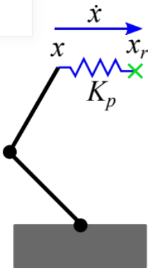

tags:: class

-
- Always use right-hand coordinate frames!
- Lectures
	- Fundamentals
		- Degrees of Freedom
		  collapsed:: true
			- Degrees of freedom (DoF) of a mechanical system define the number of independent parameters that describe its configuration.
			  id:: 6324adc2-1c8a-4363-bffb-196ff8995b84
			- DoF of a robot = total possible – number of constraints
			- Mechanical joints add constraints to the configuration space.
			- Common types of mechanical joints:
				- Revolute (1 DoF rotational movement)
				- Prismatic (1 DoF translational movement)
				- Universal (2 DoF rotational movement)
				- Ball (3 DoF rotational movement)
			- A constraint that reduces the total DoF of a ridged body is called a holonomic constraint (e.g., joint in a robot arm).
			- A constraint that reduces the total possible velocities but does NOT reduce the total DoF is called a non-holonomic constraint (e.g., wheels of a car).
			- A non-holonomic system is a physical system whose configuration depends on the path taken in order to achieve that configuration (e.g., a car).
				- Typically, in a non-holonomic system, the number of actuated DoF is less than the total DoF.
		- Pose
			- The position and orientation of the part’s coordinate frame are called pose.
			- The orientation in 3D space can be described by various mathematical tools:
				- [[Euler angles]]
				  collapsed:: true
					- {{embed [[Euler angles]]}}
				- [[Axis-angle]]
				  collapsed:: true
					- {{embed [[Axis-angle]]}}
				- [[Quaternions]]
				  collapsed:: true
					- {{embed [[Quaternions]]}}
				- [[Rotation matrix]]
				  collapsed:: true
					- {{embed [[Rotation matrix]]}}
				- [[Transformation Matrix]]
				  collapsed:: true
					- {{embed [[Transformation Matrix]]}}
					-
		- [[Numerical Integration]]
			- {{embed [[Numerical Integration]]}}
	- Recap of [[Control Theory]]
	  collapsed:: true
		- {{embed [[Control Theory]]}}
	- Robotic Manipulator Control
	  collapsed:: true
		- Position control
			- Does not have torque sensor
			- A position-controlled motor controls the reference position (or velocity) by an electrical current based on the position feedback from an encoder.
			- $$I=K\left(q_c-q_m\right)$$
			- Does not take external dynamics into account
			- The input is the commanded joint position (or joint velocity) and the output is the measured joint position. Uses the inverse of the [[Jacobian]] 
			  
			-
		- Force and torque control
			- Hooke's Law and displacement
			- $I=K\left(\tau_{c}-\tau_{m} \right)$
			  Generating a control current based on the sensor error
			- A torque-controlled motor controls the reference torque by an electrical current based on feedback from a torque sensor.
			- Since a specific reference torque can be controlled, the system and the load dynamics can be compensated.
			- We can add torque for joint position control on top of the torque for gravity compensation of the load. Unlike in a position-controller motor, in a torque-controlled motor, the gravity compensation and position control can be decoupled.
			  $$\tau_c=\tau_{\text {load }}+K_q\left(q_r-q\right)$$
			- 
			-
		- Open Loop Control
			- Control command derived by feed-forward controller
			- Does not take controlled variable into account, allows for divergent solution
			- Cheap hardware
			- Requires a model of the plant
				- Plant: combination of mechanical structures and actuator
		- Closed Loop control
			- Incorporates feedback to compare sensed values to reference variable
			- Uses sensor error to generate control signal
			- Does not require model of the plant
		- Combined Control
			- Combines closed and open loop to increase performance
			- Uses plant model to predict rough desired control value
			- Uses sensors and feedback to make small adjustments to control output
		- Endpoint position control with position-controlled robots
			- 
			- The measured joint position \(q\) is obtained from the encoders in the joints and transformed into endpoint position \(x\) by forward kinematics: \(\quad \boldsymbol{x}=\mathbb{A}(\mathbb{A}(\mathbb{d})\)
			- The actual endpoint position is compared to the desired reference endpoint position \(\boldsymbol{x}_r\) and multiplied by a proportional gain \(K_p\) (units: \(1 / \mathrm{s}\) ) to obtain a velocity that moves the actual position toward the reference:
			  $$
			  \dot{x}=K_p\left(x_r-x\right)
			  $$
			- Finally, since the robot takes joint velocity as an input, the endpoint velocity is transformed into the joint velocity:
			  $$
			  \dot{q}=J^{-1} \dot{x}
			  $$
		- Using torque-controlled robots
			- Endpoint position control
				- 
				- The actual endpoint position is compared to the desired reference endpoint position \(\boldsymbol{x}_r\) and multiplied by a stiffness \(\boldsymbol{K}\) (units: \(\mathrm{N} / \mathrm{m}\) ) to obtain an external force that moves the actual position towards the reference: \(x\) )
				  $$ F_{ext} = K (x_r - x)$$
				- Since the robot takes joint torque as an input, the endpoint force is transformed into the joint torque:
				  $$
				  \tau_{e x t}=J^T F_{\text {ext }}
				  $$
				- Additionally, the dynamics of the robot can be compensated by a torque obtained by the dynamical model. The total torque vector that is sent to the motor controllers is:
				  $$
				  \tau=\tau_{dyn}+\tau_{ext}
				  $$
			- Endpoint force control
				- The actual endpoint force (usually measured by a force sensor mounted on the endpoint) is compared to the desired reference endpoint force \(F_r\) and multiplied by a proportional gain \(K_F\) (no units) to obtain an external force that produces the desired reference force: \(F_{ext} \equiv K_F \left(F_r=F\right)\)
				- The external force is then controlled by the joint torque:
				  $$
				  \tau_{\text {ext }}=J^F F_{e \times t}
				  $$
				- As before, the dynamics of the robot can be compensated by a torque obtained by the dynamical model in order to improve the endpoint controller performance:
				  $$
				  \tau=\tau_{x a t}+\tau_{d x}
				  $$
	- Robotic Manipulator Kinematics
		- Learning outcomes
			- Derive forward kinematics and [[Jacobian]] matrix for robot arm
			- Derive inverse kinematics for a parallel robot
			- Apply the theory to control a robotic arm with redundant degrees of freedom:
				- singularity-robust endpoint position control
				- task-priority control using null space
			- Reflect on redundant degrees of freedom problems
			- Reflect on differences between serial and parallel kinematic structures
		- Kinematics: study of motion with disregard for forces/torques causing it
			- Forward kinematics: calculate endpoint position/motion from joint position/motion
				- General derivation method: Denavit-Hartenberg
			- Recalculate the [[Jacobian]] to transform endpoint velocities to joint velocities every time step, as it is dependent on the joint angle states
			  $$\dot{x}=J(q) \dot{q}$$
				- Transpose of Jacobian transforms endpoint force into joint torques
				  $$\tau=J^T(q) F$$
					- For a single-joint lever arm, the relationship holds
					  $$\dot{x} = l \cdot \dot{q}$$
					  $$\tau = l \cdot F$$
				- Every timestep has a different Jacobian
			- Inverse kinematics: calculate joint position/motion from endpoint position/motion
		- Inertial Measurement Unit (IMU): combination of accelerometer and gyroscope
			- Noise from integration
			- Drift (offfset)
		-