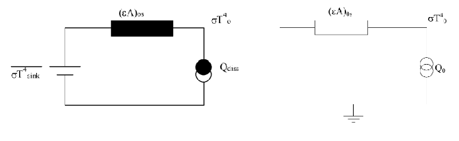

- Space Thermal Environment
  collapsed:: true
	- Deep Space
		- Cosmic background radiation
		- \(2.7 \mathrm{~K} \approx 3 \mathrm{~K}\)
	- Solar Radiation
		- Solar Constant \(S_{\odot}^N\)
		- \(1361 \mathrm{~W} / \mathrm{m}^2\)
		- The value of the nominal total solar irradiance corresponds to the mean total electromagnetic energy from the Sun, integrated over all wavelengths, incident per unit area, and per unit time at a distance of 1 AU.
	- Albedo
		- Albedo is solar radiation reflected by Earth. It has the same spectral distribution as sunlight and is assumed to be diffuse.
		- Typically, albedo is said to be a fraction (a) of the solar constant, usually 0.3 \((0.3 \cdot 1361=408 \mathrm{~W} / \mathrm{m} 2)\)
	- Planetary infra-red radiation
		- Radiation emitted by a planet
		- Average earth: \(288 \mathrm{~K}\left(230 \mathrm{~W} / \mathrm{m}^2\right)\)
		- Varies: \(150-350 \mathrm{~W} / \mathrm{m}^2\)
	- Black Body: The Sun
		- Total energy emitted by Sun:
		  $$
		  \begin{aligned}
		  & \mathrm{Q}_{\text {total }}=4 \pi \mathrm{R}^2 \sigma \mathrm{T}^4[\mathrm{~W}] \\
		  & \mathrm{R}=\text { radius of the sun }
		  \end{aligned}
		  $$
		- Solar radiant flux at distance D
		  $$
		  \begin{aligned}
		  & \Phi=Q_{\text {total }} / 4 \pi D^2\left[\mathrm{~W} / \mathrm{m}^2\right] \\
		  & \sigma=5.67^* 10^{-8}\left[\mathrm{~W} / \mathrm{m}^2 \mathrm{~K}^4\right] \\
		  & T=5778 \mathrm{~K} \\
		  & R=696^* 10^3 \mathrm{~km} \\
		  & \text { for } D=150 * 10^6 \mathrm{~km}(1 \mathrm{AU}) \rightarrow \\
		  & \qquad \Phi=1361 \mathrm{~W} / \mathrm{m}^2=1
		  \end{aligned}
		  $$
		  Solar Constant
	- Absorptivity
	  $$
	  \begin{gathered}
	  \alpha+\rho+\tau=1 \\
	  \text { (absorptivity + reflectivity }+ \text { transmissivity) }
	  \end{gathered}
	  $$
	- Specular reflector:
		- Mirror, optically smooth surface
		- All radiation is reflected at the incoming angle
	- Diffuse reflector:
		- Reflects equal amount of radiation irrespective of incoming angle
	- Spectral, directional-hemispherical reflectance:
		- Total reflected heat flux, leaving a surface in all directions due to spectral, directional irradiation
	- Kirchhoffs law: a good emitter is a good absorber at a particular wavelength or for a specific range of wavelengths
	  $$
	  \alpha_\lambda=\varepsilon_\lambda
	  $$
	  at equal wavelength (三 temperature)
	- Absorbption and emission regimes
		- solar absorber: high \(\alpha\), low \(\varepsilon\)
		  Polished Al alloy
		- solar reflector: low \(\alpha\), high \(\varepsilon\)
		  White Paint
		- "flat" absorber: constant, high \(\alpha\), \(\varepsilon\)
		  Black Paint
		- "flat" reflector: constant, low \(\alpha, \varepsilon\)
		  Al paint
	- Heat Balance
		- Earth orbiting spacecraft
		- \(Q_{\text {in }}=Q_{\text {out }}\)
		- \(\sum \alpha \mathrm{A}_S \mathrm{~S}+\sum \alpha \mathrm{A}_{\mathrm{a}} \mathrm{E}_{\mathrm{a}}+\sum \varepsilon \mathrm{A}_{\mathrm{ir}} \mathrm{E}_{\mathrm{ir}}+\sum \mathrm{Q}_{\text {intern }}=\sum \varepsilon \mathrm{A}_{\text {ext }} \sigma T^4\)
- Heat Exchange
	- Black Body Radiation
	  Lambert's cosine law (diffuse radiating surface)
		- Observed intensity of a black body is equal in all directions
		- Infinitesimal view-factor \(\mathrm{dF}_{12}=1 / \pi \mathrm{s}^2 \mathrm{dA}_2 \cos \left(\theta_1\right)[-]\)
		- The sun may be assumed as a disc with uniform brightness
	- Radiation exchange: View Factors
		- The exchange factor between two black surfaces is given by:
		  \(\mathrm{F} 12=\) fraction of radiation emitted by \(A 1\) which is directly impinging on A2
		- The radiation exchange from \(A 1\) to \(A 2\) (black surfaces) is given by:
		  $$
		  Q_{b l a c k ~ s u r f a c e s}^r=F_{12} A_1\left(\sigma T_1^4-\sigma T_2^4\right)
		  $$
		- Spherical to Spherical - Sphere to outer sphere
		  $$
		  F_{12}=\frac{1}{2}\left(1-\frac{\sqrt{H^2+2 H}}{1+H}\right)
		  $$
		  With:
		  $$
		  H=\frac{h}{R}
		  $$
		- View factor algebra
		  Conservation of energy
		  $$
		  \sum_{j=1}^n F_{i j}=1
		  $$
		  Reciprocity Relationship:
		  \(A_i F_{i j}=A_j F_{j i}\)
		  Summation:
		  $$
		  A_1 F_{1-(2+3)}=A_1 F_{12}+A_1 F_{13}
		  $$
		  Derive yourself:
		  $$
		  A_{(1+2)} F_{(1+2)-(3+4)}=A_1 F_{13}+A_1 F_{14}+A_2 F_{23}+A_2 F_{24}
		  $$
	- Radiation exchange: Gebhart factor
	  Exchange factor for diffuse gray surfaces includes (multiple) reflections
	  $$
	  Q_{12}=\varepsilon_1 A_1 B_{12}\left(\sigma T^4 1-\sigma T^4{ }_2\right)
	  $$
		- \(B_{12}=\) fraction of radiation emitted by \(A_1\) which is absorbed by \(A_2\) (inclusive reflections)
		- \(\mathrm{B}_{\mathrm{ij}}\) known as Gebhart factor, or radiation exchange factor
		- For an enclosure of \(n\) surfaces:
		  $$
		  B_{i j}=F_{i j} \varepsilon_j+\sum_{k=1}^n\left(1-\varepsilon_k\right) F_{i k} B_{k j}
		  $$
		- Reciprocity:
		  $$
		  \varepsilon_i A_i B_{i j}=\varepsilon_j \mathrm{~A}_j \mathrm{~B}_{\mathrm{ji}}=\mathrm{R}_{\mathrm{ij}}\left[\mathrm{m}^2\right]
		  $$
		- The sum of Gebhart factors from a surface must be 1 (incl. \(\mathrm{j}=\mathrm{i}\) ):
		  $$
		  \sum_j B_{i j}=1
		  $$
		- The radiation exchange from \(A 1\) to \(A 2\) (gray surfaces) is given by:
		  $$
		  Q_{i j}=R_{i j}\left(\sigma T_i^4-\sigma T_j^4\right)[W]
		  $$
		- \(Q_{i j}\) is heat flow between surface \(i\) and \(j\)
		- \(\mathrm{R}_{\mathrm{ij}}=\varepsilon_{\mathrm{i}} \mathrm{A}_{\mathrm{i}} \mathrm{B}_{\mathrm{ij}}\left[\mathrm{m}^2\right]\)
		- radiative coupling between surface \(i\) and \(j\)
		- function of areas, view factors, surface property \(\varepsilon\)
		- includes multiple reflections from all other surfaces
	- Conductive heat transfer
		- \(Q_{i j}=C_{i j}\left(T_i-T_j\right)[W]\)
		  \(-C_{i j}=\) conductive coupling between surface \(i\) and \(j[W / K]\)
		- Through a part : \(C_{i j}=k A / L=k S[W / K]\)
		  (if \(k=\) constant between \(T_i\) and \(T_{\mathrm{j}}\) )
		- \(\mathrm{k}=\) conductivity \([\mathrm{W} / \mathrm{mK}]\)
		- \(A=\) cross sectional area \(\left[\mathrm{m}^2\right]\)
		- \(L=\) length of conductive path [m]
		- \(S=\) Langmuir conductive shape factor
		- For non-constant k: So called conductivity integral
		  $$
		  Q=-A / L \int_{T 1}^{T 2} k(T) d T
		  $$
	- Contact Conductance
		- Conduction between 2 surfaces in contact:
		  $$
		  \begin{aligned}
		  -C_{i j} & =h_c{ }^* A[W / K] \\
		  & -h_c=\text { contact conductance } \\
		  & c o e f f i c i e n t ~\left[W / \mathrm{m}^2 \mathrm{~K}\right] \\
		  & \mathrm{A}=\text { interfacing contact area }\left[\mathrm{m}^2\right]
		  \end{aligned}
		  $$
		- \(\mathrm{h}_{\mathrm{c}}\) depends on:
			- Thermal conductivity of both surfaces
			- Roughness and type of machining
			- Surface finishes (e.g. anodizing)
			- Hardness
			- Stiffness of contacting parts
			- Contact pressure (distribution)
			- Radiation between parts (above 900K)
		- increase \(h_c\) by:
			- Interface filler (e.g.):
			- Graphite foil Sigraflex (electrical conductive)
			- Thermal grease (not preferred)
			- Glass re-inforced boron nitride filled silicon foil (Chotherm)
			- Increase contact pressure
			- Improve surface finish:
			- Clean
			- Polish / sand
	- Convection - Rate
	  Newton rate equation:
	  $$
	  \frac{q}{A}=h \Delta T
	  $$
	  Where: \(q\) : Rate of convective heat transfer in \(W\)
	  \(A\) : Area normal to heat flow in \(\mathrm{m}^2\)
	  \(\Delta T:\) Temperature difference in \(K\)
	  \(h\) : Convective heat transfer coefficient in \(W / \mathrm{m}^2 \mathrm{~K}\)
	- Apparent Optical properties
		- \(\alpha_{\text {cavity }}>\alpha_{\text {flat surface }}\)
		- \(\epsilon_{\text {cavity }}>\epsilon_{\text {flat surface }}\)
		- Apparent optical properties dependent on geometry \& initial optical properties
		- Bigger cavities: temperature not homogenous
		- Solar energy can be “trapped”
	- Heat Pipes - Principle
		- Capilary Force
		- Capillary pressure needs to be larger than pressure drop.
		- Verry high Conductance
		- Heat Pipe - types
		  Basic Functional types:
			- Constant Conductance Heat Pipe (CCHP)
			- Variable Conductance Heat Pipe (VCHP)
			- Diode heat pipe
			- Loop heat Pipe
		- Heat Pipe Limits
		  
			- Capillary limit:
				- Evaporation exeeds capillary pumping
				- Most common
			- Entrainment limit:
				- Droplets in the condenser
			- Boiling limit:
				- Wick boils dry
			- Sonic limit:
				- Checked flow
				- Seen in liquid metal heat pipes
		- \(\mathrm{MLI}\)
			- Effectiveness expressed in:
				- Effective thermal conductivity \(k_{e f f}\left[W^{-1} \mathrm{~K}^{-1}\right]\)
				- Effective thermal conductance \(h_{e f f}\left[W^{-2} \mathrm{~K}^{-1}\right]\)
				- Effective thermal emittance \(\epsilon_{\text {eff }}\left[W \mathrm{~m}^{-2} \mathrm{~K}^{-4}\right]\)
			- \(k_{e f f}=h_{e f f} \cdot t=\sigma \cdot \epsilon_{e f f} \cdot t \cdot 4 \cdot T^3\)
			  Where:
				- \(t\) : thickness \([\mathrm{m}]\)
				- T: Characteristic temperature insulation
				- \(\frac{Q}{A}=\sigma \epsilon_{e f f}\left(T_H^4-T_C^4\right)=k_{e f f} \frac{T_H-T_C}{t}\)
		-
- Thermal Analysis
	- Thermal Equivalent of Electrical Quantities
	  
	- 
	- Steps of Network Reduction
	  1. Setup Network
	  2. Choose Potential
	  3. Linearize all other couplings to potential
	  4. Convert potential sources to power sources
	  5. Eliminate nodes
	  6. Repeat step 5 until 1 node left
	  7. Determine temperature
	- Network Reduction - Parallel and series couplings
		- Kirchhoff's (circuit) laws
		  1. in a node, the sum of heat fluxes is zero (in steady state!) (electrical equivalent: \(\Sigma l=0\) )
		  2. in a closed circuit, the sum of temperature differences is zero (electrical equivalent: \(\Sigma \Delta \mathrm{V}=0\) )
		  Combining of thermal couplings let \(C_i\) be a radiative or conductive thermal coupling - parallel:
		  $$
		  C_{12}=C_1+C_2+C_3
		  $$
		- series:
		  $$
		  \frac{1}{C_{12}}=\frac{1}{C_1}+\frac{1}{C_2}+\frac{1}{C_3} \longrightarrow \square
		  $$
	- Starpoint elimination
	  
		- If eliminated node i has an internal power source Qi
		  $$
		  Q_{i 1}=\frac{C_1}{\sum C} Q_i \quad Q_{i 2}=\frac{C_2}{\sum C} Q_i
		  $$
		  etc. \(\quad \Sigma\) Qin \(=\) Qi (no power is lost!)
		  This rule is independent of the temperatures of the nodes!
	- Linearisation to potential
	  
	- Convert potential sources to power
	  sources
		- A boundary temperature can be converted to a power source + coupling
		- Coupling remains
		- Power (if radiative):
		  $$
		  Q_{\text {new }}=R \cdot \sigma T^4
		  $$
		- Power (if Conductive):
		  $$
		  Q_{\text {new }}=C \cdot T
		  $$
		- 
	- Sink Temperature
		- Sink Temperature: replace all external fluxes by a node with Boundary (= fixed) temperature, expressed in \(\mathrm{K},{ }^{\circ} \mathrm{C}\) or \(\mathrm{W} / \mathrm{m} 2\)
		- The sink temperature (Ts) of a surface is defined as the temperature which a surface is getting if the dissipated is zero, under the condition that the temperatures of external components are not changing under the influence of the dissipated heat
		- 
	- Sink Temperature
		- A node cannot become colder than its sink temperature
		  > What makes the exception to this rule?
		  What is the node's temperature if \(\mathrm{P}_{\text {diss }}=0\) ?
		- Network Equivalents
		  
		- in presence of various outer surfaces with various sinks:
		  $$
		  \overline{\sigma T_{\sin }^4=}=\frac{\sum_1^{(\varepsilon A)_s \sigma T_{\sin , i}^4}}{\sum_i^{(\varepsilon A)_{s s}}}
		  $$
		- Gross Temperature
			- \begin{aligned}
			  \mathrm{Q}_0 & =Q_{\text {diss }}+(\varepsilon A)_{o s} \cdot \overline{\sigma T_{\text {sink }}^4} \\
			  & =Q_{\text {diss }}+\sum \text { (absorbed external fluxes) } \\
			  & =\text { "gross power" of the node }
			  \end{aligned}
			- 
	- Effective optical properties
	  Project the thermo-optical properties \((\alpha, \varepsilon)\) of an external surface of a spacecraft to the interior of that spacecraft.
	  This helps to assess the relative degree of insulation of the spacecraft for radiative heat loss or for incident solar flux, albedo or earth shine.
		- \begin{aligned}
		  & \varepsilon^{\prime}=\frac{\varepsilon_{\text {outside }} \cdot \varepsilon_{\text {inside }}}{\varepsilon_{\text {outside }}+\varepsilon_{\text {inside }}} \\
		  & \alpha^{\prime}=\frac{\alpha_{\text {outside }} \cdot \varepsilon_{\text {inside }}}{\varepsilon_{\text {outside }}+\varepsilon_{\text {inside }}}=\frac{\alpha_{\text {outside }}}{\varepsilon_{\text {outside }}} \cdot \varepsilon^{\prime}=\left(\frac{\alpha}{\varepsilon}\right)_{\text {outside. }} \cdot \varepsilon^{\prime}
		  \end{aligned}
		  
	- Transient Behavior
		- Thermal heat balance:
		  \(\left(m c_p\right)_i \frac{d T_i}{d t}=Q_i+\left(\alpha A^S q^S+\alpha A^A q^A+\varepsilon A^E q^E\right)_i-\sum_j R_{i j} \sigma\left(T_i^4-T_j^4\right)-\sum_j C_{i j}\left(T_i-T_j\right)\)
		- If no equilibrium: \(Q_{\text {in }} \neq Q_{\text {out }} \Rightarrow Q_{\text {in }}-Q_{\text {out }}=\) \(d Q=m c_p d T / d t\)
		- \(1^{\text {st }}\) Order Approximation
			- 1st-order approximation: \(\mathrm{T}_{(\mathrm{t}=\Delta \mathrm{t})}=\mathrm{T}_{(\mathrm{t}=0)}+\left(\Delta \mathrm{Q} / \mathrm{mc}_{\mathrm{p}}\right) \cdot \Delta \mathrm{t}\)
			- Always too extreme result (assumes \(\Delta Q=\) constant over \(\Delta \mathrm{t}\) )
			- Realistic in practice only if:
			- \(\Delta \mathrm{T}\) is a small fraction of total \(\Delta T\) to the new equilibrium
			- In that case: suitable to estimate the magnitude of \(\Delta T\)
		- Time Constant
			- Exact solution of differential equation for one node (for radiation)
			- Time constant \(\tau=\mathrm{mc}_{\mathrm{p}} /\left(4 \varepsilon \mathrm{A} \sigma \mathrm{T}_{\mathrm{e}}^3\right)\)
			- \(T_e=\) new equilibrium temperature (in \(\mathrm{K}\), at \(\mathrm{t}=\) " \(\infty\) ")
			- \(\mathrm{T}\) = temperature at time \(\mathrm{t}\) (in \(\mathrm{K}\) )
			- Cooling:
			  $$
			  \mathrm{t} / \tau+C=2\left[\operatorname{coth}^{-1} \mathrm{~T} / \mathrm{Te}+\tan ^{-1} \mathrm{~T} / \mathrm{Te}\right]
			  $$
			- Heating:
			  $$
			  \mathrm{t} / \tau+\mathrm{C}=2\left[\tanh ^{-1} \mathrm{~T} / \mathrm{Te}+\tan ^{-1} \mathrm{~T} / \mathrm{Te}\right]
			  $$
			  \(\mathrm{C}=\) constant to be determined via boundary condition (temperature at \(t=0\) )
			  Disadvantage: expresses time as function of temperature (instead of vice versa)
	- Kirchhoffs law
	  Kirchhoffs law: a good emitter is a good absorber at a particular wavelength or for a specific range of wavelengths
	  $$
	  \alpha_\lambda=\varepsilon_\lambda
	  $$
	  at equal wavelength (三 temperature)
		- Optical Properties in Practice
		  
		- Practical Definition
			- Emissivity: The emitted and absorbed fraction of black body radiation in the **IR part of the spectrum**
			- Absorbtivity: The absorbed (and emitted) fraction of total incident **UV radiation**
			- Does not obey Kirchoff's Law because in different wavelength bands
	-
- Exercises
	- Lecture 2.1
		- W2.3b Exercise Heat Balance 1
		  Establish the heat balance of a \(S / C\), which has two radiators of \(A \mathrm{~m}^2\) each
			- One and the same radiator is permanently pointing to the Sun (normal incidence), the other one is permanently in shade
			- OSR radiators: \(\alpha / \varepsilon=0.10 / 0.80\) (OSR = Optical Solar Reflectors)
			- \(S=1400 \mathrm{~W} / \mathrm{m}^2\), no other environmental heat input
			- Internal equipment dissipation \(165 \mathrm{~W}\)
			- \(\mathrm{S} / \mathrm{C}\) may be represented as one node
			  Compute the required radiator area \(A\) when \(T_{\max }=33^{\circ} \mathrm{C}\)
			  Compute the heater power demand to keep Tmin \(\geq-30^{\circ} \mathrm{C}\) in survival mode
			- Same external environment
			- All equipment off (i.e. dissipation \(=0 \mathrm{~W}\) )
		- W2.3c Exercise Heat Balance 2
			- Establish the heat balance of a solar panel of \(\mathrm{A} \mathrm{m}^2\) :
			- Front surface with solar cells, pointing to the sun, \(\alpha / \varepsilon=0.91 / 0.81\)
			- Rear surface: CFRP, \(\alpha / \varepsilon=0.92 / 0.82\)
			- \(S=1400 \mathrm{~W} / \mathrm{m}^2\), no other environmental heat input
			- Electrical output (=“efficiency”): \(25 \%\) of incident sunlight
			- Calculate the temperature of the solar panel
			- Compute the required area \(\mathrm{A}\) when required output \(=1000 \mathrm{~W}\)
	- Lecture 2.2
		- W2.4 Exercise Radiation exchange 1
			- Assess view factor between solar panel rear side and \(\mathrm{S} / \mathrm{C}\) side wall and space
			- Solar panel size is \(100 \times 200 \mathrm{~mm}\) and \(\mathrm{S} / \mathrm{C}\) side wall is \(100 \times 300 \mathrm{~mm}\)
			- Repeat for \(\mathrm{S} / \mathrm{C}\) side wall \(100 \times 50\) \(\mathrm{mm}\)
		- W2.4 Exercise Radiation exchange 2
			- Assess IR Gebhart factors and radiative couplings corresponding with previous problem. Emissivity solar panel rear side \(=0.82\) and for \(S / C\) sidewall \(=0.76\).
			- Repeat for emissivity S/C sidewall \(=0.05\).
		- W2.4 Exercise 2 cubes
		  Body 1 is a cube of \(10 \mathrm{~cm}\). It is enclosed by the hollow body 2 , a cube of \(20 \mathrm{~cm}\).
			- 1. Compute view factors F12 and F21
			- 2. Compute Gebhart factors B11, B12, B21, B22 for 4 cases:
			  $$
			  \begin{aligned}
			  & -\quad \mathrm{e} 1=\mathrm{e} 2=1 \\
			  & -\quad \mathrm{e} 1=1, \text { e } 2=0.1 \\
			  & -\quad \mathrm{e} 1=0.1, \mathrm{e} 2=1 \\
			  & -\quad \mathrm{e} 1=\mathrm{e} 2=0.1
			  \end{aligned}
			  $$
			  3. Compute R12 for the 4 cases above
			  4. With \(\mathrm{e} 1=\mathrm{e} 2=1\) as reference, how many \(\%\) does R12 decrease:
			- if e2 \(=0.1\)
			- if e \(1=0.1\)
			- if e \(1=\mathrm{e} 2=0.1\)
			- Answer the previous question also if A2 is infinite large
		-
	- Lecture 3.1
		- Example Conductive H/W Design
			- Calculate the conduction between Unit 1 and Platform, assuming no gradients in the platform and in the unit itself.
			- Contact conductances: infinite (i.e. ignore)
			- The unit is mounted with 4 feet
			- Thickness foot \(=4 \mathrm{~mm}\); Platform \(=8\) \(\mathrm{mm}\)
			- Titanium alloy M4 bolt \((\mathrm{k}=7 \mathrm{~W} / \mathrm{m} . \mathrm{K})\)
			- GFRP washers \(\mathrm{k}=0.36 \mathrm{~W} / \mathrm{m} . \mathrm{K}\)
			- Washers thickness \(5 \mathrm{~mm}\)
			- Diameters \(\phi_{\text {in }}=5 \mathrm{~mm} ; \phi_{\text {out }}=10 \mathrm{~mm}\)
	- Lecture 3.2
	- Lecture 3.3
		- Example Transient Behavior SC
			- 1 m cubic spacecraft in polar orbit, \(750 \mathrm{~km}\) altitude
			- 4 radiators, \(1 \mathrm{~m}^2\) each; \(\alpha_S / \varepsilon=0.20 / 0.35\) (SSM, VDA)
			- Satellite mass: \(100 \mathrm{~kg}\)
			- Average \(c_p \approx 920 \mathrm{~J} / \mathrm{kgK}\) (aluminium)
			- Internal electrical heat dissipation: \(200 \mathrm{~W}\)
			- In the 67 minutes duration sunlit phase the 4 radiators together absorb \(260 \mathrm{~W}\) solar radiation and \(40 \mathrm{~W}\) albedo
			- Throughout the orbit the 4 radiators together absorb \(120 \mathrm{~W}\) earthshine
			- Calculate the temperature drop of the satellite during the eclipse of \(33 \mathrm{~min}\).
			- Via first-order approximation = linear temperature drop
			- Via solution of differential equation for one node
			- Compare the results of the 2 methods, explain the differences
		- Example Transient Behavior SC
			- 1 m cubic spacecraft in polar orbit, \(750 \mathrm{~km}\) altitude
			- 4 radiators, \(1 \mathrm{~m}^2\) each; \(\alpha_S / \varepsilon=0.20 / 0.35\) (SSM, VDA)
			- Satellite mass: \(100 \mathrm{~kg}\)
			- Average \(c_p \approx 920 \mathrm{~J} / \mathrm{kgK}\) (aluminium)
			- Internal electrical heat dissipation: \(200 \mathrm{~W}\)
			- In the 67 minutes duration sunlit phase the 4 radiators together absorb \(260 \mathrm{~W}\) solar radiation and \(40 \mathrm{~W}\) albedo
			- Throughout the orbit the 4 radiators together absorb \(120 \mathrm{~W}\) earthshine
			- Calculate the temperature drop of the satellite during the eclipse of \(33 \mathrm{~min}\).
			- Via first-order approximation = linear temperature drop
			- Via solution of differential equation for one node
			- Compare the results of the 2 methods, explain the differersqes
		-