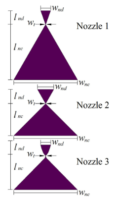

file-path:: file://C:/Users/ulfkemmsies/Zotero/storage/9HEZUB8Q/Silva et al. - 2017 - Vaporizing Liquid Microthrusters with integrated h.pdf
file:: [Silva et al. - 2017 - Vaporizing Liquid Microthrusters with integrated h.pdf](file://C:/Users/ulfkemmsies/Zotero/storage/9HEZUB8Q/Silva et al. - 2017 - Vaporizing Liquid Microthrusters with integrated h.pdf)
title:: hls__Silva et al. - 2017 - Vaporizing Liquid Microthrusters with integrated h

- The performance of micropropulsion systems can generally be analyzed using the same formulation as in normal sized systems. However, it is important to note that this formulation uses a set of assumptions that might not be applicable to micropropulsion systems as, for example, the assumption of negligible friction forces[16]. Thus, the following set of equations are used only to give insights into the ideal performance of such micropropulsion systems.
  ls-type:: annotation
  hl-page:: 2
  hl-color:: red
- ## Propulsion Background
- The thrust is the force generated by the gas accelerated and expelled through the nozzle. \(F=\dot{m} V_e+\left(p_e-p_a\right) A_e\)
  hl-page:: 2
  ls-type:: annotation
  id:: 6475ffe2-2a91-4c5c-9a0d-b310b666c5ea
  hl-color:: yellow
- The exhaust velocity can be calculated by where Me is the Mach number at the exit, k is the ratio of the specific heat at constant pressure and constant volume, T1 is the chamber temperature, and R is the specific gas constant. \(V_e=M_e \sqrt{k R T_1}\)
  hl-page:: 2
  ls-type:: annotation
  id:: 64760006-f49a-4638-9aab-1ab8b2c7c596
  hl-color:: yellow
- The mass flow rate can be written as a function of the chamber(stagnation) pressure and temperature (p1 and T1 ) and the area of the throat $$A_t$$: \(\dot{m}=A_t p_1 k \frac{\sqrt{\left(\frac{2}{k+1}\right)^{\frac{k+1}{k-1}}}}{\sqrt{k R T_1}}\)
  hl-page:: 2
  ls-type:: annotation
  id:: 64760171-2db7-4a73-8d52-7dae7dbc083d
  hl-color:: yellow
- The following equations are used to calculate the Mach number, temperature, and pressure at the exit.
  hl-page:: 2
  ls-type:: annotation
  id:: 6476019f-6790-4e89-af35-130fe4039432
  hl-color:: yellow
  \(\frac{A_e}{A_t}=\left(\frac{k+1}{2}\right)^{-\frac{k+1}{2(k-1)}} M_e^{-1}\left(1+\frac{k-1}{2} M_e^2\right)^{\frac{k+1}{2(k-1)}}\)
  \(T_e=T_1\left(1+\frac{(k-1)}{2} M_e^2\right)^{-1}\)
  \(p_e=p_1\left(1+\frac{(k-1)}{2} M_e^2\right)^{\frac{-k}{k-1}}\)
- The specific impulse \(I_{s p}\) is a measure of efficiency regarding the consumption of propellant.
  ls-type:: annotation
  hl-page:: 2
  hl-color:: yellow
  id:: 64916d09-5083-4771-bfbc-becaaa8fff3c
  $$
  I_{s p}=\frac{F}{\dot{m} g}
  $$
- ### Temperature dependent resistivity 
  hl-page:: 2
  ls-type:: annotation
  id:: 647601c8-b3b4-41df-93eb-659ec7cece37
  hl-color:: yellow
  The resistance of the heaters depends on the temperature and might be approximated by the following linear relation:
  \(\alpha=\frac{R-R_0}{R_0\left(T-T_0\right)}\)
- As the devices are very small and made of silicon which is good thermal conductor, a zero gradient of temperature might be assumed for the device. Therefore we can estimate that the temperature of the whole device is the same as the one estimated for the heaters. This approach has also been used to characterize similar devices made of molybdenum
  ls-type:: annotation
  hl-page:: 3
  hl-color:: red
  id:: 647602ba-37e5-435d-97c0-7ebd5d27af6b
- ## Design description 
  hl-page:: 3
  ls-type:: annotation
  id:: 64916d9d-da30-4ec9-a973-7b1a2a93396f
  hl-color:: yellow
  The microresistojets are composed of three main parts: a nozzle, a vaporizing chamber, and a heater. Each of these parts have different designs [17]. There are three types of nozzle named long nozzle, wide nozzle, and bell nozzle indicated in Fig. 1 as Nozzle 1, Nozzle 2 and Nozzle 3. The geometry and the area ratio (i.e. the ratio between the exit area of the nozzle and the throat area) are what differentiates them;
  
- Finally, there are two types of heaters. One heater type containing 21 lines divided into three sets of 7 lines and the other containing 30 lines divided into sets of 2 lines; in both configurations the lines are 12 um wide and 3000 um long.
  hl-page:: 3
  ls-type:: annotation
  id:: 64916db9-4aa2-4ff7-bf4f-8c3c2579f7a4
  hl-color:: yellow
- The total resistance of each heater should be according to the following equation: 
  hl-page:: 3
  ls-type:: annotation
  id:: 647601ff-8198-4ef3-9790-8031d7420aea
  hl-color:: yellow
  \(R=R_{s h} \frac{L}{W}\)
  where R is the resistance, Rsh is the sheet resistance, L is the length of the resistance, and W is the width of the resistance.
- The power P necessary to heat-up the water from room temperature of about 24 C to boiling point and vaporize it is calculated according to the following equation:
  hl-page:: 4
  ls-type:: annotation
  id:: 64760230-371c-4ca6-98bf-7f75027ab44a
  hl-color:: yellow
  \(P=\dot{m} \Delta H\) 
  where \(\Delta H=H_V-H_L, H_V\) is the enthalpy of water vapor at boiling temperature, and \(H_L\) is the enthalpy of liquid water at room temperature.
- This approach provides an acceptable estimation of the temperature, given the assumption that the whole thruster is at the same temperature.
  ls-type:: annotation
  hl-page:: 6
  hl-color:: red
  id:: 64760284-3823-404b-85c4-bf49125e95b7
- As the last step of the manufacturing is the isotropic etching, we can assume that the roughness of all the surfaces (including the nozzle throat) is similar to the measured roughness of the sample.
  ls-type:: annotation
  hl-page:: 7
  hl-color:: red
  id:: 647602d2-639e-4f64-a330-7ae80f5f1f26